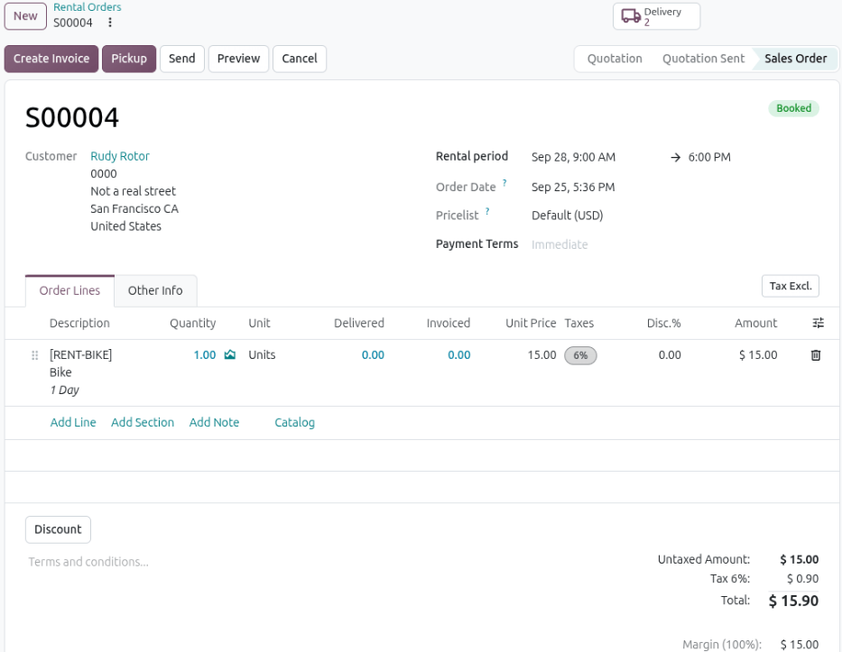
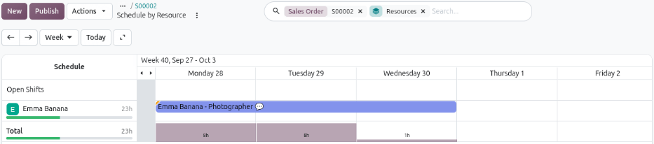
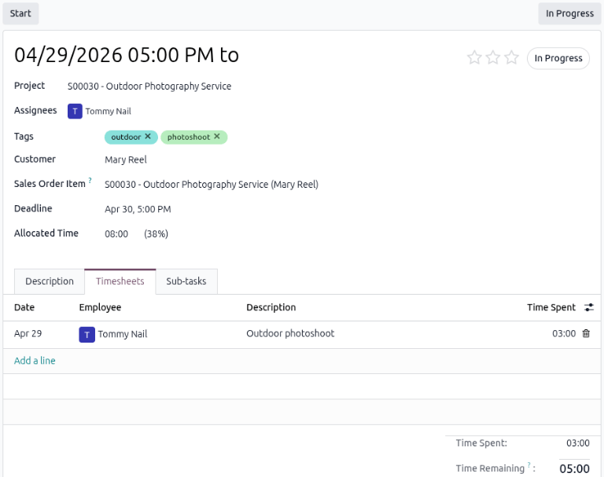

.. meta::
   :description: This page covers the rental order workflow in Odoo **Rental**, from creating a
                 quote and requesting a customer signature to tracking service time and finalizing
                 the invoice for payment.

=====================
Create a rental order
=====================

In Odoo **Rental**, quotations are created and sent to customers, similar to **Sales** quotations.
Once a quotation is confirmed, it becomes a *rental order* and can be invoiced and paid for. Only
after a rental order is confirmed can rental products be picked up.

.. important::
   To configure quotation settings, the **Sales** app **must** be installed. Refer to
   :ref:`sales/create_quotations/quotation-settings` for detailed instructions.

Create a rental quote
=====================

.. important::
   Users can convert a :doc:`sales quote <../../sales/sales_quotations/create_quotations>` to a
   rental quote by adding a rental product. Doing so automatically adds the :guilabel:`Rental
   period` field. To convert a rental quote to a sales quote, remove the rental start and return
   dates.

To create a rental quote, open the **Rental** app and create one from the *Rental Orders* dashboard
or navigate to :menuselection:`Rental app --> Orders --> Orders`, click :guilabel:`New` and select
:guilabel:`New Quotation`. Then complete the following steps:

.. tip::
   If :doc:`quotation templates <../../sales/sales_quotations/quote_template>` are enabled, users
   can select and modify a template from the :guilabel:`New` button drop-down menu.

#. **Add a Customer**: Enter or select a customer from the :guilabel:`Customer` drop-down menu.
#. **Add a rental product**: In the *Order Lines* tab, click :guilabel:`Add Line` or
   :guilabel:`Catalog`, and select the desired rental product.
#. **Set the rental duration**: Select the desired dates and times via the pop-up calendar for the
   :guilabel:`Rental period`.
#. **Optional**: Select an option from the :guilabel:`Pricelist` drop-down menu.
#. **Send and confirm rental quote**: Once all the information has been entered correctly on the
   rental order form, click :guilabel:`Send` to send the quotation to the customer. When the
   customer confirms the quotation, click :guilabel:`Confirm` to finalize the order. A
   :guilabel:`Booked` badge displays on the rental order.

.. important::
   There can only be one rental period per rental order. Multiple rental product orders with
   different rental periods require a rental order for each rental period.

As long as the rental quote isn't confirmed, the user can change the :guilabel:`Rental period` or
:doc:`Pricelist <../../sales/products_prices/prices/pricing>` on the rental quote. The **Rental**
app automatically updates the rental product's :guilabel:`Hours`, :guilabel:`Unit Price`, and
:guilabel:`Amount` on the product line and the quotation :guilabel:`Total` after the change.

When a rental order is confirmed, smart buttons may appear at the top of the form, depending on the
:ref:`app integrations <rental/product_type/app-integration>`:

- :icon:`fa-check` :guilabel:`Tasks`: Linked to the **Projects** app and shows any projects or tasks
  related to the rental order.
- :icon:`fa-clock-o` :guilabel:`Recorded`: Linked to the **Timesheets** app and shows how many hours
  are related to the rental order.
- :icon:`fa-tasks` :guilabel:`Planned`: Linked to the **Planning** app and shows how many shifts are
  related to the rental order.
- :icon:`fa-truck` :guilabel:`Delivery`: Linked to the **Inventory** app and shows any delivery and
  receipt orders related to the rental order.

.. _rental/create_rental_order/customer-signature:

Request a customer signature
============================

Odoo can request the customer sign a rental agreement outlining the arrangement between the company
and customer *before* they pick up the rental products. Such documents can ensure everything is
returned on time and in its original condition.

.. note::
   Requesting a signature can be done during any stage of the order. This feature also requires the
   :doc:`Sign <../../../productivity/sign>` app.

If signatures are required, go to the **Rental** app and from the default :guilabel:`Rental Orders`
dashboard, select the desired rental order:

1. In the chatter section, click :guilabel:`Activity`.
#. In the *Schedule Activity* pop-up window, click :guilabel:`Request Signature`.
#. Select :ref:`select an existing document template <sign/request-signatures/template-odoo-record>`
   or :ref:`upload a new one <sign/request-signatures/one-off-record>`.

After sending the request, a link to the signature request appears in the record's chatter. The
document is accessible to the customer via the customer portal or email.

.. seealso::
   `Odoo Tutorials: Sign <https://www.odoo.com/slides/sign-61>`_

Manage shifts for rental services
=================================

Confirmed rental orders containing :doc:`service products <../configure_products/service_products>`
trigger the automatic creation of shifts. These shifts are generated for the assigned role, which
can be for an employee or material, when the availability matches the designated rental period. This
automation is made possible by the integration with the **Planning** app and by configuring the
service product.

To edit a shift for a rental service complete the following steps:

1. Click the :icon:`fa-tasks` :guilabel:`Planned` smart button to open the *Schedule by Resource*
   page. The page defaults to a Gantt view of all the open shifts and shifts for the associated role
   that are available for the rental period of the rental order.
#. :ref:`Edit or delete the shift <planning/shifts>` as needed.

.. tip::
   Project templates allow for automated task assignment. When integrated with the **Planning** app,
   the system automatically schedules and publishes an employee's shift if their availability
   matches the rental period. Priority is given to employees with the relevant :ref:`roles
   <planning/planning-roles>` if applicable.

Track time for an employee shift
--------------------------------

1. Open the rental order for the rental service by going to :menuselection:`Rental app --> Orders
   --> Orders` and select the desired rental order.
#. Click the :icon:`fa-tasks` :guilabel:`Planned` smart button to open the *Schedule by Resource*
   page.
#. Click the employee shift and in the pop-up window click :guilabel:`Start` to begin tracking time
   for the shift.
#. Click :guilabel:`Complete` when the employee has completed their shift.

Manage a project created from a rental order
============================================

Click the :icon:`fa-check` :guilabel:`Tasks` smart button on top of the rental order to display a
Kanban view of all the tasks automatically created when confirming the rental order. :doc:`Customize
the project's tasks <../../../services/project/tasks/task_creation>` as needed.

.. tip::
   Configuring the use of :doc:`../../../services/project/project_management/project_templates` on
   the product form creates new projects with predefined tasks, priority levels, and assigned
   employees.

Enter time on a task for the rental service
-------------------------------------------

To enter time worked on a :doc:`service product <../configure_products/service_products>`:

1. **Go to associated project task**: Click the :icon:`fa-check` :guilabel:`Tasks` smart button on
   top of the rental order. Open the respective service task, then
#. **Enter in the service time**: Click the *Timesheets* tab, then :ref:`enter the time worked for
   the service <timesheets/timesheets/project-helpdesk>`.
#. **Return to rental order**: Click the :icon:`fa-dollar` :guilabel:`Sales Order` smart button to
   return to the rental order.

.. note::
   Once time is added in the :guilabel:`Timesheets` tab of a task, the rental order status is
   automatically changed to :guilabel:`Picked-up`, and a :guilabel:`Return` button appears.

Create an invoice
=================

Navigate to the desired invoice by opening the **Rental** app to display the :guilabel:`Rental
Orders` dashboard. Click the :guilabel:`To Invoice` smart button to view all rental orders that have
no invoices created for them.

Click the desired rental order, then click :guilabel:`Create Invoice`. Select :guilabel:`Regular
invoice` from the *Create invoice(s)* window and click :guilabel:`Create Draft`.

.. seealso::
   :doc:`manage_deposits`

Finalize the quantity for physical service products
---------------------------------------------------

For physical service products, such as hotel rooms, workstations, and conference rooms, a final
adjustment to the quantity may be needed on the invoice.

If there is a change in the number of units rented, enter the amount in the :guilabel:`Quantity`
column. If new charges were accrued during the rental period, click :guilabel:`Add a line` to
include them in the invoice draft.

Confirm and pay
---------------

If all the details are correct on the invoice draft, either click :guilabel:`Confirm` and click
:guilabel:`Send` to email the invoice to the customer, or click :guilabel:`Print` and then click
:guilabel:`Pay` if the customer is in person. In the :guilabel:`Pay` pop-up window, select a
:guilabel:`Journal` and click :guilabel:`Create Payment`.

Click the :guilabel:`Payments` smart button that appears at the top of the rental order. Click
:guilabel:`Validate` on the Payment page.

.. seealso::

   - `Odoo Tutorials: Create a Rental Order <https://youtu.be/hpQHu6U_IKk?si=Fy_Z82kzQNPBrD8v>`_
   - `Odoo Tutorials: Configuring a Rental Product
     <https://youtu.be/CE-SahTUC9A?si=ur6ci-SlKJSvQY5Q>`_
   - :doc:`pickup_return`
