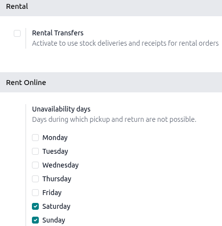
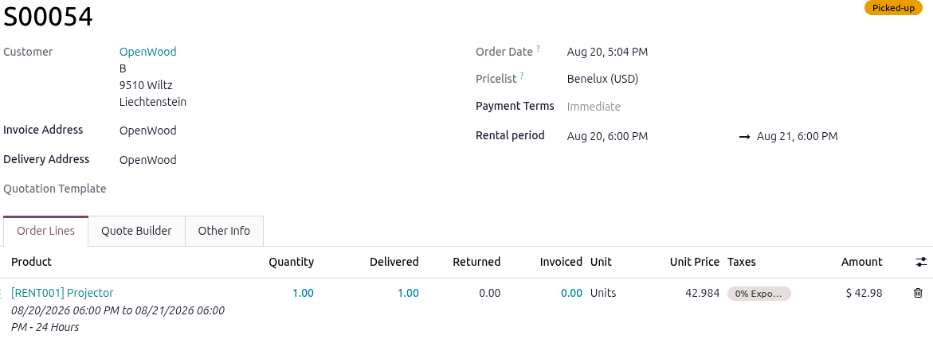
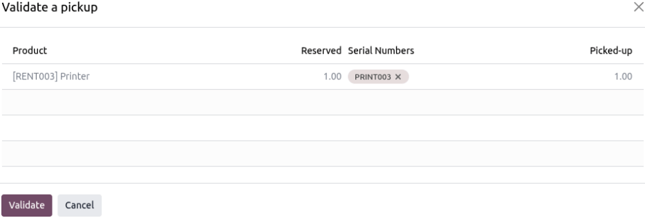
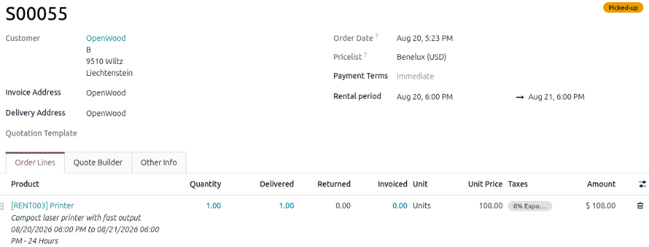
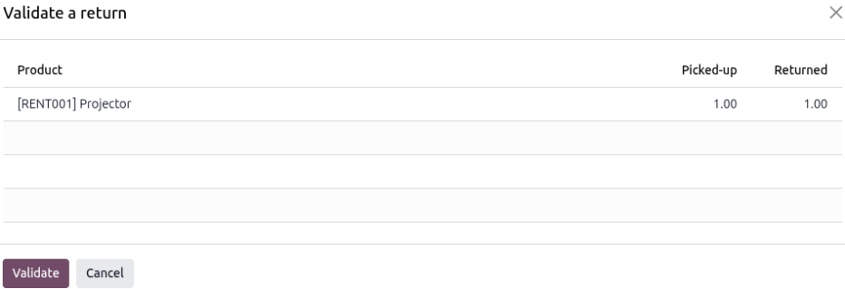
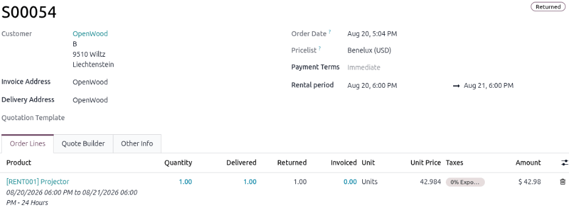
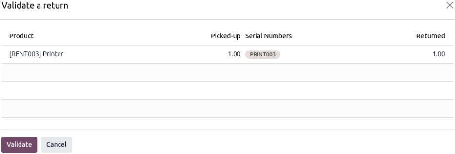
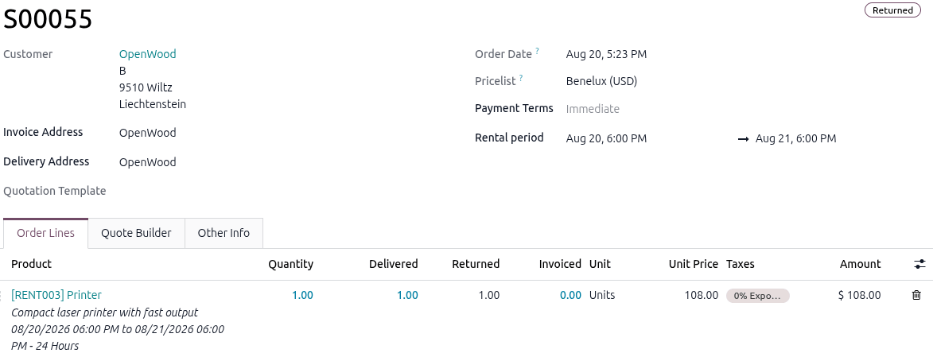
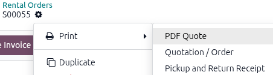

.. meta::
   :description: This document explains how to pick up and return rental Goods (physical products)
                 and Services.

==================================
Pick up and return rental products
==================================

This document focuses on the pickup and return of both rental *Goods* (physical products) such as
clothes, computer equipment, and bicycles, and *Services* (physical and non-physical) such as
photographer sessions, hotel rooms, and catering.

For rental businesses that rent out locations with no stock movement, such as hotel rooms, meeting
rooms, and storage spaces, the pickup (check-in) and return (check-out) processes are the same.

Once a rental order is confirmed, the reserved rental products become available for pickup. If
company policy requires a signed rental contract, :ref:`request the customer's signature
<rental/create_rental_order/customer-signature>` before the rental product is picked up.

.. seealso::
   :doc:`../configure_products/product_types`

.. _rental/pickup_return/configuration:

Configuration
=============

Two basic configurations cover the rental product types:

- :ref:`rental/pickup_return/physical-rental-products`
- :ref:`rental/pickup_return/service-rental-products`

.. _rental/pickup_return/physical-rental-products:

Physical rental products
------------------------

Refer to the physical rental products :ref:`settings <rental/products/settings>` to see the apps
required. If :ref:`product tracking <rental/products/product-tracking>` is enabled, the pick up and
return process requires additional steps.

.. seealso::
   - :ref:`rental/pickup_return/pickup-physical-rental-with-tracking`
   - :ref:`rental/pickup_return/return-physical-product-with-tracking`

.. _rental/pickup_return/service-rental-products:

Service rental products
-----------------------

For service rental products configuration, both physical and non-physical, refer to the
:ref:`rental/service_products/app-integration-config` section of the *Service rental products* page.

If the business wants to sell service rental products on an online shop, :ref:`configure the pickup
and return availability for eCommerce products <rental/pickup_return/ecommerce-products>`.

.. _rental/pickup_return/ecommerce-products:

Configure pickup and return availability for eCommerce products
===============================================================

The **Rental** app supports *eCommerce* configuration at the app and product level when the
**Website** app and the **eCommerce** module are installed. Using the *Unavailability days* setting
restricts the days the rental website allows pickup and returns to be scheduled. To configure the
rental product page in the online store, refer to the :ref:`Product configuration
<ecommerce/products/product-configuration>` section for the **eCommerce** module.

.. _rental/pickup_return/configuration-ecommerce:

Configuration
-------------

To configure default settings for pickup and return availability of rental products in an
**eCommerce** store, navigate to :menuselection:`Rental app --> Configuration --> Settings`.

In the *Rent Online* section, the :guilabel:`Unavailability days` setting lists checkboxes for every
day of the week. Selecting a day prevents scheduling rental pickups and returns through the online
rental product page.

Once the new work calendar is configured, click :guilabel:`Save`.

.. _rental/pickup_return/pickup:

Pick up a rental product
========================

.. note::
   For rental businesses that rent out locations with no stock movement, such as hotel rooms,
   meeting rooms, and storage spaces, the pickup (check-in) and return (check-out) processes are the
   same.

To process a pickup of a rental product, go to :menuselection:`Rental app --> Orders --> Orders` and
select the desired rental order. Click :guilabel:`Pickup`, and a *Validate a pickup* pop-up window
displays, listing the reserved rental product and quantity in :guilabel:`Product`,
:guilabel:`Reserved`, and :guilabel:`Picked-up` columns.

To confirm the list, click :guilabel:`Validate`. The action updates the rental order with a
:guilabel:`Picked-up` badge and updates the :guilabel:`Delivered` column. The action is also
recorded in the rental order's chatter.

.. _rental/pickup_return/pickup-physical-rental-with-tracking:

Pick up a physical rental product with tracking enabled
-------------------------------------------------------

.. important::
   This process requires that the *Lots & Serial Numbers* feature in the **Inventory** app be
   enabled and that the *Tracking* field be set to *By Unique Serial Number* on the rental product
   form.

To process a pickup of a physical rental product with tracking enabled, go to :menuselection:`Rental
app --> Orders --> Orders` and select the desired rental order. Click :guilabel:`Pickup`, and the
*Validate a pickup* pop-up window displays, listing the reserved rental product and quantity in
:guilabel:`Product`, :guilabel:`Reserved`, :guilabel:`Serial Numbers`, and :guilabel:`Picked-up`
columns. Check the rental product's serial number and then click in the :guilabel:`Serial Numbers`
column and select the product's serial number from the drop-down menu.

To confirm the list, click :guilabel:`Validate`. The action updates the rental order with a
:guilabel:`Picked-up` badge and updates the :guilabel:`Delivered` column. The action is also
recorded in the rental order's chatter.

.. _rental/pickup_return/pickup-rental-product-and-service:

Pick up a rental product and a rental service
---------------------------------------------

.. important::
   Refer to the :ref:`physical and service rental configuration requirements
   <rental/pickup_return/configuration>` to see the necessary app installations and settings.

When a physical rental product is rented alongside a service, it is advised to pick it up before
entering time on the associated task (if applicable).

If time is entered on the *Timesheets* tab of an associated task before the physical rental product
is picked up, the rental order automatically displays a :guilabel:`Picked-up` badge; however, the
:guilabel:`Pickup` button remains available on the rental order.

.. _rental/pickup_return/return:

Return a rental product
=======================

.. important::
   Regardless of whether a physical rental product is rented along with a service rental product,
   both must be returned on the rental order. Returning a rental service is the same process as
   returning a physical rental product without tracking enabled.

When a customer returns the rental product, go to :menuselection:`Rental app --> Orders --> Orders`
and select the desired rental order. Click :guilabel:`Return`, and the *Validate a return* pop-up
window displays, listing the returning rental product and quantity in :guilabel:`Product`,
:guilabel:`Picked-up`, and :guilabel:`Returned` columns.

To confirm the list, click :guilabel:`Validate`. The action applies a :guilabel:`Returned` badge to
the rental order and updates the :guilabel:`Returned` column. The action is also recorded in the
rental order's chatter.

.. _rental/pickup_return/return-physical-product-with-tracking:

Return a physical rental product with tracking enabled
------------------------------------------------------

When a customer returns the product, go to :menuselection:`Rental app --> Orders --> Orders` and
select the desired rental order. Click :guilabel:`Return`, and the *Validate a return* pop-up window
displays, listing the returning rental product and quantity in :guilabel:`Product`,
:guilabel:`Picked-up`, :guilabel:`Serial Numbers`, and :guilabel:`Returned` columns.

Verify that the returned rental product has the same serial number as the one listed in the
:guilabel:`Serial Numbers` column. If the serial numbers don't match, click into the
:guilabel:`Serial Numbers` column and select the correct serial number from the drop-down menu.

Once the rental product's quantity and serial number match, click :guilabel:`Validate`. The action
applies a :guilabel:`Returned` badge to the rental order and updates the :guilabel:`Returned`
column. The action is also recorded in the rental order's chatter.

.. _rental/pickup_return/print-pickup-return-receipts:

Print pickup and return receipts
================================

Pickup and return receipts can be created and downloaded for customers when they pick up or return
rental products.

To create pickup and return receipts, navigate to the desired rental order and click the
:icon:`fa-cog` :guilabel:`(Actions)` icon to open the drop-down menu.

Hover over the :icon:`fa-print` :guilabel:`Print` option, then select :guilabel:`Pickup and Return
Receipt`.

Odoo downloads a PDF of the receipt with the current status of the rented items.

.. seealso::
   - :doc:`create_rental_order`
   - :doc:`manage_deposits`
   - :doc:`../configure_products/products`
   - :doc:`../configure_products/service_products`
