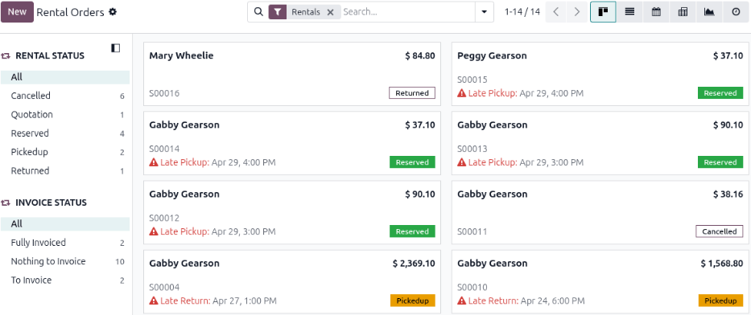

.. meta::
   :description: This page describes the *Rental Orders* dashboard, the landing page of the
                 **Rental** app, covering its available views and the status, invoice, and search
                 bar filters used to organize rental orders.

=======================
Rental Orders dashboard
=======================

The *Rental Orders* dashboard serves as the landing page for the **Rental** app. It provides a
high-level view of rental order status, a daily to-do list, and lists both sales and rental orders
depending on search filters.

Using the Rental Orders dashboard
=================================

To view the *Rental Orders* dashboard, open the **Rental** app. The dashboard offers the following
views: :icon:`oi-view-kanban` :guilabel:`(Kanban)` (default), :icon:`oi-view-list`
:guilabel:`(List)`, :icon:`fa-calendar` :guilabel:`(Calendar)`, :icon:`oi-view-pivot`
:guilabel:`(Pivot)`, :icon:`fa-area-chart` :guilabel:`(Graph)`, and :icon:`fa-clock-o`
:guilabel:`(Activity)`.

The left navigation panel has two sections: *Rental Status* and *Invoice Status*. In the *Rental
Status* section, are the following filters:

- :guilabel:`All`: Includes rental quotations and orders regardless of whether the statuses are
  :guilabel:`Reserved`, :guilabel:`Pickedup`, :guilabel:`Returned`, or :guilabel:`Cancelled`. This
  filter is the default for the *Rental Orders* dashboard.
- :guilabel:`Cancelled`: Filters the dashboard to show only rental quotations or orders that have
  the :guilabel:`Cancelled` status.
- :guilabel:`Quotation`: Filters the dashboard to show only rental quotations.
- :guilabel:`Reserved`: Filters the dashboard to show only rental orders that have the
  :guilabel:`Reserved` status.
- :guilabel:`Pickedup`: Filters the dashboard to show only rental orders that have the
  :guilabel:`Pickedup` status.
- :guilabel:`Returned`: Filters the dashboard to show only rental orders that have the
  :guilabel:`Returned` status.

In the *Invoice Status* section, are the following filters:

- :guilabel:`All`: Includes rental orders that have an invoice and those that do not.
- :guilabel:`Fully Invoiced`: Filters the dashboard to show rental orders whose posted invoice is
  fully paid.
- :guilabel:`Nothing to Invoice`: Filters the dashboard to show rental orders that have a drafted or
  posted invoice associated with them. This also includes rental quotations, as they are not
  confirmed orders and have nothing to invoice.
- :guilabel:`To Invoice`: Filters the dashboard to show only rental orders that do not have an
  invoice created.

The *Rental* and *Invoice Status* filters can be applied simultaneously. Within their own sections,
only one filter is applied at a time. Clicking the :icon:`oi-panel-right` :guilabel:`(navigation
panel)` icon folds and unfolds it.

Another way to filter the dashboard is using the search bar filters. Click the search bar to view
the preconfigured filters. In the :guilabel:`Filters` column are the:

- :guilabel:`My Orders`: Only shows rental quotations and orders created by the user.
- :guilabel:`Rentals` (default): Only shows rental orders.

  .. important::
     When this filter is removed from the search bar, the dashboard lists sales orders. Therefore,
     always keep the *Rental* filter as the default one.

- :guilabel:`To Do Today`: Shows rental orders that have the current date as the *Pickup* or
  *Return* date. Also includes pickup and return dates that are late.
- :guilabel:`Late`: Shows rental orders with the *Pickedup* status and a past *Return* date.
- :guilabel:`Pickup Date`: Shows rental orders that have the *Reserved* status.
- :guilabel:`Return Date`: Shows rental orders that have the *Pickedup* status.

In the :guilabel:`Group By` column are:

- :guilabel:`Status`: Creates and sorts rental quotations and orders by three different stages:
  *Quotation*, *Reserved*, and *Pickedup*.
- :guilabel:`Salesperson`: Creates and sorts rental quotations and orders by the user who created
  them.
- :guilabel:`Customer`: Creates and sorts rental quotations and orders by the listed customer on the
  rental quotation and order.
- :guilabel:`Custom Group`: Creates and sorts rental quotations and orders by customized groups
  created in Odoo.

.. seealso::
   - :doc:`create_rental_order`
   - :doc:`pickup_return`
   - :doc:`manage_deposits`
