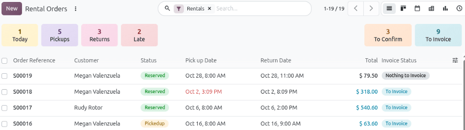

.. meta::
   :description: This page describes the *Rental Orders* dashboard, the landing page of the
                 **Rental** app, covering its available views and the status, invoice, and search
                 bar filters used to organize rental orders.

=======================
Rental Orders dashboard
=======================

The *Rental Orders* dashboard serves as the landing page for the **Rental** app. It provides a
high-level view of rental order status, a daily to-do list that includes rental order pickups,
returns scheduled for the day, and any that are overdue.

.. _rental/rental_order_dashboard/dashboard-views:

Using the Rental Orders dashboard
=================================

To view the *Rental Orders* dashboard, open the **Rental** app. The dashboard offers the following
views: :icon:`oi-view-list` :guilabel:`(List)` (default), :icon:`oi-view-kanban`
:guilabel:`(Kanban)`, :icon:`fa-calendar` :guilabel:`(Calendar)`, :icon:`oi-view-pivot`
:guilabel:`(Pivot)`, :icon:`fa-area-chart` :guilabel:`(Graph)`, and :icon:`fa-clock-o`
:guilabel:`(Activity)`.

At the top of the dashboard are five smart buttons:

- :guilabel:`Today` (default): Filters the dashboard to show rental orders whose *Pickup* or
  *Return* date is the present date. These are rental orders with the status of *Reserved* or
  *Pickedup*. Also includes pickup and return dates that are late. This filter is the default filter
  for the *Rental Orders* dashboard.
- :guilabel:`Late`: Filters the dashboard to show only rental orders with the *Pickedup* status and
  a past *Return* date.
- :guilabel:`In Progress`: Filters the dashboard to show only rental orders with the *Pickedup*
  status and a future *Return* date.
- :guilabel:`To Confirm`: Filters the dashboard to show only rental quotations. This includes
  quotations sent to the customer that are awaiting confirmation.
- :guilabel:`To Invoice`: Filters the dashboard to show only rental orders that do not have an
  invoice created.

Every smart button displays the number of rental orders or quotations within its category. Click the
smart button to apply the filter to the search bar. Click it again to remove it or delete the filter
from the search bar. The smart buttons can only be applied one at a time.

.. _rental/rental_order_dashboard/list-view-columns:

List view columns
=================

The default list view columns are: :guilabel:`Order Reference`, :guilabel:`Customer`,
:guilabel:`Status`, :guilabel:`Pick up Date`, :guilabel:`Return Date`, :guilabel:`Total`, and
:guilabel:`Invoice Status`. The following columns can be added using the :icon:`oi-settings-adjust`
:guilabel:`(adjust settings)` icon: :guilabel:`Salesperson`, :guilabel:`Order Date`,
:guilabel:`Website`, :guilabel:`Company`, :guilabel:`Sales Team`, :guilabel:`Tags`, and
:guilabel:`Activities`.

Rental orders that are late for :guilabel:`Pick up Date` or :guilabel:`Return Date` column display
in red. Rental orders without an invoice display in blue in the :guilabel:`Total` column. At the
bottom of the :guilabel:`Total` column, the total amount of all the rental quotations and orders
together is shown.

.. _rental/rental_order_dashboard/search-filters:

Search filters
==============

Another way to filter the dashboard is to use the search bar filters. Click the search bar to view
the preconfigured filters.

Filters
-------

In the :guilabel:`Filters` column, the following filters are available:

- :guilabel:`My Orders`: Only shows rental quotations and orders created by the user.
- :guilabel:`Rentals` (default): Only shows rental orders.

  .. important::
     When this filter is removed from the search bar, the dashboard lists sales orders. Therefore,
     always keep the *Rentals* filter as the default one.

- :guilabel:`Today`: Shows rental orders that have the current date as the *Pickup* or *Return*
  date. Also includes pickup and return dates that are late.
- :guilabel:`Late`: Shows rental orders with the *Pickedup* status and a past *Return* date.
- :guilabel:`Pickup Date`: Shows rental orders that have the *Reserved* status.
- :guilabel:`Return Date`: Shows rental orders that have the *Pickedup* status.

Group by
--------

In the :guilabel:`Group By` column, the following filters are available:

- :guilabel:`Status`: Creates and sorts rental quotations and orders by three different stages:
  *Quotation*, *Reserved*, and *Pickedup*.
- :guilabel:`Salesperson`: Creates and sorts rental quotations and orders by the user who created
  them.
- :guilabel:`Customer`: Creates and sorts rental quotations and orders by the listed customer on the
  rental quotation and order.
- :guilabel:`Custom Group`: Creates and sorts rental quotations and orders by customized groups
  created in Odoo.

.. seealso::
   - :doc:`create_rental_order`
   - :doc:`pickup_return`
   - :doc:`manage_deposits`
