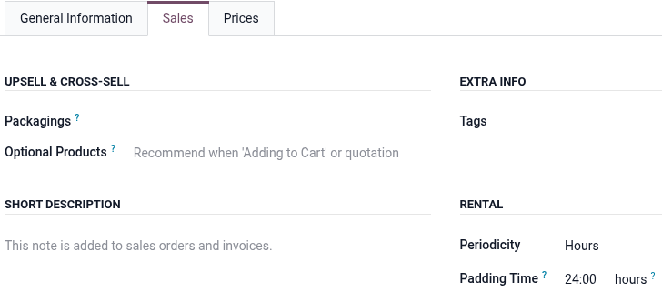
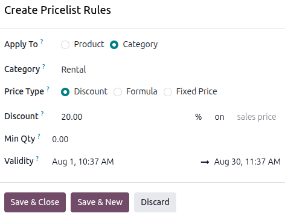
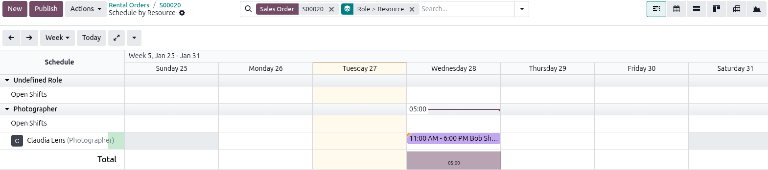
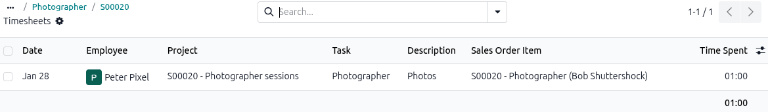
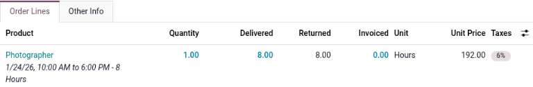

=======================
Service rental products
=======================

The **Rental** app is a comprehensive tool that enables users to customize scheduling, pricing, and
inventory for both physical rental products and non-physical goods (services) within a single
platform. This flexibility allows for combining products and services like bike rentals with guided
tours, or booking a studio with a photographer.

This document covers how to configure a rental service to automatically sync with staff shifts,
track time sheet hours, and create project tasks based on a rental order.

.. _rental/service_products/settings:

Settings
========

To configure default settings on rental products, navigate to :menuselection:`Rental app -->
Configuration --> Settings`.

.. image:: service_products/rental-settings.png
   :alt: Sample of Rental app configuration settings.

In the :guilabel:`Rental` section, enable :guilabel:`Rental Transfers`. In the :guilabel:`Rent
Online` section, designate :guilabel:`Unavailability days`.

Click :guilabel:`Save` to apply the changes.

.. _rental/service_products/app-integration-config:

App integration configuration
=============================

The following apps are essential for workflow efficiency and automation when creating a service
product and rental order:

 - **Sales** app: Enables the Prices tab, the use of Pricelists, online payments, and quotation
   templates within the **Rental** app.
 - **Sign** app: Allows for the upload and customization of different rental and service agreements.
   These documents are used to facilitate the :guilabel:`Request Signature` feature.
 - **Project** app: Enables the automation of creating projects and tasks whenever a rental order is
   confirmed through the configuration on the rental product form.
 - **Planning** apps: Enable the automation of matching rental products and services with employees
   based on availability.
 - **Timesheet** app: Allows employees to log time worked on tasks that are automatically created
   when confirming a rental order.
 - **eCommerce** app: Allows rental products and services to be rented directly from the website.

.. seealso::
   - :doc:`../sales/sales_quotations/quote_template`
   - :doc:`../sales/sales_quotations/get_paid_to_validate`
   - :doc:`../../services/project/project_management`
   - :doc:`../../services/planning`
   - :doc:`../../productivity/sign`
   - :doc:`../../services/timesheets`
   - :doc:`../../websites/ecommerce`

.. _rental/service_products/service:

View rental services
====================

To view all products that can be rented in the database, navigate to :menuselection:`Rentals app -->
Products`. By default, the :guilabel:`Rental` filter appears in the search bar, and the view is
Kanban. Remove the filter, then click the search bar. From the preset filters, select
:guilabel:`Services`. All the configured services appear.

Each service product Kanban card displays the service name, rental rate, and product image (if
applicable).

.. _rental/service_products/new-service:

Create a new service product
============================

.. important::
   The **Project**, **Planning**, and **Sales** apps must be installed for the following options to
   be available on the product form:

   - :guilabel:`Create on Order`
   - :guilabel:`Project Template`
   - :guilabel:`Invoicing Policy`
   - :guilabel:`Project & Task`
   - :guilabel:`Planing Services`

   The :guilabel:`Sales` checkbox enables the :guilabel:`Create on Order` and :guilabel:`Invoicing
   Policy` fields and also the :guilabel:`Prices` tab.

To set up a new rental service, go to the :menuselection:`Rental app --> Products --> Products` and
then click :guilabel:`New`. In the new product window, the :guilabel:`Sales` checkbox is enabled by
default.

Set the :guilabel:`Product Type` as :guilabel:`Service`. In the :guilabel:`Create on Order`
drop-down menu, select :guilabel:`Project & Task`, then select a template for the :guilabel:`Project
Template` field. In the :guilabel:`Invoicing Policy` drop-down menu, select :guilabel:`Based on
Timesheets`.

Tick the :guilabel:`Plan Services` checkbox and either create a new role or select a pre-existing
one. To create a new role, type in the name of the role in the blank field and click
:guilabel:`Create and edit` that appears.

.. image:: service_products/service-product.png
   :alt: Sample of a configured service product in the Rental app.

In the :guilabel:`Create Planning Role` pop-up window, enter the role's name. Select an option for
the :guilabel:`Services` and :guilabel:`Resources`, and click :guilabel:`Save`.

.. image:: service_products/create-planning-role-window.png
   :alt: Sample of the Create Planning Role window for a service product in the Rental app.

.. _rental/service_products/rental-periods-pricing:

Set a base rental period and price
----------------------------------

Set up a base rental rate by entering the lowest rental price in the :guilabel:`Sales Price` field.
Next, click the :guilabel:`Sales` tab, then  in the *Rental* section, select the Periodicity
(:dfn:`the unit of duration of the rental`) from the dropdown menu.

Then enter the :guilabel:`Padding Time` to make the product unavailable for pick up for the
configured duration.

.. important::
   In order to set a pricelist for additional rental rates, the **Sales** app must be installed, and
   :guilabel:`Pricelists` must be enabled. Otherwise, the :guilabel:`Prices` tab is not available.

Set additional rental periods and pricing
-----------------------------------------

There are two ways to configure additional rental rates in the Rental app: :ref:`Pricelists
<rental/service_products/pricelist-method>` and :ref:`Prices tab
<rental/service_products/prices-tab>`.

.. _rental/service_products/pricelist-method:

Using the Pricelists method
~~~~~~~~~~~~~~~~~~~~~~~~~~~

Creating a new :guilabel:`Pricelist` allows for better customization when applying rental rates to
specific time periods, products, or customers by using :guilabel:`Pricelist Rules`. To set up
additional rental rates, go to :menuselection:`Rental app --> Products --> Pricelists` and click
:guilabel:`New` to :ref:`create a new pricelist <sales/products/create-edit-pricelists>`. A *Create
Pricelist Rules* window displays.

.. tip::
   It is recommended to create a new :guilabel:`Pricelist` first, then select the customized
   :guilabel:`Pricelist` in the :guilabel:`Prices` tab instead of using the :guilabel:`Default`
   pricelist. Keeping the :guilabel:`Default` pricelist blank ensures there is a clean pricelist for
   the base rental rate.

.. _rental/service_products/prices-tab:

Using the Prices tab method
~~~~~~~~~~~~~~~~~~~~~~~~~~~

Prices can also be configured directly on the product using the :guilabel:`Prices` tab. Navigate to
:menuselection:`Products --> Products`, then click the desired product.

Click the :guilabel:`Prices` tab and click :guilabel:`Add a price`. Select the desired
:guilabel:`Pricelist`, then enter the minimum time required for the price change to trigger in the
:guilabel:`Min. Quantity` column. The :guilabel:`Min. Quantity` column is based on the
:guilabel:`Periodicity` field in the :guilabel:`Sales` tab.

Lastly, enter the :guilabel:`Price` rate. Click the :icon:`fa-cloud-upload` :guilabel:`(Save
manually)` icon near the top to save.

.. example::
   A photography studio rents out its photographers on an hourly and daily basis. The hourly rate is
   $30, but the studio offers a 20% discount for all-day sessions (eight hours or more). All
   reservations require a 24-hour notice to reserve a photographer. Navigate to
   :menuselection:`Rental app --> Products --> Products` and click the desired product.

   Enter the :guilabel:`Sales Price` and then click the :guilabel:`Sales` tab to configure the
   :guilabel:`Periodicity` and the :guilabel:`Padding Time`.

   .. image:: service_products/rental-sales-tab-rental-section.png
      :alt: Sample of the Rental section of the Sales tab of a service product.

   Using the Pricelist method, navigate to :menuselection:`Rental app --> Products --> Pricelists`
   and click :guilabel:`New`. Configure :guilabel:`Pricelist Rules` for the daily rate.

   .. image:: service_products/example-pricelist-rules.png
      :alt: Sample of the customized Pricelist of service product in the Rental app.

   Using the :guilabel:`Prices` tab method, navigate to :menuselection:`Rental app --> Products -->
   Products` and click the Photographer product. Click the :guilabel:`Prices` tab and add a new
   price for the daily rate.

   .. image:: service_products/example-prices-tab.png
      :alt: Sample of the Prices tab of service product in the Rental app.

.. _rental/service_products/ro-with-service-product:

Create a rental order with a service product
============================================

In Odoo, a rental order is the same as a sales order. When creating orders in the **Rental** app,
they are referred to as rental orders.

Navigate to the **Rental** app, which opens the Rental Orders dashboard. Click :guilabel:`New` to
open a new rental order form.

Enter the :guilabel:`Customer` field, and select a :guilabel:`Quotation Template`, if applicable.

To adjust the rental duration, click the first date in the :guilabel:`Rental period` field, and
select the range of dates and times to represent the rental duration from the pop-up calendar form
that appears.

.. image:: service_products/rental-period-field-popup.png
   :alt: Sample of the rental period field calendar pop-up window in the Rental app.

Once complete, click :guilabel:`Apply` in the calendar pop-up form. Next, add a rental service in
the :guilabel:`Order Lines` tab by clicking :guilabel:`Add a product` and selecting the desired
rental service to add to the form. Enter the desired amount in the :guilabel:`Quantity` column.

.. note::
   If a rental product is added *before* the :guilabel:`Rental period` field has been properly
   configured, the user can *still* adjust it accordingly.

   Select the desired date range to represent the rental duration, then click :guilabel:`Update
   Rental Prices`.

   .. image:: service_products/rental-update-rental-prices.png
      :alt: Sample of the Update Rental Prices option in the Rental app.

   Odoo recalculates the rental price accordingly.

.. image:: service_products/rental-order-form.png
   :alt: Sample of a rental order for a service product in the Rental app.

Once all information has been entered correctly on the rental order form, click :guilabel:`Send` to
email the quotation to the customer. When the customer approves the quotation, click
:guilabel:`Confirm`. A status banner displays on the rental order.

.. _rental/service_products/customer-signature:

Request a customer signature
============================

Before the date of the service, Odoo can request that the customer sign a service agreement. Service
agreements detail the business relationship and mutual duties. These agreements protect both the
provider and the customer by creating clear, enforceable guidelines.

.. note::
   The customer signature can be requested during any stage of the order. This feature also requires
   the :doc:`Sign <../../productivity/sign>` app.

To request a signature, open the **Rental** app and select the desired rental order. Click the
:icon:`fa-cog` :guilabel:`(Actions)` icon, then click :guilabel:`Request Signature`.

.. image:: service_products/request-signature.png
   :alt: The Action drop-down menu for requesting a signature in the Rental app.

A :guilabel:`New Signature Request` pop-up window displays. Select the desired document from the
:guilabel:`Template` drop-down menu.

.. image:: service_products/new-signature-request.png
   :alt: Sample of the New Signature Request pop-up window in the Rental app.

Doing so reveals another :guilabel:`New Signature Request` pop-up window. Confirm the information in
the :guilabel:`New Signature Request` pop-up window, then click :guilabel:`Send` to initiate the
signing process.

.. image:: service_products/new-signature-request-message.png
   :alt: Sample of the New Signature Request message in the Rental app.

A link to the signature request will appear in the chatter of the rental order. The document is
accessible to the customer via the customer portal or email.

.. tip::
   If the agreement is configured to require a signature from the rental company, a :guilabel:`Sign
   Now` button displays on the pop-up window. The user can add a signature via the **Sign** app
   integration before sending it to the customer.

A link to the signature request will appear in the chatter. The document is accessible to the
customer via the customer portal or email.

.. _rental/service_products/sign-with-email:

Signing a document from an email link
-------------------------------------

When a customer clicks :guilabel:`Sign document`, a separate page is then revealed, showcasing the
document to be signed. The customer begins the process by clicking :guilabel:`Click to start`.

The app guides the signer to the required signature locations and allows them to create electronic
signatures to complete the form.

.. image:: service_products/adopt-signature-popup.png
   :alt: Sample of a customer signature with the Auto option chosen.

Once the document has been signed and completed, click :guilabel:`Validate & Send Completed
Document` at the bottom of the document. The signed document can be downloaded for record-keeping
purposes, if necessary.

.. image:: service_products/validate-send-doc-button.png
   :alt: Sample of a signed document with the Validate & Send Completed Document button.

.. seealso::
   `Odoo Tutorials: Sign <https://www.odoo.com/slides/sign-61>`_.

Managing the project created from the rental order
==================================================

.. important::
   For the appropriate smart buttons to display, the **Project**, **Timesheet**, **Planning**, and
   **Inventory** apps are needed. The selected service product on the rental order must be
   :ref:`properly configured <rental/service_products/service>` to integrate with the recommended
   apps.

When the rental order is confirmed, the the following smart buttons appear at the top:

- :icon:`fa-puzzle-piece` :guilabel:`Tasks`: Linked to the **Projects** app and show any projects or
  tasks related to the rental order.
- :icon:`fa-clock-o` :guilabel:`Recorded`: Linked to the **Timesheets** app and shows how many hours
  are related to the rental order.
- :icon:`fa-tasks` :guilabel:`Planned`: Linked to the **Planning** app and shows how many hours are
  related to the rental order.
- :icon:`fa-truck` :guilabel:`Delivery`: Linked to the **Inventory** app and shows any delivery and
  receipt orders related to the rental order.

Click the :icon:`fa-puzzle-piece` :guilabel:`Tasks` smart button to view a Kanban view of all the
associated tasks that were automatically created when confirming the rental order. :doc:`Customize
the tasks <../../services/project/tasks/task_creation>` in the project as needed.

.. tip::
   Configuring the use of :doc:`../../services/project/project_management/project_templates` on the
   product form creates new projects with predefined tasks, priority levels, and assigned employees.

.. image:: service_products/rental-order-task-card.png
   :alt: Sample of a project task card for the rental order in the Rental app.

Managing employee shifts for rental services
--------------------------------------------

When a rental order containing a service product is confirmed, Odoo automatically creates shifts for
the employee role assigned to the service based if their shifts match the rental period. This
automation is made possible by the integration with the **Planning** app and the configuration of
the service product.

Click the :icon:`fa-tasks` :guilabel:`Planned` smart button to see a Gantt view of all the open
shifts and shifts for the associated role that are available for the rental period of the rental
order. :ref:`Customize the shifts <planning/shifts>` as needed.

.. tip::
   Project templates allows for task assignment automation. When integrated with the **Planning**
   app, the system automatically schedules and publishes an employee's shift if their availability
   matches the rental period. Priority given to employees with the relevant :ref:`roles
   <planning/planning-roles>` if applicable.

.. _rental/service_products/enter-time:

Enter time for the rental service
---------------------------------

To set the allocated time for a task to match the rental period, click the respective service
product task, then in the :guilabel:`Allocated Time` field, enter the number of hours ordered.

To enter time worked on a service product, select the respective service task, then click the
:guilabel:`Timesheets` tab. Click :guilabel:`Add a line` to enter the:

- :guilabel:`Date`: The date the work was performed.
- :guilabel:`Employee`: The employee who performed the work.
- :guilabel:`Description`: A brief description of the work performed.
- :guilabel:`Time Spent`: The number of hours worked on the task for that entry.

Click on the :icon:`fa-dollar` :guilabel:`Sales Order` smart button to return to the rental order.

.. note::
   Once time is added to the :guilabel:`Timesheets` tab of a task, the status of the rental order is
   automatically changed to :guilabel:`Picked-up`, and the :guilabel:`Return` button appears.

.. image:: service_products/rental-task-timesheets-tab.png
   :alt: A task Timesheet tab for a rental order in the Rental app.

Tracking delivered time on a rental order
-----------------------------------------

When time is entered on the :guilabel:`Timesheets` tab of an associated task, the delivered time is
automatically tracked on the rental order.

To view the delivered time, navigate to the desired rental order and click the :icon:`fa-clock-o`
:guilabel:`Recorded` smart button at the top of the rental order. The total hours worked appear in
the :guilabel:`Recorded Time` field.

.. _rental/service_products/pickup:

Process a rental order pickup
=============================

When a product is rented alongside a service, it is advised to pick it up before entering time on
the associated task.

If time is entered on the :guilabel:`Timesheets` tab of an associated task before the physical
rental product is picked up, the rental order status automatically changes to :guilabel:`Picked-up`.
The :guilabel:`Pickup` button is still available on the rental order if time is entered before
picking up the product.

When a customer picks up the product, navigate to the appropriate rental order and click
:guilabel:`Pickup`. Verify the list, then click :guilabel:`Validate` in the *Validate a pickup*
pop-up window that appears.

.. image:: service_products/pickup-popup.png
   :alt: Sample of a service product pick up pop-up window in the Rental.

Doing so places a :guilabel:`Picked-up` status banner on the rental order.

.. _rental/service_products/return:

Process a rental order return
=============================

Regardless of whether there is a product rented along with a service, the service or product must be
returned on the rental order.

When a customer returns the products or when the service has been completed, navigate to the
appropriate rental order and click :guilabel:`Return`. Validate the return by clicking
:guilabel:`Validate` in the *Validate a return* pop-up window that appears.

.. image:: service_products/validate-a-return-window.png
   :alt: Sample of returning a service product in the Rental app.

Doing so places a :guilabel:`Returned` status banner on the rental order.

.. example::
   The photography studio had a customer who wanted to rent one of their photographers and banner
   decorations for a home photo shoot. The booking was for two hours.

   On the :guilabel:`Validate a return` form for rental order, the banner line item matches the
   number of banners picked up, and the photographer line item matches the number of hours submitted
   on the :guilabel:`Timesheets` tab on the related task.

   .. image:: service_products/return-form-example-product-service.png
      :alt: Sample of a Validate a return form with a rental product and service listed.

.. _rental/service_products/create-invoice:

Create an invoice
=================

It is typical for service-based businesses to invoice customers for services rendered. In the
context of rental orders, this means creating an invoice for the services provided, such as a
photographer or event staff.

Navigate to the desired invoice by opening the :menuselection:`Rental` app and landing on the
:guilabel:`Rental Orders` dashboard. Click :guilabel:`To Invoice` in the :guilabel:`Invoice Status`
section to view all rental orders that require invoices to be sent.

.. image:: service_products/invoice-status-section.png
   :alt: Sample of the INVOICE STATUS section in the Rental app.

Click on the desired rental order Any information in the sales order's columns that are blue is
available to be invoiced.

Click :guilabel:`Create Invoice`. Select :guilabel:`Regular invoice` from the :guilabel:`Create
invoice(s)` window and click :guilabel:`Create Draft`.

.. image:: service_products/create-invoices.png
   :alt: Sample of Create invoices window in the Rental app.

If all the details are correct, click :guilabel:`Confirm` and then :guilabel:`Send` to email the
invoice to the customer. For in-person transactions, click :guilabel:`Print` and then click
:guilabel:`Pay`.

In the :guilabel:`Pay` pop-up window, select a :guilabel:`Journal` and click :guilabel:`Create
Payment`.

.. image:: service_products/pay-popup.png
   :alt: Sample of the Pay pop-up window in the Rental app.

Click the :icon:`fa-bars` :guilabel:`Payments` smart button at the top of the rental order. Click
:guilabel:`Validate` to complete the payment.

.. image:: service_products/payment-validate.png
   :alt: Sample of the Payment page in the Rental app.

Use the breadcrumbs to return to the rental order.

