=======================
Service rental products
=======================

The **Rental** app is a comprehensive tool that enables users to manage the scheduling, pricing, and
inventory for both physical goods (products) and non-physical goods (services) within a single
platform.

This flexibility allows for combining products and services like bike rentals with guided tours, or
booking a studio with a photographer.

This document covers how to configure a rental service to automatically sync with staff shifts,
track time sheet hours, and set up and link project tasks based on a rental order.

Settings
========

To configure default settings on rental products, navigate to :menuselection:`Rental app -->
Configuration --> Settings`.

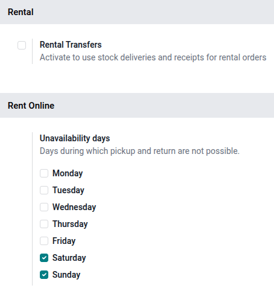

In the :guilabel:`Rental` section, under the :guilabel:`Default Delay Costs` subsection, fill in the
:guilabel:`Apply after` field.

.. note::
   For finer control, configure the costs of late returns for the :guilabel:`Per Hour` and
   :guilabel:`Per Day` fields at the product level. If the defaults apply to all products, leave the
   :guilabel:`Product` field blank.

In the :guilabel:`Default Padding Time` section, fill in the :guilabel:`Padding` field.

Next, enable :guilabel:`Rental Transfers`. In the :guilabel:`Rent Online` section, fill in the
:guilabel:`Minimal Rental Duration` field and designate :guilabel:`Unavailability days`. Click
:guilabel:`Save` to apply the changes.

App integration configuration
=============================

The following apps are essential for workflow efficiency and automation when creating a service
product and rental order:

 - **Sales** app: Enables the use of online payments and utilizes quotation templates within the
   **Rental** app.
 - **Sign** app: Allows for the upload and customization of different rental and service agreements.
   These documents are used to facilitate the :guilabel:`Request Signature` feature.
 - **Project** and **Planning** apps: Integrate with the Rental app to automatically match purchased
   products and services with employees based on availability.

.. seealso::
   - :doc:`../sales/sales_quotations/quote_template`
   - :doc:`../sales/sales_quotations/get_paid_to_validate`
   - :doc:`../../services/project/project_management`
   - :doc:`../../services/planning`
   - :doc:`../../productivity/sign`

Rental services
===============

To view all products that can be rented in the database, navigate to :menuselection:`Rentals app -->
Products`. By default, the :guilabel:`Rental` filter appears in the search bar, and the view is
Kanban. Remove the filter, then click the search bar. From the preset filters, select
:guilabel:`Services`. All the configured services appear.

Each Kanban card displays the name and rental price of the service.

.. _rental/service_products/service:

Create a new service product
============================

.. important::

   The **Project** and the **Sales** apps must be installed for following options to be available:

   - :guilabel:`Create on Order`
   - :guilabel:`Project Template`
   - :guilabel:`Invoicing Policy`
   - :guilabel:`Project & Task`

   Ticking the :guilabel:`Sales` checkbox displays the :guilabel:`Create on Order` and
   :guilabel:`Invoicing Policy`.

To set up a new rental service, go to the :menuselection:`Rental app --> Products` and then click
:guilabel:`New`. In the new product window, the :guilabel:`Rental` checkbox is already ticked by
default.

Tick the :guilabel:`Sales` checkbox. Select the :guilabel:`Product Type` as a :guilabel:`Service`.
In the :guilabel:`Create on Order` drop-down menu, select :guilabel:`Project & Task`. In the
:guilabel:`Invoicing Policy` drop-down menu, select :guilabel:`Based on Timesheets`.

Tick the :guilabel:`Plan Services` checkbox and either create a new role or select a pre-existing
one. To create a new role, type in the name of the role in the blank field and click
:guilabel:`Create and edit` that appears.

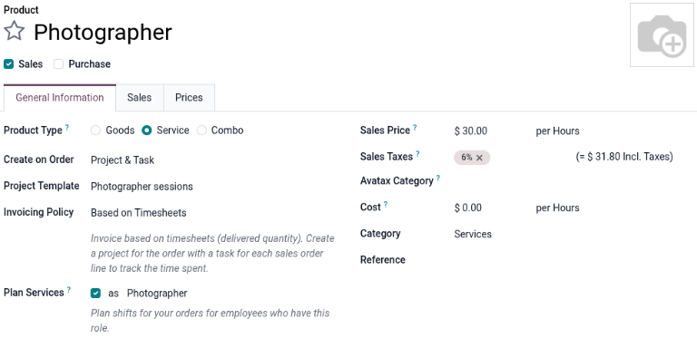

In the :guilabel:`Create Planning Role` pop-up window, enter the role's name. Select an option for
the :guilabel:`Services` and :guilabel:`Resources`, and click :guilabel:`Save`.

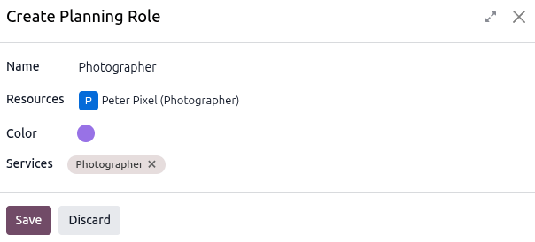

Configure rental price
----------------------

Click the :guilabel:`Rental prices` tab and in the :guilabel:`Pricing` section, click :guilabel:`Add
a price` to enter a new rental rate. Choose a *pricing period* (:dfn:`the unit of duration of the
rental`) in the :guilabel:`Period` column, or create a new pricing period by typing in the name and
clicking Create and edit.

.. tip::
   Customize rental rate time periods by navigating to :menuselection:`Rental app --> Configuration
   --> Rental periods`.

   .. image:: service_products/new-rental-period.png
      :alt: Sample of a Create Period pop up window in the Rental app.

Next, enter the :guilabel:`Price` for that specific :guilabel:`Period`. To apply the configured
rental rate to an existing pricelist, click in the :guilabel:`Pricelist` column and select the
desired list from the drop-down menu.

In the :guilabel:`Reservations` section, fill in the :guilabel:`Hourly Fine`, :guilabel:`Daily
Fine`, and the :guilabel:`Reserve product` time. These values are automatically populated from the
:guilabel:`Default Delay Costs` section, provided they have been configured in the
:menuselection:`Rental app --> Configuration --> Settings`.

Click the :icon:`fa-cloud-upload` :guilabel:`(Save manually)` icon near the top to save.

.. example::
   A photography studio rents out its photographers on an hourly and daily basis. They want to add a
   new four hour package for $750.

   All reservations require 24-hour notice to reserve a photographer, but they do not charge a fine
   if the reservations go over the agreed time. Instead, they default to their hourly fee.

   Create a new pricing period by navigating to :menuselection:`Rental app --> Configuration -->
   Rental periods`. Click :guilabel:`New` and configure the period for four hours.

   Navigate to the :guilabel:`Photographer` service product and in the :guilabel:`Rental prices`
   tab, add the four hour period set at $750. Manually save to apply changes.

   .. image:: service_products/example-4hrs-rental-period.png
      :alt: Sample of the Rental prices tab of service product in the Rental app.

Create a rental order with a service product
============================================

In Odoo, a rental order is the same as a sales order. When creating orders in the **Rental** app
they are referred to as rental orders.

Navigate to the **Rental** app which opens the Rental Orders dashboard. Click :guilabel:`New` to
open a new rental order form.

Enter the :guilabel:`Customer` field, and select a :guilabel:`Quotation Template`, if applicable.

Next, set the desired rental duration in the :guilabel:`Rental period` field. To adjust the rental
duration, click the first date in the :guilabel:`Rental period` field, and select the range of dates
and times to represent the rental duration from the pop-up calendar form that appears.

.. image:: service_products/rental-period-field-popup.png
   :alt: Sample of the rental period field calendar pop-up window in the Rental app.

Once complete, click :guilabel:`Apply` in the calendar pop-up form. Following that, the pop-up form
disappears, and the designated rental time period is represented in the :guilabel:`Duration` field.

Next, add a rental service in the :guilabel:`Order Lines` tab, by clicking :guilabel:`Add a product`
and selecting the desired rental service to add to the form. Enter the desired amount in the
:guilabel:`Quantity` column.

.. note::
   If a rental product is added before the Rental period field has been properly configured, the
   user can still adjust the Rental period field accordingly. Select the desired range of dates to
   represent the duration of the rental, then click Update Rental Prices in the Duration field.

   .. image:: service_products/rental-update-rental-prices.png
      :alt: Sample of the Duration field with the Update Rental Prices option in the Rental app.

   Doing so reveals a Confirmation pop-up window. If everything is correct, click Ok, and Odoo
   recalculates the rental price accordingly.

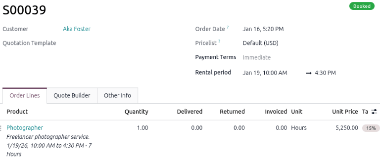

Once all information has been entered correctly on the rental order form, click :guilabel:`Send` to
email the quotation to the customer. When the customer approves the quotation, click
:guilabel:`Confirm`. A banner displays on the rental order stating its current status.

Customer signature
==================

Odoo enables electronic signature requests for customer service agreements and any other documents
that require signatures. Service agreements detail the business relationship and mutual duties.
These agreements protect both the provider and the customer by creating clear, enforceable
guidelines.

If signatures are required, go to the **Rental** app and from the default :guilabel:`Rental Orders`
dashboard, select the desired rental order. Click the :icon:`fa-cog` :guilabel:`(Actions)` icon, and
click :guilabel:`Request Signature`.

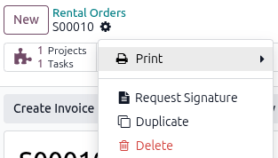

A :guilabel:`New Signature Request` pop-up window displays. Select the desired document from the
:guilabel:`Template` drop-down menu.

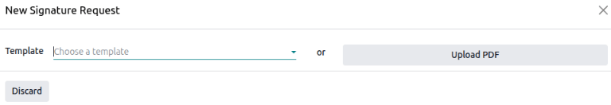

Doing so reveals a :guilabel:`New Signature Request` pop-up window. Upon confirming the information
in the :guilabel:`New Signature Request` pop-up form, click :guilabel:`Send` to initiate the signing
process.

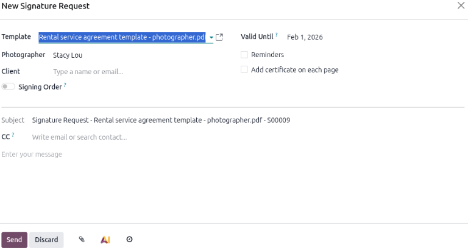

A link to the signature request will appear in the chatter of the rental order. The document is
accessible to the customer via the customer portal or email.

.. note::
   Requesting an electronic signature can be done at any stage of the order. This feature requires
   the **Sign** app. Typically, rental or service agreements are signed **after the rental order is
   confirmed** to establish the responsibilities and terms for the parties involved.

.. important::
   The :guilabel:`Request Signature` feature only allows the customer to sign the document through
   their email or customer portal. The customer cannot sign the document through the user's **Sign**
   app.

Signing a document from an email link
-------------------------------------

When a customer clicks :guilabel:`Sign document`, a separate page is then revealed, showcasing the
document to be signed. The customer begins the process by clicking :guilabel:`Click` to start.

The app guides the signer to the required signature locations and allows them to create electronic
signatures to complete the form.

.. image:: service_products/adopt-signature-popup.png
   :alt: Sample of a customer signature with the Auto option chosen.

The *Adopt your signature* pop-up window that appears in the Odoo Rental application. Once the
document has been signed and completed, click :guilabel:`Validate & Send Completed Document` at the
bottom of the document.

Odoo presents the option to download the signed document for record-keeping purposes, if necessary.

.. image:: service_products/validate-send-doc-button.png
   :alt: Sample of a signed document with the Validate & Send Completed Document button.

.. seealso::
   `Odoo Tutorials: Sign <https://www.odoo.com/slides/sign-61>`_.

Entering time for the rental order
==================================

.. important::
   For the appropriate smart buttons to display, the **Project**, **Timesheet**, and **Planning**
   apps are needed. The selected service product on the rental order must be :ref:`properly
   configured <rental/service_products/service>` to integrate with the recommended apps.

Navigate to the rental orders by :menuselection:`Rental app --> Orders --> Orders` and select the
desired rental order. At the top of the rental order form, the following smart buttons appear:

- :icon:`fa-puzzle-piece` :guilabel:`Tasks`: Linked to the **Projects** app and shows any projects
     or tasks related to the rental order.
- :icon:`fa-clock-o` :guilabel:`Recorded`: Linked to the **Timesheets** app and shows how many hours
     are related to the rental order.
- :icon:`fa-tasks` :guilabel:`Planned`: Linked to the **Planning** app and shows how many shifts are
     related to the rental order.

Click the :icon:`fa-puzzle-piece` :guilabel:`Tasks` smart button to view a Kanban view of all the
associated tasks that were automatically created when confirming the rental order. Click the desired
task, then select the :guilabel:`Timesheets` tab.

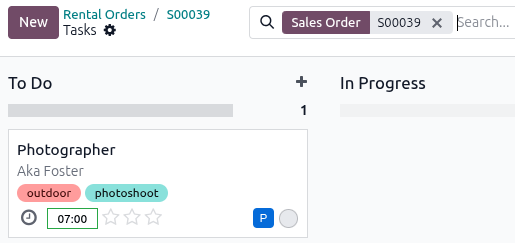

Click :guilabel:`Add a line` to enter the number of hours worked on the task manually. Click on the
:icon:`fa-dollar` :guilabel:`Sales Order` smart button to return to the rental order.

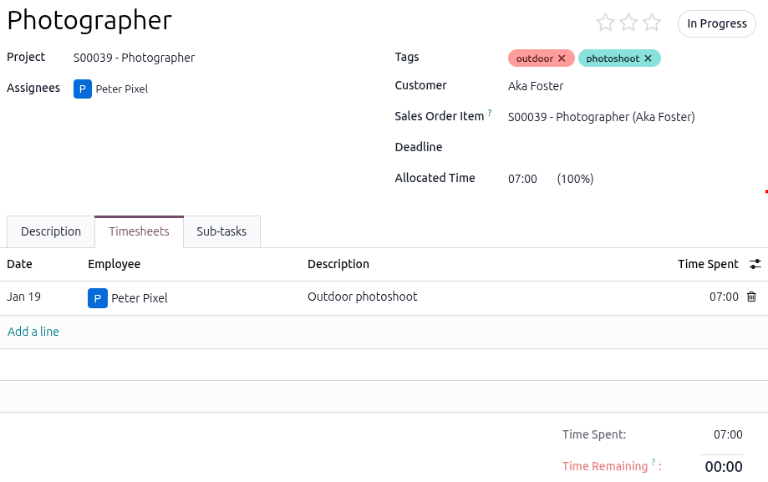

.. note::
   Once time is added to the :guilabel:`Timesheets` tab  of a task, the status of the rental order
   is automatically changed to :guilabel:`Picked-up` and the :guilabel:`Return` button appears.

Create an invoice
=================

Go to the desired invoice by navigating to the :menuselection:`Rental` app and, on the
:guilabel:`Rental Orders` dashboard, click :guilabel:`To Invoice` in the :guilabel:`INVOICE STATUS`
section to view all rental orders that require invoices to be sent.

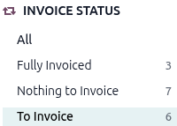

Click on the desired rental order and click :guilabel:`Create Invoice`. Select :guilabel:`Regular
invoice` from the :guilabel:`Create invoice(s)` window and click :guilabel:`Create Draft`.

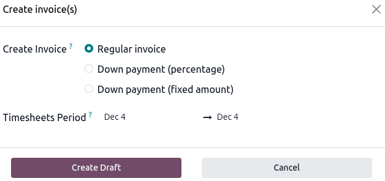

If all the details are correct, click :guilabel:`Confirm`. Click :guilabel:`Send` to email the
invoice to the customer or :guilabel:`Print` and then click :guilabel:`Pay` if the customer is in
person.

In the :guilabel:`Pay` pop-up window, select a :guilabel:`Journal` and click :guilabel:`Create
Payment`.

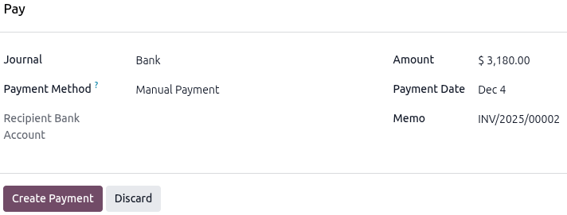

Click on the :icon:`fa-bars` :guilabel:`Payments` smart button that appears on the top of the rental
order. Click :guilabel:`Validate` on the :guilabel:`Payment` page.

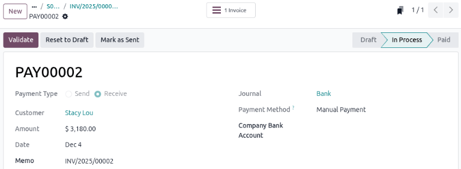

Use the breadcrumbs to return to the rental order.

Pickup products
===============

When time is entered on the :guilabel:`Timesheets` tab of an associated task, the rental order
status automatically changes to :guilabel:`Picked-up`. This happens even if time is entered before
the physical product ordered with the service is picked up.

If a product is rented alongside a service, it is advised to pick it up before entering time on the
associated task. The :guilabel:`Pickup` button is still available on the rental order if time is
entered before picking up the product.

When a customer picks up the product, navigate to the appropriate rental order, click
:guilabel:`Pickup`, and then click :guilabel:`Validate` in the :guilabel:`Validate a pickup` pop-up
form that appears.

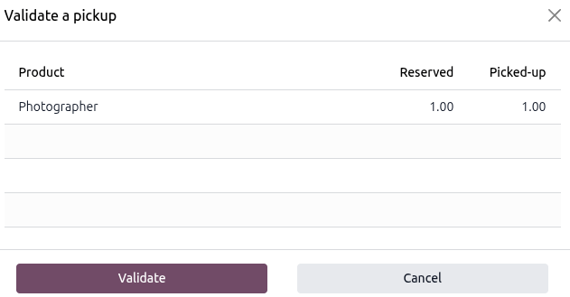

Doing so places a :guilabel:`Picked-up` status banner on the rental order.

Return products
===============

Regardless if there is a product rented along with a service, the service or product must be
returned on the rental order.

When a customer returns the products or when the service has been completed, navigate to the
appropriate rental order and click :guilabel:`Return`. Validate the return by clicking
:guilabel:`Validate` in the :guilabel:`Validate a return` pop-up form that appears.

.. image:: service_products/validate-a-return-window.png
   :alt: Sample of returning a service product in the Rental app.

Doing so places a :guilabel:`Returned` status banner on the rental order.

.. example::
   The photography studio had a customer who wanted to rent one of their photographers and banner
   decorations for a home photo shoot. The booking was for two hours.

   On the :guilabel:`Validate a return` form the rental order, the banner line item matches number
   of banners picked up and the photographer line item matches the number of hours submitted on the
   :guilabel:`Timesheets` tab on the related task.

   .. image:: service_products/return-form-example-product-service.png
      :alt: Sample of a Validate a return form with a rental product and service listed.
