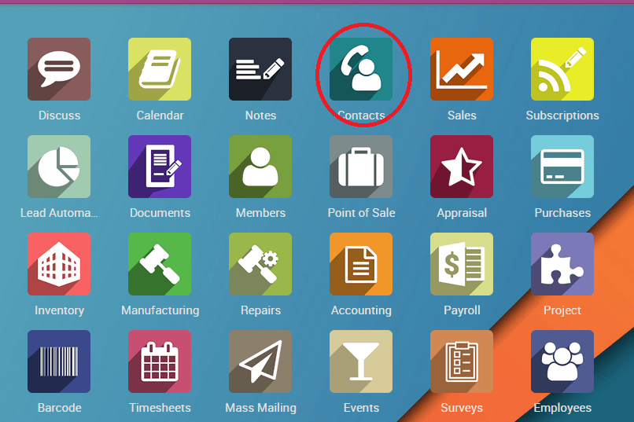
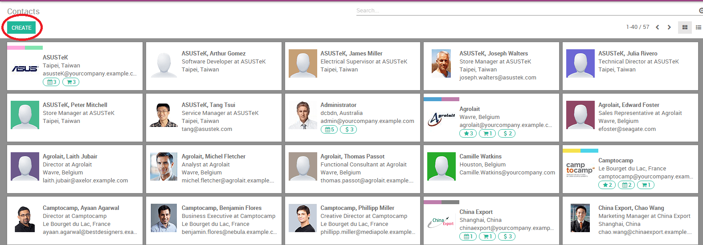
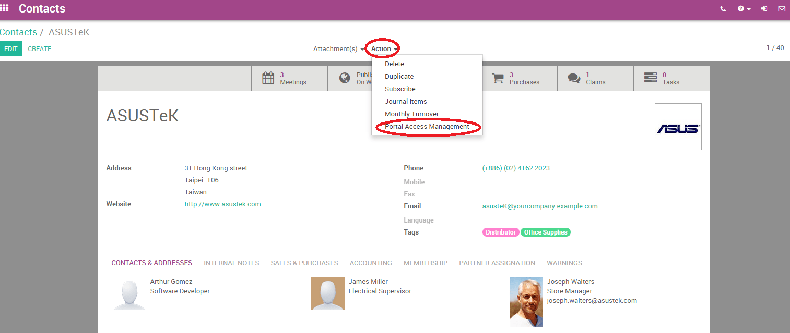
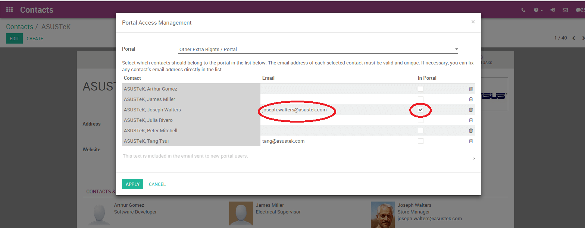

=================================================
How to give portal access rights to my customers?
=================================================

What is Portal access/Who is a portal user?
============================================

A portal access is given to a user who has the necessity to have access
to Odoo instance, to view certain documents or information in the
system.

For Example, a long term client who needs to view online quotations.

A portal user has only read/view access. He or she will not be able to
edit any document in the system.

How to give portal access to customers?
=======================================

From Contacts Module
--------------------

From the main menu, select **Contacts** menu. If the contact is not
yet created in the system, click on the create button to create
new contact. Enter details of the contact and click "save".

Choose a contact, click on the **Action** menu in the top-center of
the interface and from the drop down.

Select **Portal Access Management**. A pop up window appears.

Enter the login **email ID**, check the box under **In Portal** and
add the content to be included in the email in the text field box below. Click on **Apply** when you're done.

An email will be sent to the specified email address, indicating that
the contact is now a portal user of the respective instance.
