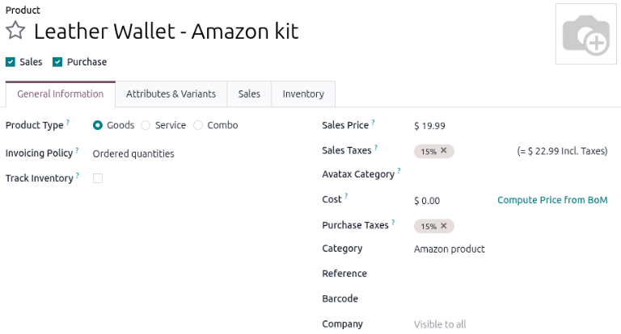
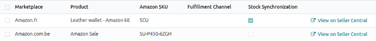
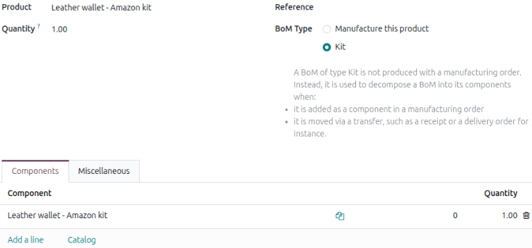

======================================================
Tracking lot or serial number products with FBA orders
======================================================

.. |FBA| replace:: :abbr:`FBA (Fulfilled by Amazon)`

When selling products tracked by lots or unique serial numbers via the Fulfilled By Amazon
:abbr:`FBA (Fulfilled by Amazon)` feature, Amazon's API does not send the specific lot or unique
serial number used for the sale. The lack of information triggers a synchronization failure in Odoo.

To successfully set up an Amazon :abbr:`FBA (Fulfilled by Amazon)` order, configure a :ref:`product
kit <amazon_connector/fba/product-kit>` in Odoo based on the original Amazon product. When a new
|FBA| order syncs, Odoo sells the product kit, which prevents the error that occurs with the tracked
product.

When :ref:`resupplying the Amazon Fulfillment center <amazon_connector/fba/follow-deliveries>`,
transfer the tracked product to the `WH/Amazon` location. This records the movement in traceability
reports and accounts for inventory consumption at the point of transfer rather than the point of
sale.

.. note::
   The `WH/Amazon` location is automatically created as a default location when the first Amazon
   account is linked.

Under this system, the quantity of the product kits remains negative indefinitely. Treat this as a
standard byproduct of the bypass, as the actual stock levels are managed through the initial
fulfillment center transfer.

.. important::
   This setup does not track the specific lot or unique serial number used for the sale. It only
   ensures that the |FBA| order can be processed without synchronization failures.

Settings
========

The following apps are essential for the product kit workflow:

- **Sales app**: Enables :ref:`connecting an Amazon Seller account to Odoo <amazon/setup>`.
- **Inventory app**: Allows for product replenishment by :ref:`warehouse location
  <use_locations/configuration>`.
- **Manufacturing app**: Enables :ref:`BoM creation <manufacturing/basic-setup/bom-setup>` for
  products and product kits.

.. _amazon_connector/fba/product-kit:

Create a product kit
====================

To enable accurate tracking, create a product kit for the existing Amazon product. When a new |FBA|
order syncs, Odoo sells the kit, which prevents the error that occurs with the tracked product.

Navigate to :menuselection:`Sales app --> Products --> Products` and click :guilabel:`New`. Then,
:ref:`create a kit as a product <manufacturing/adv-configuration/kits>` that represents the Amazon
item.

.. important::
   *Never* enable :guilabel:`Track Inventory` for the product kit.

.. _amazon_connector/fba/link-amazon-sku:

Link the Amazon item SKU to the product kit
-------------------------------------------

Next, go to the :menuselection:`Sales app --> Configuration --> Offers` and click :guilabel:`New`.
Enter the desired :ref:`Amazon market <amazon/supported-marketplaces>` in the
:guilabel:`Marketplace` column, and select the product kit in the :guilabel:`Product` column. In the
:guilabel:`Amazon SKU` column, enter the SKU of the existing Amazon product.

.. note::
   This method removes the link between the Amazon SKU and the tracked product. Breaking this
   connection is necessary because Odoo cannot automatically assign specific tracking numbers during
   the sync process.

   Keeping this link active causes a synchronization failure for every |FBA| order. By
   disconnecting them, the system bypasses the tracking requirement and allows the sync to complete.

.. _amazon_connector/fba/create-bom-for-kit:

Create the BoM for the product kit
----------------------------------

Navigate to the product kit by clicking the :menuselection:`Sales app --> Products --> Products` and
select the product kit. Click the :icon:`fa-flask` :guilabel:`Bill of Materials` smart button and
:ref:`create a kit BoM <manufacturing/adv-configuration/kit-bom>`.

In the :guilabel:`Components` tab, click :guilabel:`Add a line` and type in the name of the Amazon
product that is tracked by lots or a unique serial number.

.. important::
   The Amazon product must be **the sole component** of the kit BoM.

Now the Amazon product can be processed and tracked accurately in the **Sales** app by using the kit
product and its associated BoM.
