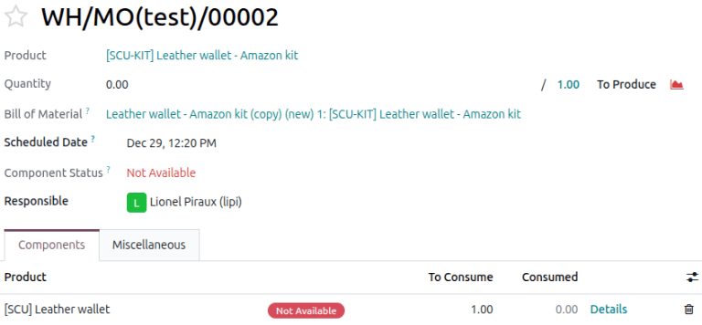
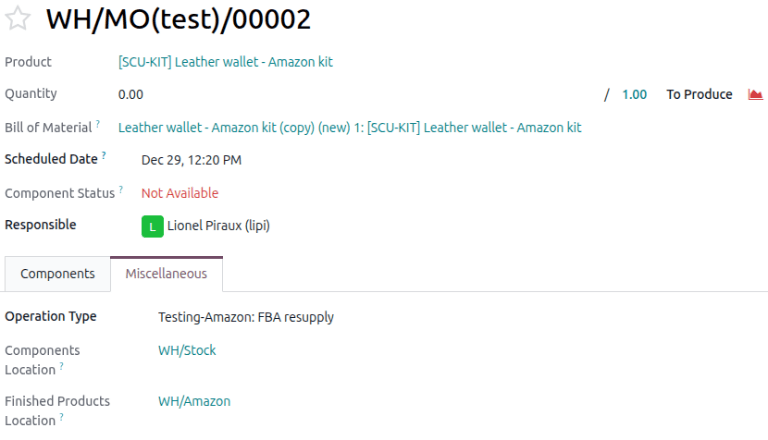

======================================================
Tracking lot or serial number products with FBA orders
======================================================

When selling products tracked by lots or unique serial numbers via the Fulfilled By Amazon
:abbr:`FBA (Fulfilled by Amazon)`, Amazon's API does not send the specific lot or unique serial
number used for the sale. The lack of information prevents the Odoo Amazon connector from validating
the required stock move, which, in turn, prevents the creation of the :abbr:`Sales Order (SO)`.

To enable product tracking via Amazon :abbr:`FBA (Fulfilled by Amazon)` orders, the user must
configure a :ref:`kit product <amazon_connector/fba/kit-product>` in Odoo based on the original
Amazon product and :ref:`manage its stock replenishment <amazon_connector/fba/stock-replenishment>`.

Settings
========

The following apps are essential for the kit product workflow:

- **Sales app**: Enables :ref:`connecting of an Amazon Seller account to Odoo <amazon/setup>`.
- **Inventory app**: Allows for product tracking and replenishment by :ref:`warehouse location
  <use_locations/configuration>` and through :ref:`lots and serial numbers
  <inventory/product_management/enable-lot-serial>`.
- **Manufacturing app**: Enables :ref:`BoM creation <manufacturing/basic-setup/bom-setup>` for
  products and kit products, and replenishment of kit product stock via the default operation type.

.. _amazon_connector/fba/kit-product:

Create a kit product
====================

To enable accurate tracking, create a kit product for the existing Amazon product. When a new FBA
order syncs, Odoo sells the kit, which automatically triggers consumption of the Amazon prodcust
that is tracked by lot or unique serial number. This process bypasses the validation error.

Navigate to :menuselection:`Sales app --> Products --> Products` and click :guilabel:`New`. Then,
:ref:`create a kit as a product <manufacturing/adv-configuration/kits>` that represents the Amazon
item. Select the :guilabel:`By Quantity` option for :guilabel:`Track Inventory`.

.. important::
   **Never** use :guilabel:`By Lots` or :guilabel:`By Unique Serial Number` tracking for the kit
   product.

.. image:: fba/kit-product-form.png
   :alt: Example of a product form configured to be a kit in the Inventory app.

Link the Amazon item SKU to the kit product
-------------------------------------------

Next, go to the :menuselection:`Sales app --> Configuration --> Offers` and click :guilabel:`New`.
Enter the desired Amazon market in the :guilabel:`Marketplace` column, and select the kit product in
the :guilabel:`Product` column. In the :guilabel:`Amazon SKU` column, enter the SKU of the existing
Amazon product.

.. image:: fba/link-amazon-sku.png
   :alt: Example of a kit product linked to an Amazon SKU in the Offers page in the Sales app.

Create the BoM for the kit product
----------------------------------

Navigate to the kit product by clicking the :menuselection:`Sales app --> Products --> Products` and
select the kit product. Click on the :icon:`fa-flask` :guilabel:`Bill of Materials` icon.
:ref:`Create a kit BoM <manufacturing/adv-configuration/kit-bom>`.

In the :guilabel:`Components` tab, click :guilabel:`Add a line` and type in the name of the Amazon
product that is tracked by lots or a unique serial number.

.. important::
   The Amazon product must be **the sole component** of the kit BoM.

.. image:: fba/amazon-product-bom-kit.png
   :alt: Example of the kit BoM for the kit product to represent the Amazon listing.

Now the Amazon product can be processed and tracked accurately in the **Sales** app by using the kit
product and its associated BoM.

.. _amazon_connector/fba/stock-replenishment:

Stock replenishment
===================

Do **not** use standard internal transfers, WH/Stock to WH/Amazon, for Amazon FBA kit products.
These transfers fail because the Amazon API does not support lot or serial number tracking.
Additionally, Odoo incorrectly moves individual components rather than the kit itself, resulting in
inventory errors.

Use a :abbr:`MO(Manufacturing Order)` for replenishment instead. The following workflow ensures that
stock adjusts correctly in the Amazon location.

Create a second BoM to manufacture
----------------------------------

Navigate to :menuselection:`Sales app --> Products --> Products`. Select the kit product,
:ref:`create a second BoM <manufacturing/basic-setup/bom-setup>`, and set the :guilabel:`BoM Type`
to :guilabel:`Manufacture this product`.

In the :guilabel:`Components` tab, click :guilabel:`Add a line`, then type the name of the Amazon
product that is tracked by lot or unique serial number.

.. important::
   The Amazon product must be **the sole component** of the BoM.

.. image:: fba/amazon-product-bom-manufacture.png
   :alt: Example of the BoM manufacture type for the Amazon product.

Create a Manufacturing Order (MO)
---------------------------------

The :abbr:`MO(Manufacturing Order)` consumes the Amazon listing that is tracked by lot or unique
serial number from the main WH/Stock and "builds" the non-tracked kit product directly into the
WH/Amazon location, correctly representing the Amazon FBA stock.

Navigate to :menuselection:`Manufacturing app --> Operations --> Manufacturing Orders` and click
:guilabel:`New`. Create a :ref:`new Manufacturing Order
<manufacturing/one-step-manufacturing/create-mo>` for the desired quantity of the kit product.

Click the :guilabel:`Miscellaneous` tab and hover over the :guilabel:`Operation Type` field. Click
the :icon:`oi-arrow-right` :guilabel:`Internal link` icon when it appears to open the default
:guilabel:`Manufacturing` operation type.

Click the :icon:`fa-cog` :guilabel:`Action` icon, then select :guilabel:`Duplicate`. Rename the copy
:guilabel:`Operation Type` to "FBA resupply". In the :guilabel:`Locations` section, choose
:guilabel:`WH/Amazon` from the :guilabel:`Destination Location` drop-down menu.

.. image:: fba/fba-operation-type.png
   :alt: Example of the Operation Type form for the FBA resupply workflow.

Navigate to the kit product BoM configured for manufacturing via the breadcrumbs, then click the
:guilabel:`Miscellaneous` tab. Select :guilabel:`YourCompany:FBA resupply` as the
:guilabel:`Operation Type`.

Finally, click :guilabel:`Confirm` to confirm the :abbr:`MO(Manufacturing Order)`.
