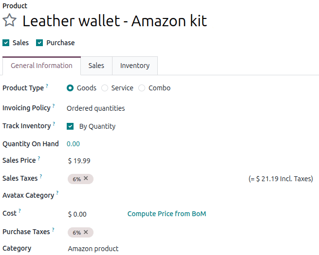
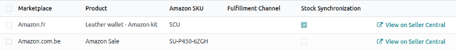
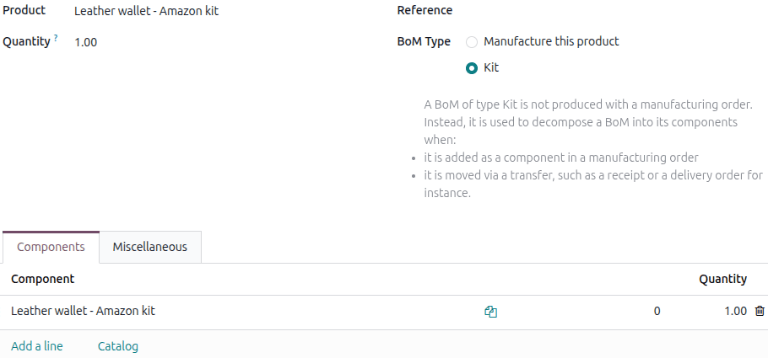
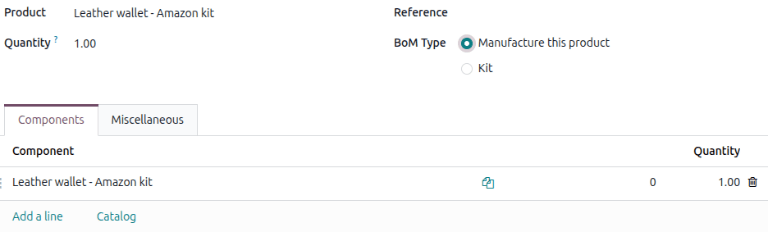
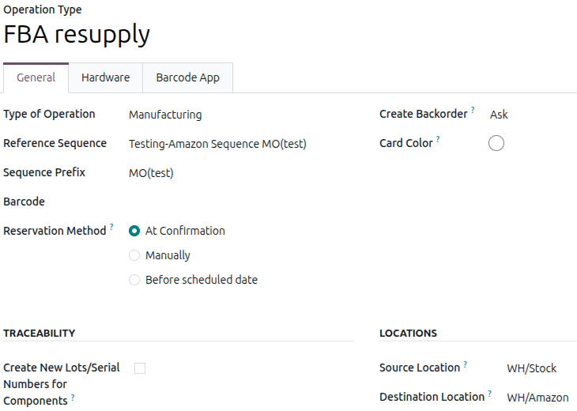

===================================================
Tracking lot/serial number products with FBA orders
===================================================

When selling products tracked by serial numbers or lots via the Fulfilled By Amazon :abbr:`FBA
(Fulfilled by Amazon)`, Amazon's API does not send the specific serial numbers or lots used for the
sale. The lack of information prevents the Odoo Amazon connector from validating the required stock
move, which consequently prevents the creation of the :abbr:`Sales Order (SO)`.

To enable product tracking via Amazon :abbr:`FBA (Fulfilled by Amazon)` orders, the user must
configure a :ref:`kit product <amazon_connector/fba/kit-product>` in Odoo and :ref:`manage stock
replenishment <amazon_connector/fba/stock-replenishment>` for it.

Settings
========

The following apps are essential for the kit product workflow:

- **Sales app**: Enables :ref:`connecting of an Amazon Seller account to Odoo <amazon/setup>`.
- **Inventory app**: Allows for product tracking and replenishment by :ref:`warehouse location
  <use_locations/configuration>` and through :ref:`lots and serial numbers
  <inventory/product_management/enable-lot-serial>`.
- **Manufacturing app**: Enables :ref:`BoM creation <manufacturing/basic-setup/bom-setup>` for
  products and kit products, and replenishment of kit product stock via the default operation type.

.. _amazon_connector/fba/kit-product:

Create the kit product
======================

To enable accurate tracking, create a kit product that represents the Amazon listing. When a new FBA
order syncs, Odoo sells the kit product, which triggers consumption of the lot or
serial-number-tracked Amazon product, bypassing the validation error.

Navigate to :menuselection:`Sales app --> Products --> Products` and click :guilabel:`New`. Then,
:ref:`create a kit as a product <manufacturing/adv-configuration/kits>` that represents the Amazon
item. Select the :guilabel:`By Quantity` option for :guilabel:`Track Inventory`.

.. important::
   **Never** use :guilabel:`By Lots` or :guilabel:`By Unique Serial Number` tracking for this
   product.

Link the Amazon item SKU
------------------------

Next, go to the :menuselection:`Sales app --> Configuration --> Offers` and click :guilabel:`New`.
Enter in the desired Amazon market in the :guilabel:`Marketplace` column, and in the
:guilabel:`Product` column, select the Odoo kit product. In the :guilabel:`Amazon SKU` column, enter
the SKU for the desired Amazon item.

    app.

Create the BoM for the kit product
----------------------------------

Navigate to the kit product by clicking the :menuselection:`Sales app --> Products --> Products` and
select the kit product. Click on the :icon:`fa-flask` :guilabel:`Bill of Materials` icon.
:ref:`Create a kit BoM <manufacturing/adv-configuration/kit-bom>`.

In the :guilabel:`Components` tab, click :guilabel:`Add a line` and type in the name of the Odoo kit
product.

.. important::
   The Odoo kit product must be **the sole component** of the kit.

.. _amazon_connector/fba/stock-replenishment:

Stock replenishment
===================

Do not use standard internal transfers, WH/Stock to WH/Amazon, for Amazon FBA kit products. These
transfers fail because the Amazon API does not support lot/serial number tracking. Additionally,
Odoo incorrectly moves individual components rather than the kit itself, resulting in inventory
errors.

Use a :abbr:`MO(Manufacturing Order)` for replenishment instead. The following workflow ensures that
stock adjusts correctly in the Amazon location.

Create a second BoM to manufacture
----------------------------------

Navigate to :menuselection:`Sales app --> Products --> Products`. Select the kit product,
:ref:`create a second BoM <manufacturing/basic-setup/bom-setup>`, and set the :guilabel:`BoM Type`
to :guilabel:`Manufacture this product`.

In the :guilabel:`Components` tab, click :guilabel:`Add a line` and type in the name of the Odoo kit
product.

.. important::
   The Odoo kit product must be **the sole component** of the kit.

Create a Manufacturing Order (MO)
---------------------------------

The :abbr:`MO(Manufacturing Order)` consumes the lot/serial number-tracked Amazon listing from the
main WH/Stock and "builds" the non-tracked kit product directly into the WH/Amazon location,
correctly representing the Amazon FBA stock.

Navigate to :menuselection:`Manufacturing app --> Operations --> Manufacturing Orders` and click
:guilabel:`New`. Create a :ref:`new Manufacturing Order
<manufacturing/one-step-manufacturing/create-mo>` for the desired quantity of the kit product.

Click the :guilabel:`Miscellaneous` tab and hover over the :guilabel:`Operation Type` field. Click
the :icon:`oi-arrow-right` :guilabel:`Internal link` icon when it appears to open the default
:guilabel:`Manufacturing` operation type.

Click the :icon:`fa-cog` :guilabel:`Action` icon, then select :guilabel:`Duplicate`. Rename the copy
:guilabel:`Operation Type` to "FBA resupply". In the :guilabel:`Locations` section, choose
:guilabel:`WH/Amazon` from the :guilabel:`Destination Location` drop-down menu.

Navigate to the kit product BoM configured for manufacturing via the breadcrumbs, then click the
:guilabel:`Miscellaneous` tab. Select :guilabel:`YourCompany:FBA resupply` as the
:guilabel:`Operation Type`.
