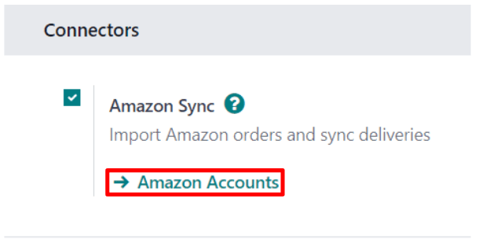

==============================
Amazon Connector configuration
==============================

Odoo allows users to register an Amazon seller account in the database, but the user **must** have
a paid Amazon Seller account prior to completing the configuration.

Set up a paid Seller account on Amazon by first logging into the Amazon platform, and navigating to
:menuselection:`Account \& Lists --> Start a Selling Account` from the drop-down menu located in
the header section.

Then on the :guilabel:`Sell with Amazon` page, follow the sign-up process and finally proceed to
follow the instructions below to register and link that Amazon Seller account in Odoo.

.. seealso::
   `Sell with Amazon <https://www.amazon.com/b/?node=12766669011>`_

Connect Amazon Seller account to Odoo
=====================================

.. _amazon/setup:

To connect an Amazon Seller account in Odoo, navigate to :menuselection:`Sales app -->
Configuration --> Settings --> Connectors section`, activate the :guilabel:`Amazon Sync` feature,
and click :guilabel:`Save`.

Then, return to :menuselection:`Sales app --> Configuration --> Settings --> Connectors section`,
and click on the :guilabel:`Amazon Accounts` link under the :guilabel:`Amazon Sync` setting.

Doing so reveals a separate :guilabel:`Amazon Accounts` page. From here, click :guilabel:`New` to
create and link a new Amazon account.

On the blank :guilabel:`Amazon Account` form page, start by choosing a name for the account (e.g.
`American Marketplace`). Then, in the :guilabel:`Credentials` tab, select the marketplace on which
the seller account was initially created from the :guilabel:`Home Marketplace` drop-down menu.

.. image:: setup/amazon-accounts-form-page.png
   :align: center
   :alt: A typical Amazon Account form page in the Odoo Sales application.

After saving, the field in the :guilabel:`Credentials` tab is replaced by a :guilabel:`Link with
Amazon` button.

.. image:: setup/amazon-accounts-form-link-button.png
   :align: center
   :alt: A typical Amazon Account form page and Link with Amazon button in Odoo Sales.

Clicking that button redirects to either the Amazon login page, or directly to the required consent
page, if the user is already logged in to Amazon.

On the login page, log in to the desired Amazon seller account.

On the consent page, confirm that Amazon is allowed to give Odoo access to the account and related
data.

Upon confirmation, Amazon returns the user to Odoo, and the account has been registered.

With the Amazon account successfully registered, the marketplaces available to this specific account
are synchronized with Odoo and listed under the :guilabel:`Marketplaces` tab.

If desired, remove items from the list of synchronized marketplaces to disable synchronization.

Amazon orders in Odoo
=====================

When an Amazon order is synchronized, up to three line items are created on the sales order in Odoo.
Each one represents a product sold on Amazon: one for the product that was sold on Amazon
Marketplace, one for the shipping charges (if any), and one for the gift wrapping charges (if any).

.. _amazon/matching:

The selection of a database product for a sales order item is done by matching its
:guilabel:`Internal Reference` (a customizable product reference idenifier in Odoo, like `FURN001`)
with the Amazon *SKU* for marketplace items, the Amazon *Shipping Code* for delivery charges, and
the Amazon *Gift Wrapping* code for gift wrapping charges.

For marketplace products, pairings are saved as *Amazon Offers*, which are listed under the
:guilabel:`Offers` smart button on the account form.

.. image:: setup/amazon-offers-button.png
   :align: center
   :alt: The Amazon Offers smart button on the account form in Odoo Sales.

Offers are automatically created when the pairing is established, and they're used for subsequent
orders to lookup SKUs. If no offer with a matching SKU is found, :ref:`the internal reference is
used instead <amazon/matching>`.

.. tip::
   It's possible to force the pairing of a marketplace item with a specific product, by changing
   either the product or the SKU of an offer to ensure they match. The offer can be manually created
   if it was not automatically done yet.

   This is useful if the internal reference is not used as the SKU, or if the product sells under
   different conditions.

If no database product with a matching internal reference is found for a given Amazon SKU or gift
wrapping code, then a default database product, *Amazon Sale*, is used. The same is done with the
default product *Amazon Shipping* if no database product is found for a given Amazon shipping code.

.. note::
   To modify default products, activate the :ref:`developer mode <developer-mode>`, and navigate to
   :menuselection:`Sales app --> Configuration --> Settings --> Connectors --> Amazon Sync -->
   Default Products`.

Product tax configuration
=========================

To allow for tax reporting of Amazon sales with Odoo, the taxes applied to the sales order items are
those set on the product, or determined by the fiscal position.

Make sure to have the correct taxes set on your products in Odoo, or have it done by a fiscal
position, to avoid discrepancies in the subtotals between *Amazon Seller Central* and Odoo.

.. note::
   As Amazon does not necessarily apply the same taxes as those configured in Odoo, it may happen
   that order totals differ by a few cents between Odoo and *Amazon Seller Central*. Those
   differences can be resolved with a write-off when reconciling the payments in Odoo.

.. _amazon/add-new-marketplace:

Add a new marketplace
=====================

All marketplaces are supported by the Amazon Connector. To add a new marketplace, proceed as
follows:

#. Activate the :ref:`developer mode <developer-mode>`.
#. Go to :menuselection:`Sales app --> Configuration --> Settings --> Connectors --> Amazon Sync -->
   Amazon Marketplaces`.
#. Click :guilabel:`New` to create a new marketplace record.
#. Enter the Marketplace ID in the :guilabel:`API Idenifier` field, and select the :guilabel:`Amazon
   Region` for your marketplace as described in the `Amazon Documentation for marketplace IDs and
   regions <https://developer-docs.amazon.com/amazon-shipping/docs/marketplace-ids>`_, and the
   :guilabel:`Seller Central URL` as described in the `Amazon Documentation for seller central URLs
   <https://developer-docs.amazon.com/amazon-shipping/docs/seller-central-urls>`_.
#. Set the :guilabel:`Name` of the record to `Amazon.<country code>` to easily retrieve it (e.g.
   `Amazon.se`). The :guilabel:`API Identifier`, the :guilabel:`Region` and the :guilabel:`Seller
   Central URL` fields should respectively hold the *Marketplace ID*, the selected Amazon region,
   and the *Seller Central URL* values from the Amazon Documentation.
#. Once the marketplace is saved, update the Amazon Account configuration by going to
   :menuselection:`Sales app --> Configuration --> Settings --> Connectors --> Amazon Sync -->
   Amazon Accounts`.
#. Select the account on which to use the new marketplace, go to the :guilabel:`Marketplaces` tab,
   and click on :guilabel:`Update available marketplaces`. An animation should confirm the success
   of the operation. Newly added marketplaces are automatically added to the list of synchronized
   marketplaces. If the new marketplace is not added to the list, it means that it is either
   incompatible or unavailable for the seller account.

.. seealso::
   - :doc:`features`
   - :doc:`manage`
