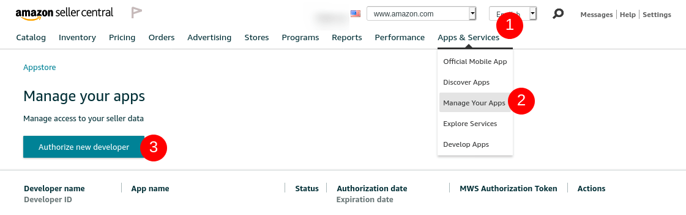
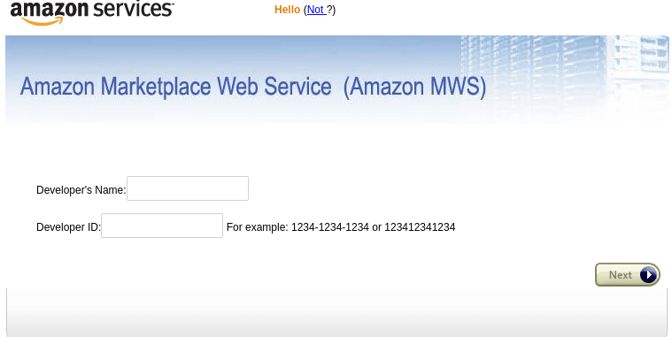

==================================
Configure Amazon Connector in Odoo
==================================

Generate an Authorization Token in Seller Central
=================================================

.. _amazon/generate_auth_token:

The Amazon Connector uses an Authorization Token that allows Odoo to fetch data from your Amazon
Seller Central account. This token can be obtained directly through Seller Central in a few clicks
and needs to be set up in your Odoo database configuration.

Connect to your Seller Central account for the marketplace you initially signed
up (e.g. if you created your account on Amazon Germany, go to `Amazon Seller
Central for Germany <https://sellercentral.amazon.de>`_) with an administrator account.

.. note::
  You might need to use the *main* (or first) administrator account and not one
  added subsequently.

In the main menu, select :menuselection:`Apps & Services --> Manage Your Apps`;
in the page that displays, click on the ``Authorize new developper`` button:

Fill in the form depending on your Marketplace:

If your seller account is registered in the **North America** region, use these values:

- Developer's Name: ``Odoo S.A.``
- Developer ID: ``586127723692``

For the **Europe** region, use these values:

- Developer's Name: ``Odoo S.A.``
- Developer ID: ``579095187166``

Amazon will then inform you that by submitting the form, you are giving access
to your Seller Central Information to Odoo S.A.

.. note::
    Odoo S.A. is unable to access your Amazon account's information without the
    Authorization Token which is stored in your Odoo database - we do not store
    these tokens on our platform directly and are therefore unable to access
    your account's information outside of the Amazon Connector normal flows.

Register your Amazon account in Odoo
====================================

.. _amazon/setup:

To register your seller account in Odoo, navigate to :menuselection:`Sales --> Configuration
--> Settings --> Connectors --> Amazon Sync --> Amazon Accounts` and click on **CREATE**.

The **Seller ID** can be found in Seller Central under the link **Your Merchant Token** on the
**Seller Account Information** page. The **Authorization Token** is the one you generated in the
:ref:`previous step <amazon/generate_auth_token>`.

Upon saving, your credentials are checked. In case of issues, an error will be displayed - the
information cannot be saved until your credentials are recognized by Amazon.

Once the account is registered, the marketplaces available to this account are synchronized and
listed under the **Marketplaces** tab. If you wish, you can remove some items from the list of
synchronized marketplaces to disable their synchronization.

Match database products in Amazon
=================================

When an Amazon order is synchronized, up to three sales order items are created in Odoo for each
product sold on Amazon: one for the marketplace product, one for the shipping charges (if any) and
one for the gift wrapping charges (if any).

.. _amazon/matching:

The selection of a database product for a sales order item is done by matching its
**internal reference** with the **SKU** for marketplace items, the **shipping code** for delivery
charges, and the **gift wrapping** code for gift wrapping charges.

For marketplace products, pairings are saved as **Amazon Offers** which are listed under the
**Offers** stat button on the account form. Offers are automatically created when the pairing is
established and are used for subsequent orders to lookup SKUs. If no offer with a matching SKU is
found, :ref:`the internal reference is used instead <amazon/matching>`.

.. tip::
   It is possible to force the pairing of a marketplace item with a specific product by changing
   either the product or the SKU of an offer. The offer can be manually created if it was not
   automatically done yet. This is useful if you do not use the internal reference as the SKU or if
   you sell the product under different conditions.

If no database product with a matching internal reference is found for a given SKU or gift wrapping
code, a default database product **Amazon Sale** is used. The same is done with the default product
**Amazon Shipping** and the shipping code.

.. note::
   To modify the default products, activate the :ref:`developer mode <developer-mode>` and navigate
   to :menuselection:`Sales --> Configuration --> Settings --> Connectors --> Amazon Sync -->
   Default Products`.

Configure taxes of products
===========================

To allow for tax reporting of Amazon sales with Odoo, the taxes applied to the sales order items are
those set on the product or determined by the fiscal position. Make sure to have set the correct
taxes on your products in Odoo or to have it done by a fiscal position, to avoid discrepancies in
the subtotals between Seller Central and Odoo.

.. note::
   As Amazon does not necessarily apply the same taxes as those configured in Odoo, it may happen
   that order totals differ by a few cents from that on Seller Central. Those differences can be
   resolved with a write-off when reconciling the payments in Odoo.

.. _amazon/add-unsupported-marketplace:

Add an unsupported marketplace
==============================

Some Amazon Marketplaces, such as Amazon Brazil, are not officially supported by Odoo but might be
compatible with your seller account. These marketplaces can be added manually should you wish to use
them. See :ref:`here <amazon/supported-marketplaces>` for the exhaustive list of natively supported
marketplaces.

.. tip::
   To find out if a marketplace is eventually compatible, check the `Amazon Documentation
   <https://docs.developer.amazonservices.com/en_US/dev_guide/DG_Endpoints.html>`_. The marketplace
   must belong to the same region as that of your seller account.

To add a new marketplace, you must first activate the :ref:`developer mode <developer-mode>`.

Once that is done, go to :menuselection:`Sales --> Configuration --> Settings --> Connectors -->
Amazon Sync --> Amazon Marketplaces`.

From there, you can create a new marketplace record. You will need the Marketplace ID and Endpoint
for your marketplace as described in the `Amazon Documentation
<https://docs.developer.amazonservices.com/en_US/dev_guide/DG_Endpoints.html>`_.

Set the name of the record to ``Amazon.<domain>`` to easily retrieve it (for instance:
``Amazon.se``). The **Code**, **Domain** and **API Identifier** fields should respectively hold
the *Country Code*, *Amazon MWS Endpoint* and *MarketplaceId* values from the Amazon Documentation.

Once the marketplace is saved, you should then update the Amazon Account configuration by going to 
:menuselection:`Sales --> Configuration --> Settings --> Connectors --> Amazon Sync -->
Amazon Accounts`, open the account on which you wish to use the new marketplace, go to the
**Marketplaces** tab and click on **Update available marketplaces** (an animation should confirm the
success of the operation). Newly added marketplaces are automatically added to the list of
synchronized marketplaces. If the new marketplace is not added to the list, it means that it is
either incompatible or unavailable for your seller account.

.. important::
   As manually added marketplaces are not officially supported by Odoo, there is no guarantee that
   adding one as described above will work, nor can this be considered as a bug when contacting Odoo
   Support.

.. seealso::
   - :doc:`features`
   - :doc:`manage`
