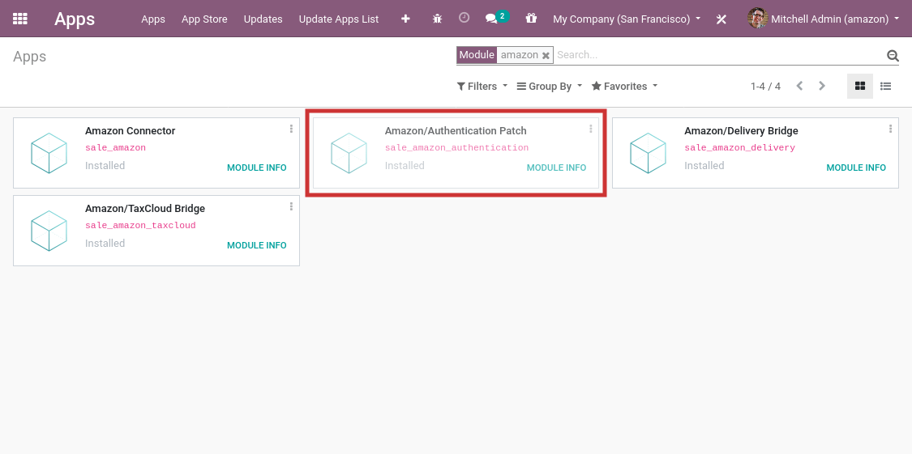

==================================================
Install the Amazon Connector Authentication Update
==================================================

Starting July 2020, the Amazon Connector requires the use of a new authentication
method that makes it easier for you to set up the Connector.

Prior to the update, Odoo customers who wished to use the Amazon Connector had
to apply to get developer credentials through Amazon, which was a painful and long
process that could take weeks. This method of authentication is still technically
possible, but Amazon will refuse to provide developer credentials for Odoo customers
from July 2020 onwards and will deactivate such credentials for existing customers.

This documentation will help you install the update and use the new authentication
flow.

Note that if your Odoo database was first created after the update was released, the
update module is installed automatically. You can check if this module is already installed
by going to the  **Apps** menu, removing the ``Apps`` search facet and search for ``amazon``.
If the module **Amazon/Authentication Patch** is present and marked as installed, your Odoo
database is already up-to-date and you can proceed with the :doc:`setup <setup>` step
of the Amazon Connector.

Update Odoo to the latest release
=================================

The new authentication mechanism is made available through a new Odoo module; to
be able to install it, you must make sure that your Odoo source code is up-to-date.

If you use Odoo on Odoo.com or Odoo.sh platform, your code is already up-to-date and
you can proceed to the next step.

If you use Odoo with an on-premise setup or through a partner, then you must update
your installation as detailed in
:doc:`this documentation page </administration/update>`
or by contacting your integrating partner.

Update the list of available modules
====================================

New modules must be *discovered* by your Odoo instance to be available in the **Apps**
menu.

To do so, activate the :ref:`developer mode <developer-mode>`, and go to :menuselection:`Apps -->
Update Apps List`. A wizard will ask for confirmation.

Install the Amazon/Authentication Patch
=======================================

.. warning::
    You should never install new modules in your production database without testing
    them in a duplicate or staging environment. For Odoo.com customers, a duplicate database
    can be created from the database management page as explained in 
    :doc:`this documentation page </administration/db_management/db_online>`. For
    Odoo.sh users, you should use a staging or duplicate database. For on-premise users,
    you should use a staging environment - you should contact your integrating partner for
    more information regarding how to test a new module in your particular setup.

The module should now be available in your **Apps** menu. Remove the ``Apps`` search facet
and search for ``amazon``; the module **Amazon/Authentication Patch** should be available for
installation. If you cannot find the module after having updated the list of available
modules, it means your Odoo source code is not up-to-date; refer to step one of this
page.

Once the module is installed, you will need to generate an Authorization Token in Amazon
Seller Central and set it up on your Amazon Account in Odoo; this process is detailed
in the :doc:`setup <setup>` page.

.. seealso::
   - :doc:`features`
   - :doc:`setup`
   - :doc:`manage`