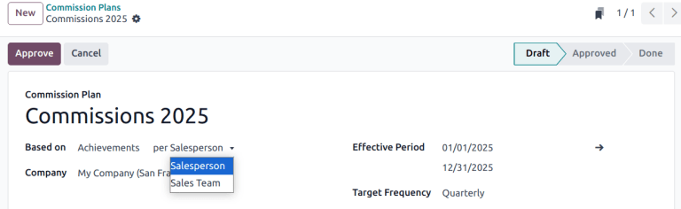

===========
Commissions
===========

.. |SOs| replace:: :abbr:`SOs (Sales Orders)`

Commissions are a powerful tool to motivate sales team members. They incentivize performance, boost
productivity, and encourage healthy competition. The *Commissions* feature in Odoo's **Sales**
application provides a way to reward salespeople or sales teams based on their performance. This
feature supports the creation of flexible, measurable commission structures that align with business
goals, whether that means driving revenue, volume, profit, or recurring contracts.

Configuration
=============

To enable the *Commissions* feature, navigate to :menuselection:`Sales app --> Configuration -->
Settings`. Scroll to the :guilabel:`Invoicing` section, and tick the :guilabel:`Commissions`
checkbox. Then, click :guilabel:`Save`. Doing so causes a new :guilabel:`Commissions` menu to appear
in the menu bar. To create a new commission plan, navigate to :menuselection:`Commissions -->
Comission Plans` and click :guilabel:`New`.

Commission plan structure
=========================

Each commission plan is comprised of several components:

- :guilabel:`Based on`: Determines whether commissions are awarded based on progress toward
  :guilabel:`Targets` or :guilabel:`Achievements`
- :guilabel:`per`: Indicates whether the plan applies to individual salespeople or an entire sales
  team
- :guilabel:`Target Frequency`: Sets how often targets reset: **Monthly**, **Quarterly**, or
  **Yearly**.
- :guilabel:`Achievements`: Determines what is being measured toward commissions.

Target-based commission plans
-----------------------------

In a *Target* based commission plan, commissions are awarded based on the percentage of sales
targets reached. Target based plans are ideal for setting clear, measurable goals, such as invoicing
a specific amount in sales per quarter, then rewarding sales people progressively based on how close
they come to reaching or exceeding that goal.

.. tip::
   Target based plans differ from *Achievement* based plans because they are based on reaching a
   fixed, predefined goal. They focus on goal-based incentives and performance milestones.

To configure a new target based commission plan, navigate to the :menuselection:`Sales app -->
Commissions --> Commission Plans`, then click :guilabel:`New`. Click in the :guilabel:`Based on`
drop-down menu and select :guilabel:`Targets`. Then, select an option in the :guilabel:`per` field.

In the :guilabel:`On Target Commission` field, set the payout amount for reaching `100%` of the
target. Update the :guilabel:`Effective Period` fields to confirm the dates for this plan. Then,
update the :guilabel:`Target Frequency` field based on how often the targets should be set and
evaluated.

- *Monthly*: short term goals with frequent payouts.
- *Quarterly*: aligns with business cycles and provides mid-range objectives.
- *Yearly*: long term sales goals for strategic planning.

After the :guilabel:`Target Frequency` field is updated, the :guilabel:`Targets` tab updates with a
list of the appropriate time frame. For each :guilabel:`Period`, enter a :guilabel:`Target` goal.

On the :guilabel:`Achievements` tab, add one or more :ref:`Achievement metric
<sales/commissions/achievement-metric>` for this plan by clicking :guilabel:`Add a new achievement`.

Click the :guilabel:`Sales People` tab to assign this plan to the appropriate staff. Click either
:guilabel:`Add a new Sales Person` to add them individually, or :guilabel:`Add Multiple
Salespersons` to bulk add several at once.

.. note::
   The :guilabel:`Add Multiple Salespersons` button is only available if
   :doc:`../../general/developer_mode` is active.

Levels
------

To provide additional incentive, *commission levels* can be added to *Target* based plans. These
tiers allow salespeople to earn varying commission amounts based on their performance levels. Levels
can start at `0%` and increase incrementally. This allows for salespeople to earn commission even if
they do not achieve `100%` of the target, as well as the ability to achieve over `100%` of the
target. Commission levels can be set from the :guilabel:`Commissions` tab when creating a commission
plan.

If no levels are added above 100%, salespeople are **not** able to earn above the stated commission.

.. example::
   In the plan below, the levels start at `0%`, and continue until `300%`. If a salesperson exceeds
   `100%` of the expected target, their expected payout continues to increase up to `300%`.

   .. image:: commissions/commission-levels.png
      :alt: An example of commission levels, with levels above 100 percent.

Achievement-based commission plans
----------------------------------

In a *Achievement* based commission plan, salespeople earn a percentage of their invoice value as
commission. Target based plans are ideal for rewarding sales activity consistently, regardless of
specific goals. For example, offering a `5%` commission on all invoiced amounts, regardless of how
much is sold.

.. tip::
   Achievement based plans differ from *Target* based plans because they are calculated based on
   actual achievements using a flat, consistent rate. They are beneficial for ongoing, non-goal
   based compensation plans.

To configure a new target based commission plan, navigate to the :menuselection:`Sales app -->
Commissions --> Commission Plans`, then click :guilabel:`New`. Click in the :guilabel:`Based on`
drop-down and select :guilabel:`Achievements`. Then, select an option in the :guilabel:`per` field.

Update the :guilabel:`Effective Period` fields to confirm the dates for this plan. Then, update the
:guilabel:`Target Frequency` field based on how often the targets should be set and evaluated.

On the :guilabel:`Achievements` tab, add one or more :ref:`Achievement metric
<sales/commissions/achievement-metric>` for this plan by clicking :guilabel:`Add a new achievement`.

Click the :guilabel:`Sales People` tab to assign this plan to the appropriate staff. Click either
:guilabel:`Add a new Sales Person` to add them individually, or :guilabel:`Add Multiple
Salespersons` to bulk add several at once.

.. _sales/commissions/achievement-metric:

Achievements
------------

Performance can be measured in several ways in performance plans. These are configured in the
:guilabel:`Achievements` tab of each plan.

- :guilabel:`Amount Sold`: the total value of sales orders (SOs).
- :guilabel:`Amount Invoiced`: the total value of confirmed invoices.
- :guilabel:`Quantity Sold`: the total number of units sold via |SOs|.
- :guilabel:`Quantity Invoiced`: the total number of units invoiced.
- :guilabel:`Margin`: the profit margin (selling price minus cost price).
- :guilabel:`MRR`: the new *Monthly Recurring Revenue* from subscription sales. this option is
  **only** available if the :doc:`Subscriptions <../../sales/subscriptions>` app is installed.

.. note::
   Regardless of what the plan is :guilabel:`Based on`, each plan needs both *Achievements* and
   *Targets* configured.

Plan approval
=============

After confirming the details of the new plan, click :guilabel:`Approve`. This moves the plan from
the :guilabel:`Draft` stage into the :guilabel:`Approved` stage.

.. important::
   Commissions plans in the :guilabel:`Approved` stage **cannot** be edited. To edit an approved
   plan, it must first be :guilabel:`Reset to Draft`.

After a plan is approved, Odoo automatically tracks performance and calculates commissions based on
the established parameters.
