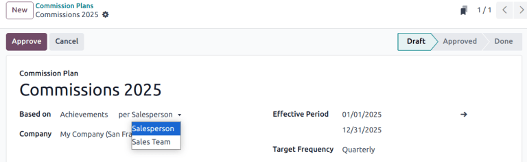

===========
Commissions
===========

Commissions are a powerful tool to motivate sales team members. They incentivize performance, boost
productivity, and encourage healthy competition. The **Sales** app allows companies to define
commission targets, and compute commission achievements.

Configuration
=============

To enable the *Commissions* feature, navigate to :menuselection:`Sales app --> Configuration -->
Settings` and tick the :guilabel:`Commissions` checkbox. Then, click :guilabel:`Save`. Doing so
causes a new :guilabel:`Commissions` menu to appear in the menu bar.

Setting up a commission plan
============================

To create a new commission plan, navigate to :menuselection:`Sales --> Commissions --> Commission
Plans --> New`. On the blank form, enter a title in the :guilabel:`Commission Plan` field. Then,
select what the plan should be :guilabel:`Based On` by choosing an option from the drop-down:

- With *Achievement* based commission plans, salespeople earn a percentage of their invoice value as
  commission.
- With *Target* based commission plans, commissions are awarded based on the percentage of sales
  targets reached.

Next, select whether the plan should be calculated based on the performance of each individual
salesperson, or the entire sales team. Choose the appropriate option from the drop-down.

Target frequencies define how often commission targets are set and evaluated.

- Monthly: short term goals with frequent payouts.
- Quarterly: aligns with business cycles and provides mid-range objectives.
- Yearly: long term sales goals for strategic planning.

Achievements
------------

Achievement plans
-----------------

Target plans
------------

Levels
~~~~~~

If no levels are added above 100%, salespeople are not able to earn above the stated commission.

.. example::
    In

    .. image:: commissions/commission-levels.png
       :alt: An example of commission levels, with levels above 100 percent.

Plan approval
=============

After confirming the details of the new plan, click :guilabel:`Approve`. This moves the plan from
the :guilabel:`Draft` stage into the :guilabel:`Approved` stage.

.. important::
   Commissions plans in the :guilabel:`Approved` stage **cannot** be edited. To edit an approved
   plan, it must first be :guilabel:`Reset to Draft`.

