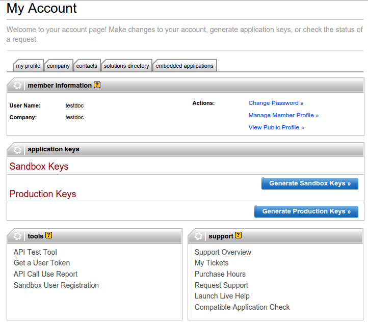
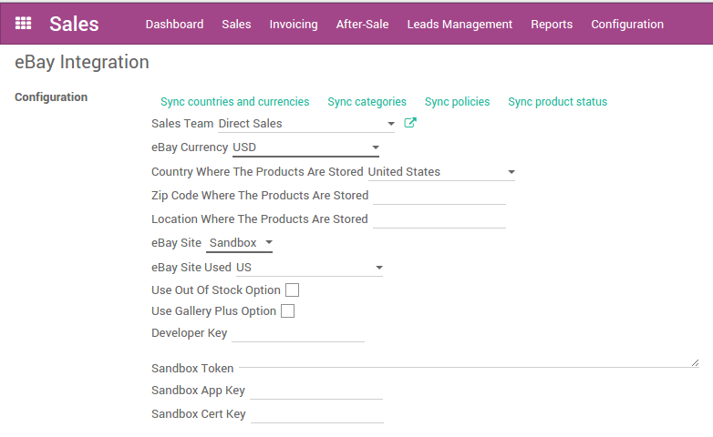

==============================
How to configure eBay in Odoo?
==============================

Create eBay tokens
==================

In order to create your tokens, you need to create a developer account on the
`developer portal <https://go.developer.ebay.com/>`_.
Once you are logged in, you can create **Sandbox Keys** and **Production Keys**
by clicking on the adequate buttons.

After the creation of the keys, you can get the user token. To do so, click on
the **Get a User Token** link in the bottom of the page. Go through the form,
log in with you eBay account and you will get the keys and token needed to
configure the module in Odoo.

Set up tokens in Odoo?
======================

To set up the eBay integration, go to :menuselection:`Sales --> Configuration --> Settings`.

First choose if you want to use the production or the sandbox eBay Site. Then
fill in the fields **Developer Key**, **Token**, **App Key**, **Cert Key**.
Apply the changes.

Once the page is reloaded, you need to synchronize information from eBay. Push
on **Sync countries and currencies**, then you can fill in all the other fields.

When all the fields are filled in, you can synchronize the categories and the
policies by clicking on the adequate buttons.