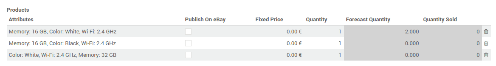
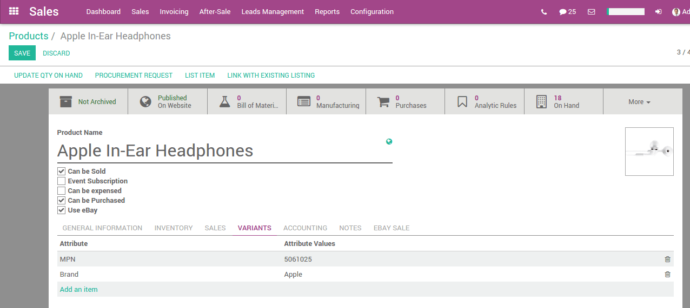

======================
How to list a product?
======================

Listing without variation
=========================

In order to list a product, you need to check the **use eBay** field on a product
form. The eBay tab will be available.

.. image:: manage/manage01.png
  :align: center

When the **Use Stock Quantity** field is checked, the quantity sets on eBay will
be the Odoo **Forecast Quantity**.

The **Description Template** allows you to use templates for your listings. The
default template only use the **eBay Description** field of the product. You can
use html inside the **Description Template** and in the **eBay Description**.

To use pictures in your listing, you need to add them as **Attachments** on the product template.

Listing with variations
=======================

When the **use eBay** on a product with variations is checked and with **Fixed
Price** as **Listing Type**, the eBay form is slightly different. In the
variants array, you can choose which variant will be listed on eBay as well as
set the price and the quantity for each variant.

Listing with item specifics
===========================

In order to add item specifics, you should create a product attribute with one
value in the **Variants** tab on the product form.

Product Identifiers
===================

Products identifiers such as EAN, UPC, Brand or MPN are required in most of the eBay category.
The module manages the EAN and UPC identifiers with the **Barcode** field of the product variant.
If the **Barcode** field is empty or is value is not valid, the EAN and UPC values will be set as 'Does not apply' as recommended by eBay.
The Brand and MPN values are working as item specifics and should be define in the **Variants** tab on the product form.
If these values are not set, 'Does not apply' will be used for the eBay listing.
