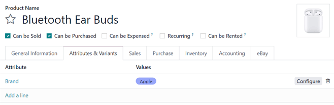

=====================
List products on eBay
=====================

Odoo makes it possible for users to list products on eBay through the database by implementing the
following configurations.

Listing (without product variants)
==================================

To list a product on eBay through Odoo, some necessary configurations must be completed on the
desired product form.

To access products, navigate to :menuselection:`Sales app --> Products --> Products`, and select the
desired the product to be listed on eBay.

Once on the product form, open the :guilabel:`eBay` tab. Under the :guilabel:`eBay` tab, check the
box beside :guilabel:`Sell on eBay`.

Upon activating that feature, a number of other options appear in the :guilabel:`eBay` tab on the
product form. These fields can be used to customize the configuration of the product, and how it
appears on eBay.

.. image:: manage/sell-on-ebay-configurations.png
   :align: center
   :alt: The sell on eBay configurations under the ebay tab on a product form in Odoo sales.

.. tip::
   The :guilabel:`Description Template` allows the use of templates for eBay listings. To create a
   template, type the desired name of the template in the :guilabel:`Description Template` field,
   and click :guilabel:`Create and edit...` from the drop-down menu that appears.

   When that's selected, a :guilabel:`Create Description Template` pop-up form appears, in which
   the body of the description can be added, along with any attachments that may be necessary.

   .. image:: manage/create-description-template-popup-form.png
      :align: center
      :alt: The crete description template pop-up form in eBay tab on product form in Odoo sales.

Listing (with product variants)
===============================

When the :guilabel:`Sell on eBay` feature is activated under the :guilabel:`eBay` tab on a product
form for a product with variants, the available field configurations are the same as products
without variants.

However, when the :guilabel:`Listing Type` is changed to :guilabel:`Fixed Price`, Odoo presents a
variant table at the bottom of the :guilabel:`eBay` tab, in which the :guilabel:`Fixed Price` can be
entered, and the decision to :guilabel:`Publish on eBay` can be made for specific variants, along
with other options.

.. image:: manage/fixed-listing-price.png
   :align: center
   :alt: The fixed price listing type in the eBay tab on a product form in Odoo sales.

Listing (with item specifics)
=============================

In order to add product specifics, such as brand names, a product attribute dedicated to that
specific detail should be created -- with that detail represented by a single value -- in the
:guilabel:`Attributes & Variants` tab of the product form.

Open the desired product form, and click into the :guilabel:`Attributes & Variants` tab.

Then, click :guilabel:`Add a line`, name the :guilabel:`Attribute` after the product detail (e.g.
`Brand`), and enter the specific detail in the :guilabel:`Values` column (e.g. `Apple`).

List item on eBay
=================

Once all configurations and customizations have been entered on the product form, click the
:guilabel:`List Item on eBay` button to list that product on the synchronized eBay account.

Or, click the :guilabel:`Link With Existing eBay Listing` to combine the product with an existing
product listing on the synchronized eBay account.

.. important::
   Products can **only** be listed or linked to eBay if the proper configurations have been made to
   synchronize an eBay account with Odoo. Check out the documentation on
   :doc:`/applications/sales/sales/ebay_connector/setup` to learn more.

Product identifiers
===================

Different product identifiers (such as EAN, UPC, Brands, or MPN) are required in most of the
categories on eBay listings.

The module manages EAN and UPC identifiers via the :guilabel:`Barcode` field on the product form in
Odoo. However, if the :guilabel:`Barcode` field is empty, or the value itself is not valid for any
reason, the EAN and UPC values are set as `Does not apply`, as recommended by eBay.

The Brand and MPN (Manufacturing Part Number) values of a product operate as item specifics, and
should be defined in the :guilabel:`Attributes & Variants` tab. If these values are *not* set in
this fashion, a similar `Does not apply` is used for the eBay listing.

.. seealso::
   :doc:`/applications/sales/sales/ebay_connector/setup`
