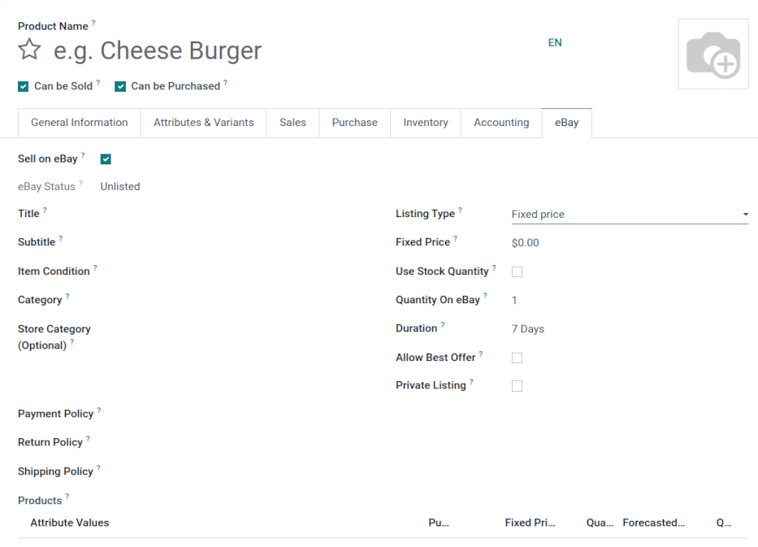
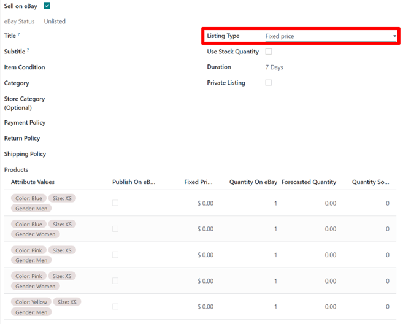

======================
How to list a product?
======================

.. _ebay-connector/listing:

In order to list a product on eBay and Odoo there are two methods in Odoo to do so:

#. Make a product in Odoo and list the item eBay.

   - Click :guilabel:`List Item on eBay` in the top menu of the product template. The product
     template can be accessed by navigating to :menuselection:`Sales app --> Products --> Product`
     and selecting the individual product.
#. List the item on eBay, then create the product in Odoo, and finally link product to the item on
   eBay.

   - Click :guilabel:`Link With Existing eBay Listing` in the top menu on the product template.The
     product template can be accessed by navigating to :menuselection:`Sales app --> Product -->
     Product` and selecting the individual product.

.. note::
   If an order comes in and the listing from the order is not linked to a product, eBay will create
   a consumable product.product in its place. These consumables should be altered on the *sales
   order* while in draft state to represent a storable product, and then the user can link to the
   listing as they come in.

.. seealso::
   To learn more about the eBay connector visit these pages as well:

   - :doc:`setup`
   - :doc:`linking_listings`
   - :doc:`troubleshooting`

Listing without variation
=========================

Access the product template by navigating to :menuselection:`Sales app --> Products --> Product` and
selecting the individual product.

In order to list a product, select the :guilabel:`Sell on eBay` field on a product template.
:guilabel:`Sell on eBay` is either in an :guilabel:`eBay` tab or under the :guilabel:`Product
name`. Click :guilabel:`Save` if necessary.

When the :guilabel:`Use Stock Quantity` field is checked, the quantity set on eBay will be the Odoo
*Forecast Quantity* (Odoo *Inventory* app).

The :guilabel:`Description Template` allows the administrator to use templates in listings. The
default template only use the :guilabel:`eBay Description` field of the product. HTML can be used
inside the :guilabel:`Description Template` and in the :guilabel:`eBay Description` in Odoo 14.
Starting in Odoo 15, the powerbox feature is available to use in the template and description.
Simply type a forward slash `/` to reveal a menu with formatting, layout, and text options. To add
an image, type `/image`.

To use images in the listing, another option is to add them as *Attachments* on the product
template.

.. seealso::
   For more information on template configuration in Odoo visit:
   :doc:`../../../general/email_communication/email_template`.

Listing with variations
=======================

When the :guilabel:`Sell on eBay` is checked on a product containing variations with
:guilabel:`Fixed Price` as :guilabel:`Listing Type`, the eBay form is slightly different. Go to the
:guilabel:`Variants` tab to or click :guilabel:`Configure Variants` in the top menu to configure the
variant settings. Pricing can be configured for each variation.

When the :guilabel:`Listing Type` is changed to :guilabel:`Fixed Price`, Odoo presents a
variant table at the bottom of the :guilabel:`eBay` tab, in which the :guilabel:`Fixed Price` can be
entered, and the decision to :guilabel:`Publish on eBay` can be made for specific variants, along
with other options.

Product identifiers
===================

Products identifiers such as EAN, UPC, Brand or MPN are required in most of the eBay categories.

EAN and UPC identifiers
-----------------------

The module manages the EAN and UPC identifiers with the :guilabel:`Barcode` field of the product
variant. If the :guilabel:`Barcode` field is empty or is value is not valid, the EAN and UPC values
will be set as 'Does not apply' as recommended by eBay.

Barcodes can be found on the product template, under the the :guilabel:`General Information` tab.
Access the product template, first, by navigating to :menuselection:`Sales app --> Products -->
Product` and selecting the individual product.

Listing with item specifics
---------------------------

In order to add item specifics, one should create a product attribute with a single value in the
:guilabel:`Attributes & Variants` tab on the product form. Examples of item specifics include: `MPN`
or `Brand`. The Brand and MPN values are working as item specifics and should be defined in the
:guilabel:`Attributes & Variants` tab on the product form. If these values are not set, 'Does not
apply' will be used for the eBay listing.

Process invoices and payments
=============================

Posting payment
---------------

When eBay orders are placed they are always paid for up front, via the eBay site. At no point will
users pay for items on eBay through Odoo. Therefore, once orders are synced into Odoo from eBay they
are already paid for. Odoo's invoicing and payment functionalities are not utilized. However,
invoices need to be created and marked as Paid to “close” the *Sales Order*.

Users can opt to mass create and post invoices in batches. To do so, navigate to Quotations in the
list view by going to :menuselection:`Sales app --> Orders --> Quotations`. In the upper right
corner, select the list view icon. Hover over the icons to reveal the name of each. Then check the
boxes on the left that invoices should be made for and go to the :guilabel:`Action` menu or ⚙️ [Gear
icon] . Click on :guilabel:`Create Invoices`.

A pop-up will appear and click on the :guilabel:`Create and view invoice` button. A new screen will
populate with the newly created invoices. Next, select all of them by clicking on the box icon next
to :guilabel:`Number` in the header row of the list, this will select all the records. Then navigate
to the :guilabel:`Action` menu and click :guilabel:`Post entries`. Following this step, a pop-up
will appear and click on :guilabel:`Post journal entries`. This will take the invoices out of
*draft* and set them to *posted*.

Reconciling payments
--------------------

Users typically utilize PayPal to receive payment from eBay, and then send lump sums from PayPal
into their bank account. To reconcile this income, users can reconcile the one PayPal transfer with
all related invoices.

First navigate to the :guilabel:`Accounting Dashboard` by going to the :menuselection:`Accounting
app --> Dashboard --> Bank`. :guilabel:`Create` a new transaction and enter the :guilabel:`Label`
as `eBay Sales`. Fill out the :guilabel:`Amount` and enter a :guilabel:`Statement` date in. Click on
:guilabel:`Create and edit`.

For the :guilabel:`Ending Balance` field, enter the same account that was entered for the
:guilabel:`Amount` above. Click on :guilabel:`Save`. Next, open the new balance that needs to be
reconciled. Under the tab marked: :guilabel:`Match Existing Entries` select the entries that are
included in this balance.

After adding all the necessary entries, click :guilabel:`Validate` to complete the reconciliation.
To verify the payment, navigate to :menuselection:`Customers --> Invoices` and select the desired
customer invoice. The *Paid* label should appear under the :guilabel:`Payment Status` column.

.. seealso::
   - :doc:`/applications/sales/sales/ebay_connector/troubleshooting`
   - :doc:`/applications/sales/sales/ebay_connector/linking_listings`
   - :doc:`/applications/sales/sales/ebay_connector/setup`
