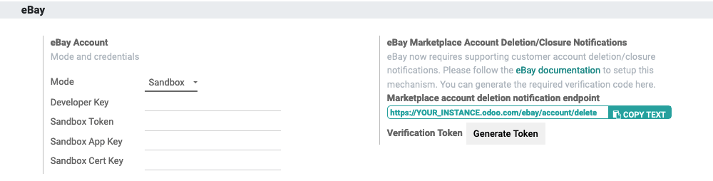
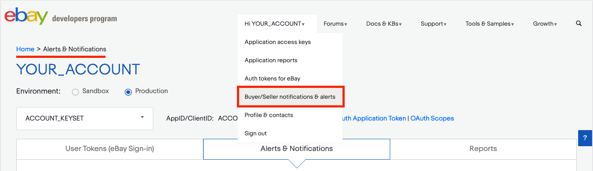
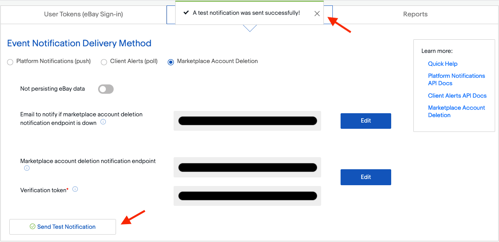

==============================
How to configure eBay in Odoo?
==============================

Create eBay tokens
==================

In order to create your tokens, you need to create a developer account on the
`developer portal <https://go.developer.ebay.com/>`_.
Once you are logged in, you can create **Sandbox Keys** and **Production Keys**
by clicking on the adequate buttons.

.. image:: setup/setup01.png
  :align: center

After the creation of the keys, you can get the user token. To do so, click on
the **Get a User Token** link in the bottom of the page. Go through the form,
log in with you eBay account and you will get the keys and token needed to
configure the module in Odoo.

Set up tokens in Odoo?
======================

To set up the eBay integration, go to :menuselection:`Sales --> Configuration --> Settings`.

.. image:: setup/setup02.png
  :align: center

First choose if you want to use the production or the sandbox eBay Site. Then
fill in the fields **Developer Key**, **Token**, **App Key**, **Cert Key**.
Apply the changes.

Once the page is reloaded, you need to synchronize information from eBay. Push
on **Sync countries and currencies**, then you can fill in all the other fields.

When all the fields are filled in, you can synchronize the categories and the
policies by clicking on the adequate buttons.

Accept account deletion notifications
=====================================

Since September 2021, **eBay requires supporting customer account deletion/closure notifications**.
As such, when eBay receives an account request for deletion, all eBay partners must confirm the
reception of the request and take further action if necessary.

Odoo has a notification endpoint to receive those notifications, confirm the reception of the
request, and handle the first set of actions to anonymize the account details in **Contacts** and
remove the customer's access to the portal.

.. important::
   Make sure to correctly :ref:`set up your subscription to the marketplace account deletion
   notifications <ebay/subscribe-account-deletion-notifications>` as eBay may temporarily disable
   the related eBay account until the subscription is completed.

.. _ebay/retrieve-endpoint-details:

Retrieve endpoint details from Odoo
-----------------------------------

The endpoint details can be found in :menuselection:`Sales --> Configuration --> Settings --> eBay`.
Click on *Generate Token* to retrieve your **Verification Token**.

.. _ebay/subscribe-account-deletion-notifications:

Subscribe to account deletion notifications
-------------------------------------------

Log in on the `developer portal of eBay <https://go.developer.ebay.com/>`_ and go to **Alerts &
Notifications**.

To subscribe to deletion/closure notifications, eBay needs a few details:

- An **email address** to send notifications to if the endpoint is unreachable.
- The **endpoint details**:

  - The URL to Odoo's account deletion notification endpoint
  - A verification token

.. image:: setup/ebay-notification-endpoint.png
   :align: center
   :alt: Dedicated fields to enter the endpoint details

.. tip::
   You can edit the last two fields once the email address field is filled out.

Verify the connectivity with the endpoint
-----------------------------------------

After setting the retrieved endpoint details in eBay's dashboard, consider testing the connectivity
with the **Send Test Notification** button.

You should get the following confirmation message: "A test notification was sent successfully!"

Using the updated synchronisation method
========================================

If you have a lot of products, the eBay API can sometimes refuse some synchronization
calls due to a time-based limit on the number of requests that eBay enforces.

To fix this issue, a new implementation mechanism has been developed; however this
updated mechanism is disabled by default to avoid having the 2 systems running in
parallel in existing installations.

To switch to the new synchronization mechanism:

#. Activate the :ref:`developer mode <developer-mode>`.
#. Go to :menuselection:`Settings --> Technical --> Scheduled Actions`
#. Archive the old synchronization actions (both are named *Ebay: update product status*)
#. Activate the new synchronization actions (*Ebay: get new orders* which runs every 15min by
   default and *Ebay: synchronise stock (for 'get new orders' synchronisation)* which runs once a
   day per default)
#. Ensure that the **Next Execution Date** for both these actions are in the near future

Starting with the next execution date, the new method will be used instead of the old one.
