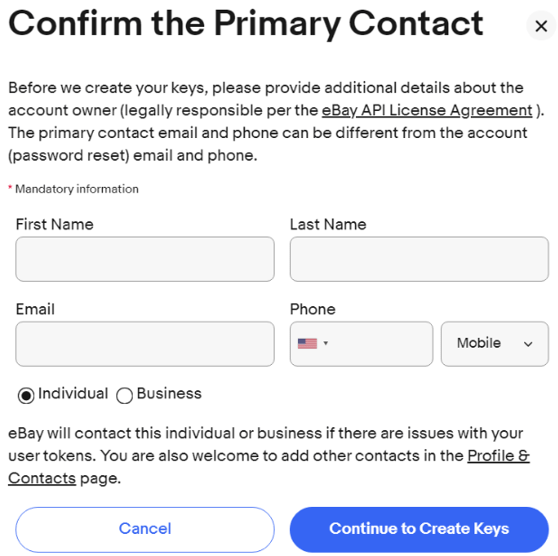
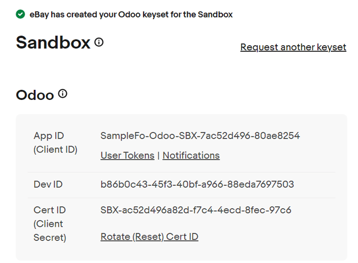
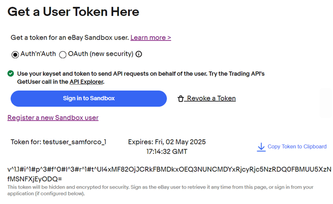
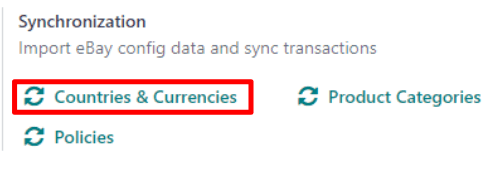
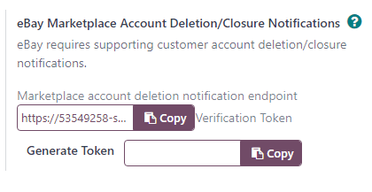
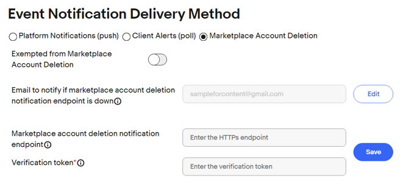

==================
eBay configuration
==================

The following details how to properly configure the eBay connector to the Odoo database.

Create eBay tokens
==================

First, create a *Developer* account with eBay via the `developer portal
<https://go.developer.ebay.com/>`_.

.. note::
   It may take up to one business day for eBay to confirm the status of the account.

Once the *Developer* account has been created and confirmed, tokens need to be created
from the :guilabel:`Application Keys` page, accessible via the *eBay developers program* dashboard.

To do that, log in to the *Developer* account, and proceed to create keysets for the
:guilabel:`Sandbox` section.

.. image:: setup/application-keys.png
   :align: center
   :alt: The application keys in the eBay developer portal.

Then, click :guilabel:`Create a keyset` beneath, and proceed to enter in the necessary information
in the :guilabel:`Confirm the Primary Contact` pop-up form that appears.

With all the required information filled in, click the :guilabel:`Continue to Create Keys` button.

After clicking that button, the pop-up form disappears, and eBay presents the keyset.

After the keyset has been created, click the :guilabel:`User Tokens` links in the
:guilabel:`Sandbox` and :guilabel:`Production` sections.

Doing so reveals a separate :guilabel:`User Tokens` page. On this page, upon signing in, and eBay
presents the necessary user token needed to configure the module in Odoo.

.. note::
   The same process can be used to create a keyset and user token for the :guilabel:`Production`
   section, as well.

Set up eBay tokens in Odoo
==========================

To properly set up the eBay integration in Odoo, navigate to :menuselection:`Sales app -->
Configuration --> Settings`. Then, on the *Sales* app :guilabel:`Settings` page, scroll down to the
:guilabel:`eBay` section of configurable settings.

.. image:: setup/ebay-settings-section-sales-app.png
   :align: center
   :alt: The eBay settings section in the Odoo sales application.

First, designate the desired :guilabel:`Mode` to use: :guilabel:`Sandbox` or :guilabel:`Production`.

Then, proceed to enter in the :guilabel:`Developer Key`, and the respective :guilabel:`Token`,
:guilabel:`App Key`, and :guilabel:`Cert Key`, all of which can be found on the :guilabel:`eBay
developers program` page, as detailed in the above section.

Next, click :guilabel:`Save` to apply the changes.

Once the page has reloaded, some additional information must be synchronized from eBay. To do that,
scroll back down to the :guilabel:`eBay` section on the :guilabel:`Settings` page. Then, in the
:guilabel:`Synchronization` portion, click :guilabel:`Countries & Currencies`

Then, confirm the auto-populate options in the :guilabel:`eBay Options` portion, located above the
:guilabel:`Synchronization` portion, are accurate.

.. image:: setup/specific-ebay-options-section-sales-settings.png
   :align: center
   :alt: The eBay options section of settings that appears after synchronization in Odoo Sales.

When those fields are accurately filled in, proceed to synchronize the :guilabel:`Product
Categories` and :guilabel:`Policies`, via their respective buttons in the
:guilabel:`Synchronization` portion.

Accept account deletion notifications
=====================================

Since September 2021, eBay **requires** supporting customer account deletion/closure notifications.

As such, when eBay receives an account request for deletion, all eBay partners must confirm the
reception of the request, and take further action, if necessary.

Odoo has a notification endpoint to receive those notifications, confirm the reception of the
request, and handle the first set of actions to delete the account details, and remove the
customer's access to the portal.

.. important::
   Make sure to correctly :ref:`set up the subscription to the marketplace account deletion
   notifications <ebay/subscribe-account-deletion-notifications>`, as eBay may temporarily disable
   the related eBay account until the subscription is completed.

.. _ebay/retrieve-endpoint-details:

Retrieve endpoint details from Odoo
-----------------------------------

The endpoint details can be found in :menuselection:`Sales app --> Configuration --> Settings -->
eBay section`.

From here, the necessary *Verification Token* can be found.

With the :guilabel:`Production` credentials entered and saved, click :guilabel:`Generate Token` to
generate the required token information.

.. _ebay/subscribe-account-deletion-notifications:

Subscribe to account deletion notifications
-------------------------------------------

Log in on the `developer portal of eBay <https://go.developer.ebay.com/>`_ and go to the
:guilabel:`Alerts & Notifications` page.

To subscribe to deletion/closure notifications, fill out the :guilabel:`Event Notification Delivery
Method` form.

Enter an email address to send notifications to, if the endpoint is unreachable. Then, enter the
endpoint details: the URL to Odoo's account deletion notification endpoint, and the verification
token, which was generated on the *Sales* settings page.

.. note::
   The ability to edit the last two fields becomes available, once the email address field is filled
   out.

Updated synchronization method
==============================

If working with a lot of products, eBay can sometimes refuse some synchronization calls, due to a
time-based limit on the number of requests eBay enforces.

To avoid this issue, a new implementation mechanism has been developed.

To ensure this is active, and to switch to the new synchronization, follow these steps:

#. Activate :ref:`developer mode <developer-mode>` in Odoo.
#. Navigate to :menuselection:`Settings app -- > Technical drop-down menu --> Scheduled Actions`.
#. Search `ebay` in the :guilabel:`Search...` bar.
#. Activate (if needed) the :guilabel:`Ebay: get new orders` and :guilabel:`Ebay: synchronise stock`
   actions.
#. Ensure the :guilabel:`Next Execution Date` for both actions are set for the near future.

Starting with the next execution date, the new method will be used, instead of the previous one.

.. tip::
   This updated mechanism may be disabled, by default, to avoid having two systems running
   concurrently in existing installations.

.. seealso::
   - :doc:`/applications/sales/sales/ebay_connector/manage`
