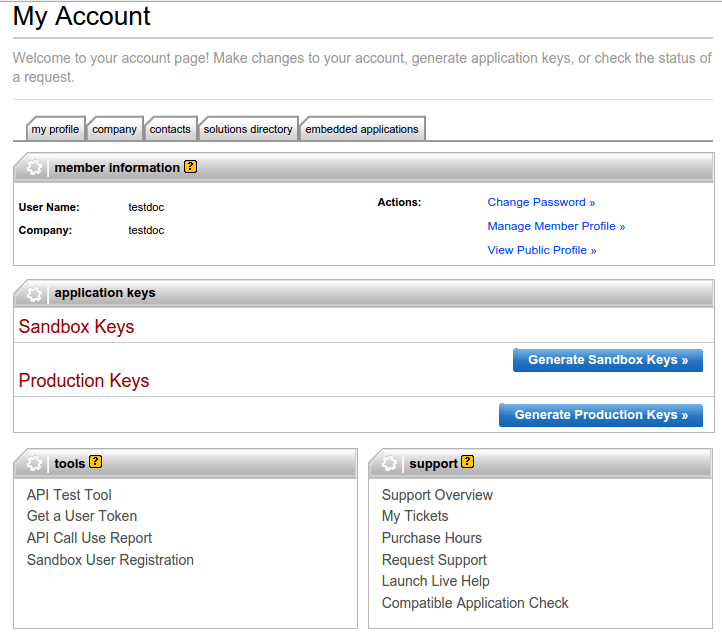
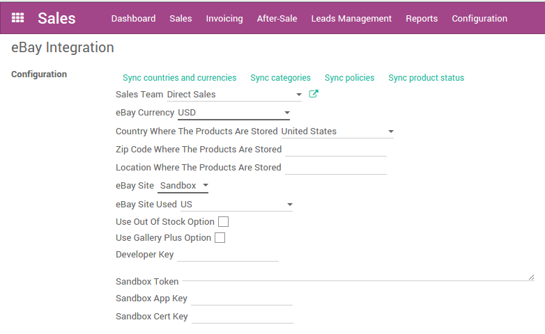

==============================
How to configure eBay in Odoo?
==============================

Create eBay tokens
==================

In order to create your tokens, you need to create a developer account on the
`developer portal <https://go.developer.ebay.com/>`_.
Once you are logged in, you can create **Sandbox Keys** and **Production Keys**
by clicking on the adequate buttons.

After the creation of the keys, you can get the user token. To do so, click on
the **Get a User Token** link in the bottom of the page. Go through the form,
log in with you eBay account and you will get the keys and token needed to
configure the module in Odoo.

Set up tokens in Odoo?
======================

To set up the eBay integration, go to :menuselection:`Sales --> Configuration --> Settings`.

First choose if you want to use the production or the sandbox eBay Site. Then
fill in the fields **Developer Key**, **Token**, **App Key**, **Cert Key**.
Apply the changes.

Once the page is reloaded, you need to synchronize information from eBay. Push
on **Sync countries and currencies**, then you can fill in all the other fields.

When all the fields are filled in, you can synchronize the categories and the
policies by clicking on the adequate buttons.

Using the updated synchronisation method
========================================

If you have a lot of products, the eBay API can sometimes refuse some synchronization
calls due to a time-based limit on the number of requests that eBay enforces.

To fix this issue, a new implementation mechanism has been developped; however this
updated mechanism is disabled by default to avoid having the 2 systems running in
parallel in existing installations.

To switch to the new synchronization mechanism:

#. Enable the :doc:`Developer mode <../../../../applications/general/developer_mode>`.
#. Go to :menuselection:`Settings --> Technical --> Scheduled Actions`
#. Archive the old synchronization actions (both are named *Ebay: update product status*)
#. Activate the new synchronization actions (*Ebay: get new orders* which runs every 15min by default and *Ebay: synchronise stock (for 'get new orders' synchronisation)* which runs once a day per default)
#. Ensure that the **Next Execution Date** for both these actions are in the near future

Starting with the next execution date, the new method will be used instead of the old one.
