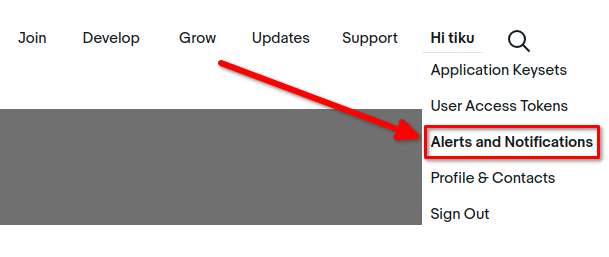

==============================
Troubleshooting eBay connector
==============================

.. seealso::
   To learn more about the eBay connector visit these pages as well:

   - :doc:`setup`
   - :doc:`manage`
   - :doc:`linking_listings`

Accept account deletion notifications
=====================================

Since September 2021, **eBay requires supporting customer account deletion/closure notifications**.
As such, when eBay receives an account request for deletion, all eBay partners must confirm the
reception of the request and take further action if necessary.

Odoo has a notification endpoint to receive those notifications, confirm the reception of the
request, and handle the first set of actions to anonymize the account details in *Contacts* and
remove the customer's access to the portal.

.. important::
   Make sure to correctly :ref:`set up the subscription to the marketplace account deletion
   notifications <ebay/subscribe-account-deletion-notifications>` as eBay may temporarily disable
   the related eBay account until the subscription is completed.

Verify the installation of Odoo is up to date
---------------------------------------------

In order to activate the endpoint, the module *eBay Connector - Account Deletion* must be installed.
If the Odoo database was first created after September 2021, the module is installed automatically
and the administrator can proceed to the :ref:`next step <ebay/retrieve-endpoint-details>`.

Update Odoo to the latest release
~~~~~~~~~~~~~~~~~~~~~~~~~~~~~~~~~

The notification endpoint is made available through a new Odoo module; to be able to install it, the
administrator must make sure that the Odoo source code is up-to-date.

- If the company uses Odoo on Odoo.com or Odoo.sh platform, the code is already up-to-date, so
  proceed to the next step.
- If the company uses Odoo with an on-premise setup or through a partner, then the administrator
  must update the installation as detailed in :doc:`this documentation page
  </administration/maintain/update>` or by contacting an integrating partner.

Update the list of available modules
~~~~~~~~~~~~~~~~~~~~~~~~~~~~~~~~~~~~

New modules must be *discovered* by the Odoo instance to be available in the :menuselection:`Apps`
menu.

To do so, activate the :ref:`developer mode <developer-mode>`, and go to :menuselection:`Apps ->
Update Apps List`. A wizard will ask for confirmation.

Install the eBay Connector - Account Deletion update
~~~~~~~~~~~~~~~~~~~~~~~~~~~~~~~~~~~~~~~~~~~~~~~~~~~~

.. warning::
   **Never** install new modules in the production database without testing them in a duplicate or
   staging environment. For Odoo.com customers, a duplicate database can be created from the
   database management page. For Odoo.sh users, the administrator should use a staging or duplicate
   database. For on-premise users, the administrator should use a staging environment - contact the
   integrating partner for more information regarding how to test a new module in a particular
   setup.

To install the module, go to the :menuselection:`Apps` menu, remove the `Apps` search facet and
search for `eBay`. If the module *eBay Connector - Account Deletion* is present and marked as
installed, the Odoo database is already up-to-date and the administrator can proceed with the next
step. If it is not yet installed, install it now.

.. _ebay/retrieve-endpoint-details:

Retrieve endpoint details from Odoo
-----------------------------------

The endpoint details can be found in :menuselection:`Sales --> Configuration --> Settings --> eBay`.
First, input random text values for the :guilabel:`Production App Key` and for the
:guilabel:`Production Cert Key`. Click on :guilabel:`Generate Token` to retrieve the
:guilabel:`Verification Token`.

.. image:: troubleshooting/generate-token.png
   :align: center
   :alt: Generate a verification token in Odoo.

.. _ebay/subscribe-account-deletion-notifications:

Subscribe to account deletion notifications
-------------------------------------------

Navigate to the `eBay developer portal <https://go.developer.ebay.com/>`_. Configure the account
deletion/notification settings in eBay by navigating to the `Hi [username]` at the top right of
screen, then go to :guilabel:`Alerts & Notifications`.

To subscribe to deletion/closure notifications, eBay needs a few details:

- An *email address* to send notifications to if the endpoint is unreachable.
- The *endpoint details*:

  - The URL to Odoo's account deletion notification endpoint
  - A verification token

.. image:: troubleshooting/ebay-notification-endpoint.png
   :align: center
   :alt: Dedicated fields to enter the endpoint details

.. tip::
   The administrator can edit the last two fields once the email address field is filled out.

Verify the connectivity with the endpoint
-----------------------------------------

After setting the retrieved endpoint details in eBay's dashboard, consider testing the connectivity
with the :guilabel:`Send Test Notification` button.

 The following confirmation message should be received: "A test notification was sent successfully!"

.. image:: troubleshooting/test-notification.png
   :align: center
   :alt: Button to send test notification

.. seealso::
   - :doc:`/applications/sales/sales/ebay_connector/manage`
   - :doc:`/applications/sales/sales/ebay_connector/linking_listings`
   - :doc:`/applications/sales/sales/ebay_connector/setup`
