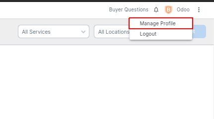
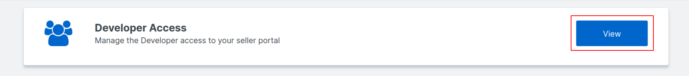
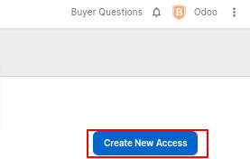
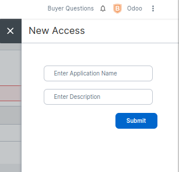

==================================
How to configure Flipkart in Odoo?
==================================

Connect Flipkart with OAuth
===========================

In Odoo you can find the Flipkart Configuration under :menuselection:`Settings --> Sale --> Flipkart Connector`

All you have to do is click on the Connect button and you will be redirected to Flipkart Permission Registration page

After successful login, seller would be presented with a Request for Authorization dialog.

After clicking on Allow you will be redirected to Odoo back and now you can sync your flipkart orders to Odoo

.. note::
  Odoo will setup a default Sale Team and Flipkart Location for Flipkart Connector.

.. seealso::
   - :doc:`features`
   - :doc:`manual_sync`
