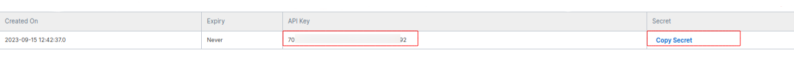

==================================
How to configure Flipkart in Odoo?
==================================

Create a new Access on Flipkart Seller Account
==============================================

In order to start syncing Flipkart orders in Odoo, you need to login to your Flipkart seller account on the
`seller hub <https://seller.flipkart.com/>`_.
Once you are logged in, you need to follow the following steps to create a new **Access**
by clicking on top right side of the page :menuselection:`Profile --> Manage Profile` as show in the below image.

.. image:: setup/setup01.png
  :align: center

Click on **View** next to **Developer Access**

.. image:: setup/setup02.png
  :align: center

Click on **Create a New Access**

.. image:: setup/setup03.png
  :align: center

Enter **Application Name** (i.e. Odoo) and **Description**

.. image:: setup/setup04.png
  :align: center

Now copy the **API key** and **Secret**. It will be needed to configure Flipkart Connector in Odoo

.. important::
   API key and Secret is confidential must not be shared.

.. _flipkart/configure_connector:

Configure Flipkart Connector in Odoo
====================================

In Odoo you can find the Flipkart Configuration under :menuselection:`Settings --> Sale --> Flipkart Connector`

Enter the **API key** and **Secret** generated from Flipkart Seller Dashboard as **Client Id** and **Client Secret** and save it.
Now you have succesfully configured your credentials in Odoo. Now you just need to :ref:`verify your Flipkart credentials<flipkart/verify_credential>`

.. note::
  Odoo will setup a default Sale Team and Flipkart Location for Flipkart Connector. If not selected by the user.

.. seealso::
   - :doc:`features`
   - :doc:`verify`
