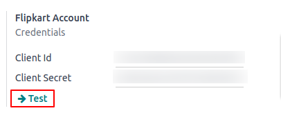
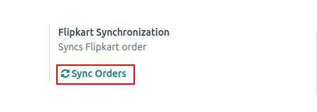

=======================================================
Verify your Flipkart Credentials and Manual Sync Orders
=======================================================

.. _flipkart/verify_credential:

Verify Connection
=================

To verify your Flipkart credential, Click on **Test button**

Once the test is successful, it means Odoo has verified your credentials with Flipkart. Now, Odoo's automated action will fetch Flipkart orders in every 24hr.

Manual Sync Orders
==================

You can manually sync Flipkart orders from the last sync date and time performed by Odoo up to the current moment.

You need to click on **Sync Orders** in Flipkart Connector Configuration Panel as show below

Odoo will fetch all the Flipkarts as mentioned in the :ref:`Supported Features<flipkart/supported_features>`

.. seealso::
   - :doc:`setup`
