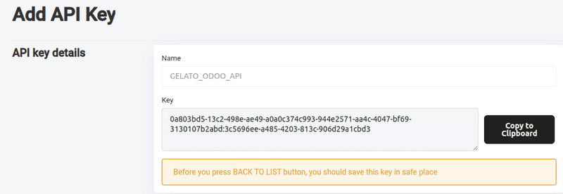
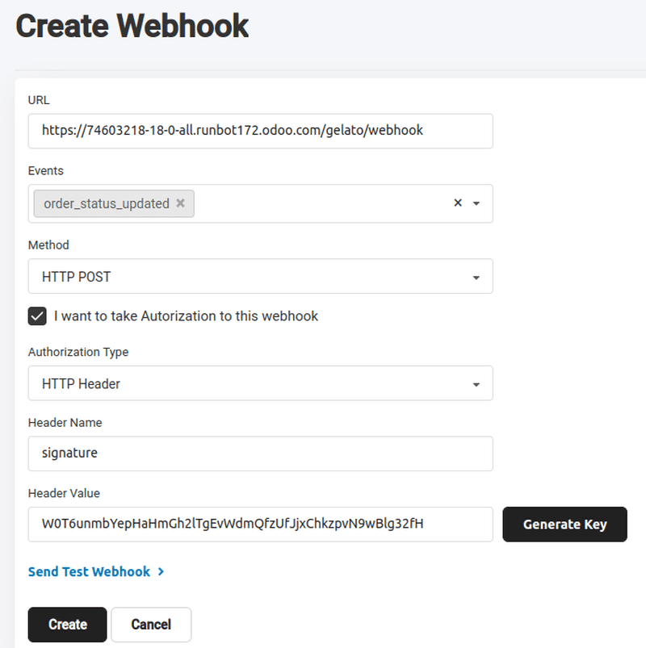

======
Gelato
======

Gelato is a global print-on-demand platform that integrates with Odoo to sync product catalogs and
automate order fulfillment.

Connecting Gelato's services with Odoo's **Sales** and **eCommerce** apps enables the following:

- Sync Odoo sales orders with Gelato for automated order fulfillment
- Create and manage Gelato products within Odoo; supports product variant and image sync
- Configure delivery options in Odoo and receive order updates via webhooks.

Configuration
=============

.. important::
   The company information (*Company name* and *Billing address*) in the Gelato account *must* match
   the company information in the Odoo database in order for sales orders to be confirmed and sent
   to Gelato for fulfillment.

   .. image:: gelato/gelato-company.png
      :alt: Company information in Gelato.

   .. image:: gelato/odoo-company.png
      :alt: Company information in Odoo.

Configure API keys and webhooks in Gelato
-----------------------------------------

Before configuring the Gelato connector in Odoo, first obtain API credentials and webhooks from the
Gelato account.

API connectors enable Odoo **Sales** to send and receive data from Gelato for order processing,
while webhooks provide real-time updates on order status and shipment tracking.

API Key
~~~~~~~

An API Key is a unique authentication token that allows Odoo to securely communicate with Gelato's
API, enabling order transmission, status updates, and data synchronization.

After logging into Gelato, click :icon:`fa-code` :guilabel:`Developer` in the left menu bar. From
here, click on :guilabel:`API keys`. In the new page, click the :guilabel:`Add API Key` button to
open a new API key form. Type in a name, then click :guilabel:`Create Key`.

Copy the generated API key using :guilabel:`Copy to Clipboard`.

.. important::
   Copy the API key and store it somewhere safe and secure before leaving this page. Once the page
   is refreshed or exited, the key will not be available to copy.

   If the key cannot be copied or is lost, return to the :guilabel:`API key` page and start over,
   creating a new API key.

Webhook
~~~~~~~

A webhook is an automated notification system that instantly updates Odoo when Gelato processes,
ships, or delivers an order, ensuring real-time tracking and minimal manual intervention.

To create a webhook, go to :menuselection:`Developer --> Webhooks` under the :guilabel:`Developer`
drop-down menu in the left menu bar. In the new page, click :guilabel:`Add Webhook` to open a
:guilabel:`Create Webhook` form.

The webhook form requires several specific configurations:

- :guilabel:`URL`: This tells Gelato where to send the order updates in Odoo. Copy and paste the
  Odoo database URL with the additional suffix `/gelato/webhook`.

  .. example::
     `https://stealthywood.odoo.com/odoo/gelato/webhook`

- :guilabel:`Events`: Click into the field and select :guilabel:`order_status_updated`. Selecting
  :guilabel:`order_status_updated` ensures Odoo receives order changes automatically.
- :guilabel:`Method`: Click into the field and select the :guilabel:`HTTP Post` option, as this is
  the request method used to send data from Gelato to Odoo.
- Tick the checkbox next to :guilabel:`I want to take Authorization to this webhook`.
- :guilabel:`Header Name`: In this field, type in `signature` to match the field in Odoo.
- Click :guilabel:`Generate Key` to generate a :guilabel:`Header Value`.
- Click :guilabel:`Create` to complete this webhook configuration.

.. tip::
   Copy and paste the API key and webhook on a notepad before tabbing out of the Gelato webpage as
   backup.

Configure Gelato connector in Odoo
----------------------------------

In Odoo, navigate to :menuselection:`Sales app --> Configuration --> Settings`, then scroll to the
:guilabel:`Connectors` section. Enable the :guilabel:`Gelato` connector by ticking the checkbox.
Next, paste the newly generated API keys and webhook secret key into their respective fields. Once
saved, Gelato is available in Odoo **Sales** and **eCommerce** products.

Synchronizing Gelato products with Odoo Sales
=============================================

It is recommended to have products already configured in Gelato before configuring them in Odoo. To
get the product ID in Gelato, navigate to the :guilabel:`Templates` page from the side bar menu.
Select which product to synchronize in Odoo, then hover over the product card to reveal the
:icon:`fa-ellipsis-v` :guilabel:`(vertical ellipsis)` menu icon. Click the menu icon, then click
:guilabel:`Copy Template ID` to copy the product template ID to the clipboard.

.. seealso::
   `Start selling products with Gelato: Quick & easy setup
   <https://www.gelato.com/blog/get-started-with-gelato-creating-products>`_

Odoo Sales product
------------------

To create a product in Odoo that matches the Gelato one, navigate to :menuselection:`Sales app -->
Products --> Products`, select :guilabel:`New` to create a new product form. Type in the product
:guilabel:`Name`, then navigate to the :guilabel:`Sales` tab. Find the :guilabel:`Gelato` section,
then click into the :guilabel:`Template Reference` field and paste the copied template ID from the
Gelato product. Finally, click :guilabel:`Synchronize`.

Successful synchronization pulls the Gelato product variant options into the newly configured Odoo
product.

In the new :guilabel:`Print Images` field, click the :guilabel:`default` marker to set a default
product image. Click the :icon:`fa-pencil` :guilabel:`(edit)` icon and select the product image file
to upload, then :guilabel:`Save & Close`.

.. important::
   The :guilabel:`Print Images` field *must* be configured on the product before it can be ordered.

Product variants
----------------

To view and edit the newly synchronized product variants, navigate to the :guilabel:`Attributes &
Variants` tab, which will have the variants pulled from the Gelato product configuration. Click the
:guilabel:`Configure` button to edit and configure the variant images, delivery methods, additional
pricing, etc.

Order a Gelato product from Odoo
--------------------------------

Once synchronized, Gelato products are available to order in Odoo through :doc:`sales quotations
<send_quotations>` or on the **eCommerce** store. Gelato delivery options are automatically
synchronized upon API and webhook configuration.

To add Gelato delivery, click :guilabel:`Add shipping` on the sales order. Select
:guilabel:`Standard Delivery` or :guilabel:`Express Delivery` in the :guilabel:`Shipping Method`
field, then click :guilabel:`Get rate`.

Once the quotation is confirmed, it becomes an active sales order, and the order is sent to Gelato
for fulfillment. Once a sales order is sent from Odoo to Gelato, Gelato processes the order,
produces the product at the nearest fulfillment center, and ships it directly to the end-customer.

.. seealso::
   :doc:`send_quotations/create_quotations`

.. important::
   When creating a sales order for Gelato products in the database, only Gelato products can be
   added to the same sales order. Multivendor orders are not available with the Gelato connector at
   this time.

.. important::
   For **eCommerce** orders, deliver methods must be manually published on the website for them to
   appear at checkout.
