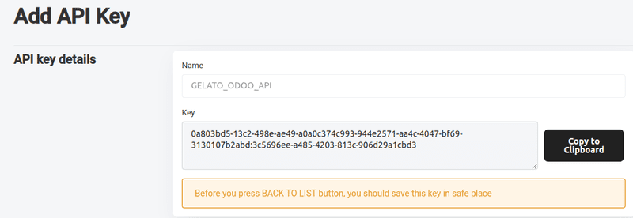
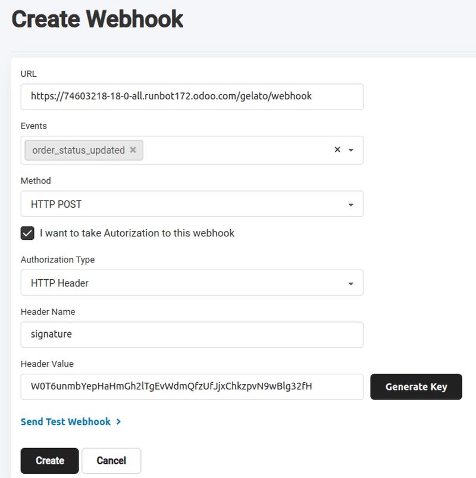

:orphan:

======
Gelato
======

Gelato is a global print-on-demand platform that enables businesses to produce and ship customized
products, such as apparel, posters, mugs, and books, closer to end customers through a network of
local print partners. This reduces shipping times, costs, and environmental impact.

Gelato integrates with platforms like Odoo to automate order fulfillment and product
synchronization.

The Gelato Connector integrates Gelato's print-on-demand services with Odoo's **Sales** and
**eCommerce** apps, automating order fulfillment and product synchronization. This reduces manual
work and ensures accurate order processing between Odoo and Gelato.

With the Gelato Connector, you can effortlessly synchronize Odoo sales orders with Gelato, allowing
for automated fulfillment. Additionally, you can create and manage Gelato products directly within
Odoo and automatically sync product variants and images from Gelato.

Delivery options are seamlessly configured in Odoo, while webhook notifications ensure users stay
informed about order updates.

Configuration
=============

Before installing the Gelato Connector in Odoo, first create a new API key in the Gelato platform.

Configure API Keys and Webhooks in Gelato
-----------------------------------------

To install the Gelato module, first obtain API credentials and webhooks from Gelato.

In the menu bar on your Gelato account, click on :guilabel:`Developer` to open the drop-down menu.
From here, click on :guilabel:`API keys`. In the new page, click the :guilabel:`ADD API Key` button
to open a new API key form. Type in a name, then click :guilabel:`Create Key`.

This generates a new API key. Select all and copy, or click :guilabel:`Copy to Clipboard`.

.. important::
   Copy the API key and store on a notepad before leaving this page. Once you refresh or leave new
   API key form, the key will not be available to copy.

   If you are not able to copy the key or lose it, simply return to the :guilabel:`API key` page and
   start over, creating a new API key.

To create a webhook, click on :guilabel:`Webhooks` in the menu bar. In the new page, click
:guilabel:`Add Webhook` to open a :guilabel:`Create Webhook` form.

The webhook form requires several specific configurations:

- :guilabel:`URL`: Copy and paste your Odoo database URL with the additional suffix "/gelato/webhook
  ".
- :guilabel:`Events`: Click into the field and select :guilabel:`order_status_updated`.
- :guilabel:`Method`: Click into the field and select :guilabel:`HTTP Post`.
- Tick the checkbox next to :guilabel:`I want to take Authorization to this webhook`
- :guilabel:`Header Name`: In this field, type in "signature" to match the field in Odoo.
- Click :guilabel:`Generate Key` to generate a :guilabel:`Header Value`.

Click :guilabel:`Create` to complete this webhook configuration.

.. tip::
   Copy and paste the API key and webhook on a notepad before tabbing out of the Gelato webpage as
   backup.

Install Gelato Connector in Odoo
--------------------------------

In Odoo, navigate to :menuselection:`Sales app --> Configuration --> Settings`, then scroll to the
:guilabel:`Connectors` section. Enable the :guilabel:`Gelato` connector by ticking the checkbox.
Next, paste the newly generated API keys and Webhook secret key into their respective fields. Once
saved, the Gelato Connector will be available in Odoo **Sales** and **eCommerce** products.

Synchronizing Gelato Products with Odoo Sales
=============================================

It is recommended to have products readily configured in Gelato before configuring them in Odoo. In
the Gelato, navigate to the :guilabel:`Templates` page from the side bar. Select which product to
synchronize in Odoo, then hover over the product card to reveal the three-dot menu. Click the menu
icon, then click :guilabel:`Copy Template ID` to copy the product template ID to your clipboard.

.. seealso::
   `Gelato Product Documentation
   <https://www.gelato.com/blog/get-started-with-gelato-creating-products>`_

Odoo Sales Product
------------------

In Odoo, navigate to :menuselection:`Sales app --> Products --> Products`, select New to create a
new product form. Type in the product :guilabel:`Name`, then navigate to the :guilabel:`Sales` tab.
Find the :guilabel:`Gelato` field, then click into the :guilabel:`Template Reference` field and
paste the copied template ID from your Gelato product. Finally, click :guilabel:`Synchronize`.

Successful synchronization pulls the Gelato product variant options into the newly configured Odoo
product.

In the new :guilabel:`Print Images` field, click the :guilabel:`default` marker to set a default
product image. Click the :icon:`fa-pencil` icon and select the product image file to upload, then
:guilabel:`Save & Close`.

Product variants
----------------

To view and edit the newly synchronized product variants, navigate to the
:guilabel:`Attributes & Variants` tab, which will have the variants pulled from the Gelato product
configuration. Click the :guilabel:`Configure` button to edit and configure the variant images,
delivery methods, additional pricing, etc.

Order a Gelato Product from Odoo
--------------------------------

Once synchronized, Gelato products are available to order in Odoo through :doc:`sales quotations
<send_quotations>` or on the **eCommerce** website store. Gelato delivery options are automatically
synchronized upon API and webhook configuration.

To add Gelato delivery, click :guilabel:`Add shipping` on the sales order. Select
:guilabel:`Standard Delivery` or :guilabel:`Express Delivery` in the :guilabel:`Shipping Method`
field, then click :guilabel:`Get rate`.

Once the quotation is confirmed, it becomes an active sales order, and the order is sent to Gelato
for fulfillment.

.. seealso::
   :doc:`send_quotations/create_quotations`

.. important::
   When creating a sales order for Gelato products in the database, only Gelato products can be
   added to the same sales order. Multivendor orders are not available with the Gelato connector at
   this time.

.. important::
   For **eCommerce** orders, deliver methods must be manually published on the website for them to
   appear at checkout.
