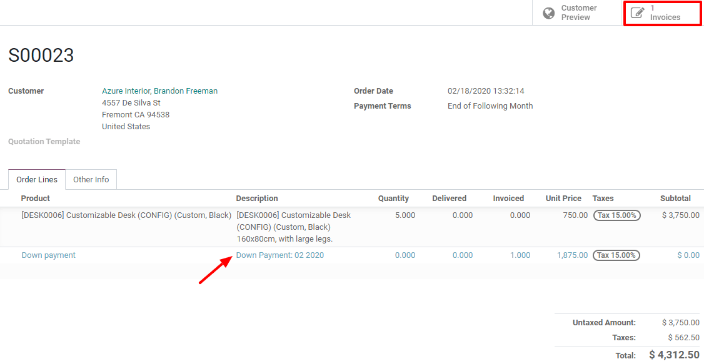
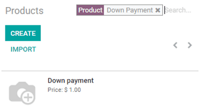
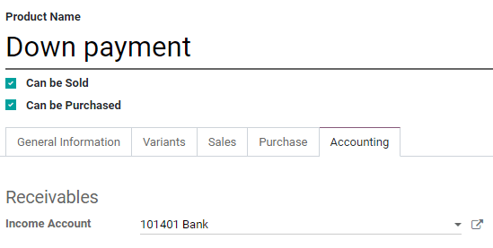

======================
Request a down payment
======================

A down payment is a partial payment made by the buyer when a sales contract is concluded. This
implies both parties' full commitment (seller and buyer) to honor the contract. With a down payment,
the buyers show their will to acquire the product and agree to pay the rest later, while the sellers
are obliged to provide the goods by accepting it.

Sometimes a down payment is required for expensive orders or projects. That way, you can protect
yourself and make sure that your customer is reliable.

First time you request a down payment
=====================================

When a sales order is confirmed, you then have the possibility to create an invoice. Invoices
are automatically created in drafts so that you can review them before validation. To create an
invoice, Odoo Sales offers you 3 options:

- Regular invoice
- Down payment (percentage)
- Down payment (fixed amount)

In terms of down payment, it can either be a fixed amount or a percentage of the total amount. The
first time you request a down payment, you can set a percentage or a fixed amount of your choice,
and select the right income account and taxes. These settings will be reused for future down
payments.

.. image:: down_payment/down_payment_1.png
   :align: center
   :alt: How can you do a down payment on Odoo Sales?

.. important::
   When you request your first down payment, a new product called **Down payment** will be created.
   This product will be registered as a **service** product with an invoicing policy of
   **ordered quantities**. As a reminder, you can edit this product and modify it at any time.
   Please note that if you choose **delivered quantities** as invoicing policy,
   **you will not be able to create an invoice**.

Basic sales flow using down payments
====================================

For this first example, we will use a 50% amount down payment with a product using
**ordered quantities** as invoicing policy. Make sure to check out our documentation about invoicing
policies here: :doc:`invoicing_policy` , before requesting your first down payment. When it comes to
create and view the invoice, you will only have access to a draft invoice mentioning the down
payment (as you can see below).

.. image:: down_payment/down_payment_2.png
   :align: center
   :alt: What is a basic sales flow using down payments on Odoo Sales (1)?

There, you can post the invoice and register the payment of your customer. But, we all know that in
real life this flow does not happen immediately. So, for now, you can return to the sales order.
There, you will have the possibility to see the order as a customer with the **Customer preview**
button or to reach easily the previous draft invoice with the **Invoice** button. In any case, the
down payment will be mentioned on both (sales order and draft invoice).

To complete the flow, when the customer wants to pay the rest of his sales order, you must create
another invoice. Once again, you will have the choice to make another down payment or to deduct all
the down payments and so, paying the rest of the invoice as a regular invoice.

.. image:: down_payment/down_payment_4.png
   :align: center
   :alt: What is a basic sales flow using down payments on Odoo Sales (3)?

This flow is also possible with a down payment taking into account a fixed amount.

.. important::
   Be careful that if you do a down payment with a product using **delivered quantities** as
   invoicing policy, you won’t be able to deduct all the down payments when it comes to invoicing
   your customer. Indeed, you have to deliver a product before creating the final invoice. If
   nothing has been delivered, you create a **credit note** that cancels the draft invoice
   created after the down payment. To do so, you have to install the **Inventory App** to confirm
   the delivery. Otherwise, you can enter the delivered quantity manually on the sales order.

Modify the income account and customer taxes
============================================

From the products list, search for the **Down Payment** product.

You can edit it and under the **General Information Tab** you will be able to change the customer
taxes. Now, to change the income account, you will need to install the **Accounting App** to have
the possibility to see the **Accounting Tab** on the product form.

.. seealso::
  - :doc:`invoicing_policy`