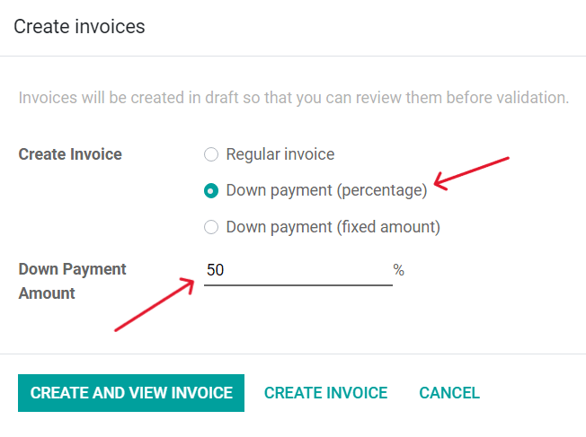
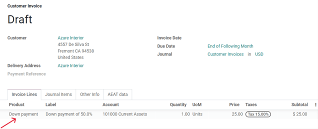
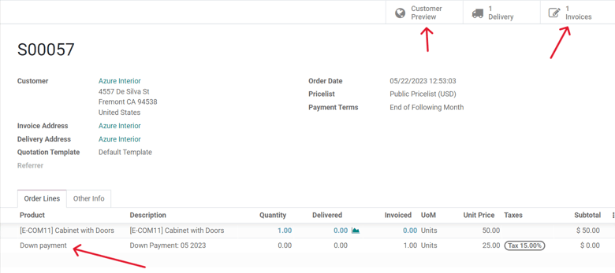
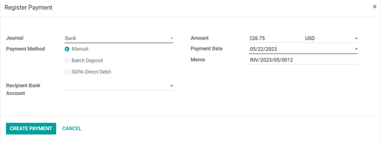
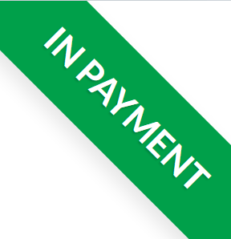
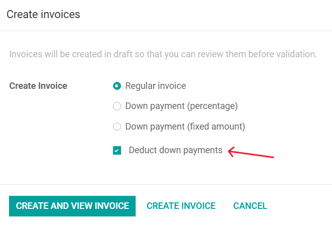
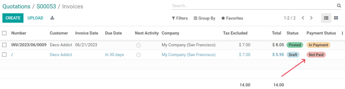

=============
Down payments
=============

A down payment is a partial payment made by the buyer when a sales contract is concluded. This
implies both parties' (seller and buyer) full commitment to honor the contract.

With a down payment, the buyer pays a portion of the total amount owed while agreeing to pay the
remaining amount at a later date. In turn, the seller provides goods or services to the buyer after
accepting the down payment, trusting that the remaining amount will be paid later on.

Initial down payment request
============================

When a sales order is confirmed, the option to create an invoice becomes available, via the
:guilabel:`Create Invoice` button, located in the upper-left corner of the sales order form. When
clicked, a :guilabel:`Create invoices` pop-up appears.

.. note::
   Invoices are automatically created in drafts, so they can be reviewed before validation.

On the :guilabel:`Create invoices` pop-up, there are 3 options to choose from in the
:guilabel:`Create Invoice` field:

- :guilabel:`Regular invoice`
   .. note::
      If :guilabel:`Regular Invoice` is selected the other fields disappear, as they only pertain to
      down payment configurations.
- :guilabel:`Down payment (percentage)`
- :guilabel:`Down payment (fixed amount)`

In terms of a down payment, it can either be a fixed amount or a percentage of the total amount.

Once the desired down payment option is selected in the :guilabel:`Create Invoice` field, designate
the desired amount (either as a percentage or fixed amount) in the :guilabel:`Down Payment Amount`
field.

Then, select the appropriate income account for the invoice in the :guilabel:`Income Account` field,
and add a tax amount, if necessary, in the :guilabel:`Customer Taxes` field. These settings will be
reused for future down payments.

.. image:: down_payment/create-invoices-popup-form.png
   :align: center
   :alt: How to configure a down payment on Odoo Sales.

.. important::
   When a down payment is first requested, a new product called :guilabel:`Down payment` is created.
   This product is registered as a :guilabel:`Service` product, with an invoicing policy of
   :guilabel:`Ordered quantities`. This product can be edited and modified at any time.

.. warning::
   If :guilabel:`Delivered quantities` is chosen as the invoicing policy, an invoice will **not** be
   able to be created.

Request a 50% down payment
==========================

For the following example, the flow involves a 50% amount down payment on a product with
:guilabel:`Ordered quantities` as the invoicing policy.

.. seealso::
   :doc:`/applications/sales/sales/invoicing/invoicing_policy`

When the order is confirmed (via the :guilabel:`Confirm` button), it's time to create/view the
invoice, by clicking :guilabel:`Create Invoice`.

Then, on the :guilabel:`Create invoices` pop-up window that appears, select :guilabel:`Down payment
(percentage)`, and type `50` in the :guilabel:`Down Payment Amount` field. Lastly, click
:guilabel:`Create and View Invoice` to create and view the invoice.

Doing so reveals the draft invoice, which mentions the down payment.

From there, the invoice can be confirmed/posted, and the payment can be registered. Return to the
sales order, via the breadcrumbs.

On the sales order, the option to view what the customer will see is available, via the
:guilabel:`Customer Preview` smart button, and the :guilabel:`Invoice` button reveals the drafted
invoice. In either case, the down payment is mentioned on both the sales order and draft invoice.

To confirm and register the first payment of the down payment, click the :guilabel:`Invoices` smart
button to return to the invoice. On the :guilabel:`Customer Invoice` page, click
:guilabel:`Confirm`, then :guilabel:`Register Payment` to open a :guilabel:`Register Payment`
pop-up form.

On this form, select the appropriate :guilabel:`Journal` and confirm that the down payment amount
is correct in the :guilabel:`Amount` field. Then, make any other modifications to the other fields,
if necessary, before clicking :guilabel:`Create Payment`.

Odoo returns to the invoice, which now has a green :guilabel:`In Payment` banner visible in the
upper-right corner.

Now, when the customer wants to pay the remaining amount of the order, another invoice must be
created. To do that, return to the sales order, and click :guilabel:`Create Invoice`.

On the :guilabel:`Create invoices` pop-up window, there is now an option to :guilabel:`Deduct down
payments`, which is selected by default.

If the remaining amount is ready to be paid, the :guilabel:`Regular Invoice` option should be
selected, and the :guilabel:`Deduct down payments` option should *stay* selected. Then, click
:guilabel:`Create and View Invoice`.

Doing so reveals a separate :guilabel:`Invoices` page, listing all the invoices for that specific
sales order. Each invoice line item displays all the necessary information related to each invoice,
along with the current :guilabel:`Payment Status`.

To complete the flow, select the invoice with the :guilabel:`Not Paid` status, which opens that
invoice. On the invoice page, click :guilabel:`Confirm`, then :guilabel:`Register Payment`, and
confirm that the remaining :guilabel:`Amount` is correct. Then, click :guilabel:`Create Payment`.

That pop-up window disappears, and a green :guilabel:`In Payment` banner is now present on the
invoice. The line items on the invoice show that the total amount has been paid, including mentions
of the down payment, and the flow is complete.

This flow is also possible with the :guilabel:`Fixed amount` down payment option.

.. important::
   If a down payment is used with a product that has a :guilabel:`Delivered quantities` invoicing
   policy, the down payments will **not** be able to be deducted when it comes time to invoice the
   customer. This is because, due to the invoicing policy, the product(s) would have to be delivered
   *before* creating the final invoice.

   If nothing has been delivered, a :guilabel:`Credit Note` is created, which cancels the draft
   invoice that was created after the down payment. To utilize the :guilabel:`Credit Note` option,
   the *Inventory* application must be installed, in order to confirm the delivery. Otherwise, the
   delivered quantity can be entered manually directly on the sales order.

Income account and customer taxes modifications
===============================================

To adjust the income account and customer taxes attached to a down payment, navigate to the
:guilabel:`Products` page (:menuselection:`Sales app --> Products --> Products`), search for the
`Down Payment` product in the search bar, and select it to reveal the product detail page.

On the :guilabel:`Down Payment` product page, click :guilabel:`Edit`, then scroll down to the
:guilabel:`General Information` tab. In this tab, the customer taxes can be modified in the
:guilabel:`Customer Taxes` field.

.. image:: down_payment/customer-taxes-field.png
   :align: center
   :alt: How to modify the income account link to down payments

To change or adjust the income account attached to the :guilabel:`Down Payment` product page, the
*Accounting* app **must** be installed. With the *Accounting* app installed, the
:guilabel:`Accounting` tab becomes available on the product page. That tab will **not** be
accessible without the *Accounting* app installed.

In the :guilabel:`Accounting` tab, the income account can be changed in the :guilabel:`Income
Account` field, in the :guilabel:`Receivables` section. Once all desired changes are complete, click
:guilabel:`Save`.

.. image:: down_payment/income-account.png
   :align: center
   :alt: How to modify the income account link to down payments

.. seealso::
   :doc:`/applications/sales/sales/invoicing/invoicing_policy`
