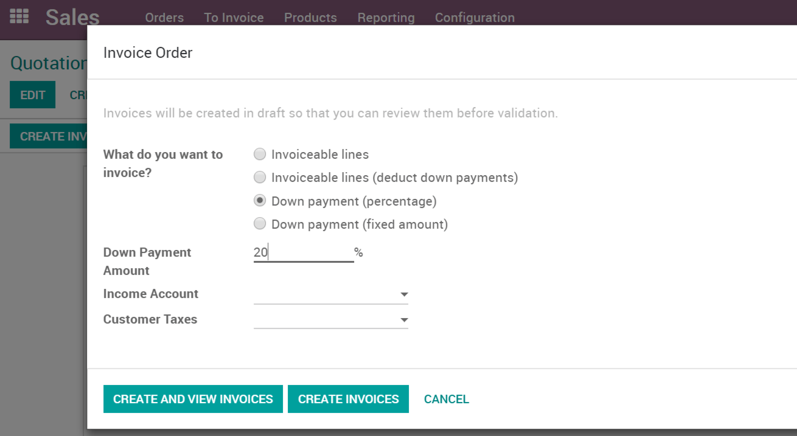
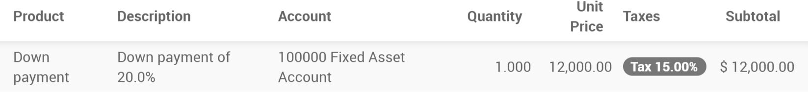
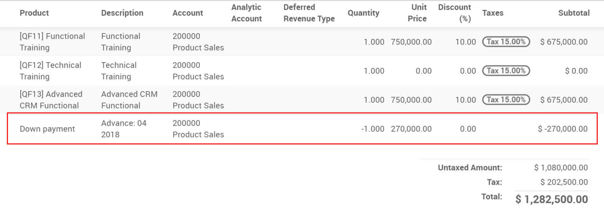
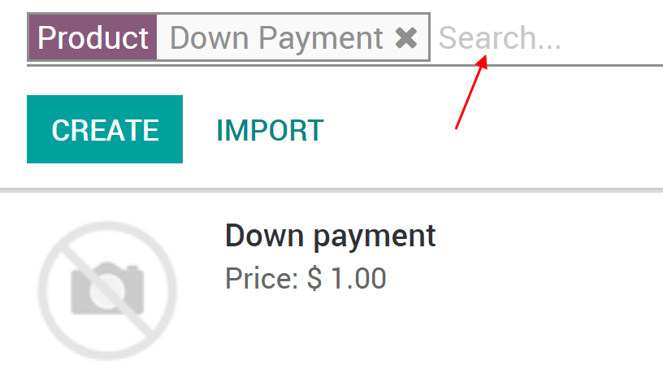
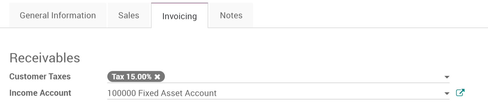

======================
Request a down payment
======================

A down payment is an initial, partial payment, with the agreement that
the rest will be paid later. For expensive orders or projects, it is a
way to protect yourself and make sure your customer is serious.

First time you request a down payment
=====================================

When you confirm a sale, you can create an invoice and select a down
payment option. It can either be a fixed amount or a percentage of the
total amount.

The first time you request a down payment you can select an income
account and a tax setting that will be reused for next down payments.

You will then see the invoice for the down payment.

On the subsequent or final invoice, any prepayment made will be
automatically deducted.

Modify the income account and customer taxes
============================================

From the products list, search for *Down Payment*.

You can then edit it, under the invoicing tab you will be able to change
the income account & customer taxes.

