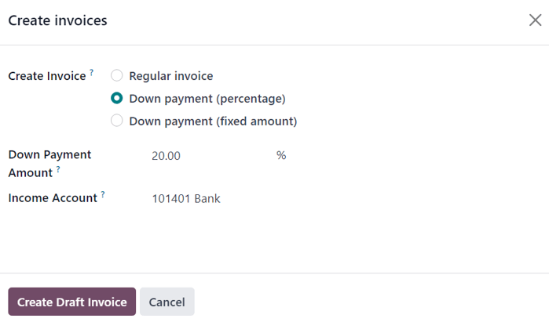

=============
Down payments
=============

A down payment is a partial payment made by the buyer when a sales contract is concluded. This
implies both parties' (seller and buyer) full commitment to honor the contract.

With a down payment, the buyer pays a portion of the total amount owed while agreeing to pay the
remaining amount at a later date. In turn, the seller provides goods or services to the buyer after
accepting the down payment, trusting that the remaining amount will be paid later on.

Create invoices
===============

When a sales order is confirmed, the option to create an invoice becomes available, via the
:guilabel:`Create Invoice` button, located in the upper-left corner of the sales order form. When
clicked, a :guilabel:`Create invoices` pop-up appears.

.. image:: down_payment/create-invoices-popup-form.png
   :align: center
   :alt: Create invoices pop-up form that appears in Odoo Sales.

.. note::
   Invoices are automatically created as drafts, so they can be reviewed before validation.

On the :guilabel:`Create invoices` pop-up, there are 3 options to choose from in the
:guilabel:`Create Invoice` field:

- :guilabel:`Regular invoice`
- :guilabel:`Down payment (percentage)`
- :guilabel:`Down payment (fixed amount)`

.. note::
   If :guilabel:`Regular Invoice` is selected, the other fields disappear, as they only pertain to
   down payment configurations.

Initial down payment request
============================

On the :guilabel:`Create invoices` pop-up form, the down payment options are:

- :guilabel:`Down payment (percentage)`
- :guilabel:`Down payment (fixed amount)`

Once the desired down payment option is selected in the :guilabel:`Create Invoice` field on the
pop-up form, designate the desired amount, either as a percentage or a fixed amount, in the
:guilabel:`Down Payment Amount` field.

Then, select the appropriate income account for the invoice in the :guilabel:`Income Account` field.
Next, select a tax amount, if necessary, in the :guilabel:`Customer Taxes` drop-down field.

Once all fields are filled in with the desired information, click the :guilabel:`Create Draft
Invoice` button. Upon clicking this button, Odoo reveals the :guilabel:`Customer Invoice Draft`.

In the :guilabel:`Invoice Lines` tab of the :guilabel:`Customer Invoice Draft`, the down payment
that was just configured in the :guilabel:`Create invoices` pop-up form appears as a
:guilabel:`Product`.

.. image:: down_payment/down-payment-product-inv-draft.png
   :align: center
   :alt: Down payment as a product in the invoice lines tab of a customer invoice draft in Odoo.

.. note::
   When the :guilabel:`Down payment` product in the :guilabel:`Invoice Lines` tab is clicked, Odoo
   reveals the product form for the down payment.

   By default, the :guilabel:`Product Type` of down payment products generated for invoices are set
   as :guilabel:`Service`, with the :guilabel:`Invoicing Policy` set to :guilabel:`Prepaid/Fixed
   Price`.

   .. image:: down_payment/down-payment-product.png
      :align: center
      :alt: Down payment product form with service product type and invoicing policy field.

   This product can be edited/modified at any time.

.. warning::
   If :guilabel:`Based on Delivered Quantity (Manual)` is chosen as the :guilabel:`Invoicing
   Policy`, an invoice will **not** be able to be created.

Example: request 50% down payment
=================================

.. note::
   The following example involves a 50% amount down payment on a product (:guilabel:`Cabinet with
   Doors`) with :guilabel:`Ordered quantities` as the :guilabel:`Invoicing Policy`.

   .. image:: down_payment/cabinet-product-details.png
      :align: center
      :alt: Cabinet with doors product form showcasing various details and fields.

.. seealso::
   :doc:`invoicing_policy`

First, navigate to :menuselection:`Sales app --> New`, and add a :guilabel:`Customer` to the
quotation.

Then, click :guilabel:`Add a product` in the :guilabel:`Order Lines` tab, and select the
:guilabel:`Cabinet with Doors` product.

When the order is confirmed (via the :guilabel:`Confirm` button), the quotation turns into a sales
order. Once this occurs, create and view the invoice by clicking :guilabel:`Create Invoice`.

.. image:: down_payment/cabinet-sales-orders-confirmed.png
   :align: center
   :alt: Cabinet with doors sales order that's been confirmed in the Odoo Sales application.

Next, on the :guilabel:`Create invoices` pop-up window that appears, select :guilabel:`Down payment
(percentage)`, and type `50` in the :guilabel:`Down Payment Amount` field.

.. note::
   The :guilabel:`Income Account` and :guilabel:`Customer Taxes` fields are *not* required fields,
   and they will *not* appear if they've already been preconfigured in previous down payment
   requests.

   For more information, check out the documentation on :ref:`customer taxes modification on down
   payments <sales/invoicing/customer-tax-modification-down-payments>` and :ref:`income account
   modification on down payments <sales/invoicing/income-account-modification>`.

Lastly, click :guilabel:`Create Draft Invoice` to create and view the invoice draft.

Clicking :guilabel:`Create Draft Invoice` reveals the draft invoice, which includes the down
payment as a :guilabel:`Product` in the :guilabel:`Invoice Lines` tab.

From there, the invoice can be confirmed and posted by clicking :guilabel:`Confirm`. Confirming the
invoice changes the status from :guilabel:`Draft` to :guilabel:`Posted`. It also reveals a new
series of buttons at the top of the page.

.. image:: down_payment/draft-invoice-sample.png
   :align: center
   :alt: A sample draft invoice with down payment mentioned in Odoo Sales.

From those buttons, the payment can be registered by clicking :guilabel:`Register Payment`.

.. image:: down_payment/register-payment-button.png
   :align: center
   :alt: Showcase of the Register Payment button on a confirmed customer invoice.

Doing so reveals a :guilabel:`Register Payment` pop-up form, which is auto-populated with the
necessary information. Confirm the information provided is correct and make any necessary
adjustments. When ready, click the :guilabel:`Create Payment` button.

.. image:: down_payment/register-payment-pop-up-window.png
   :align: center
   :alt: Showcase of the Register Payment pop-up window with create payment button.

After clicking :guilabel:`Create Payment`, Odoo reveals the customer invoice, now with a green
:guilabel:`In Payment` banner in the upper-right corner.

.. image:: down_payment/customer-invoice-green-payment-banner.png
   :align: center
   :alt: Customer Invoice with a green In Payment banner located in the upper-right corner.

Now, when the customer wants to pay the remaining amount of the order, another invoice must be
created. To do that, return to the sales order, via the breadcrumb links.

Back on the sales order, a new :guilabel:`Down Payments` section is present in the :guilabel:`Order
Lines` tab, along with the down payment that was just invoiced and posted.

.. image:: down_payment/down-payments-section-order-lines.png
   :align: center
   :alt: The down payments section in the order lines tab of a sales order.

Next, click the :guilabel:`Create Invoice` button.

On the :guilabel:`Create invoices` pop-up window that appears, there are two new fields:
:guilabel:`Already invoiced` and :guilabel:`Amount to invoice`.

.. image:: down_payment/create-invoices-pop-up-already-invoiced.png
   :align: center
   :alt: The deduct down payment option on the create invoices pop up in Odoo Sales.

If the remaining amount is ready to be paid, select the :guilabel:`Regular Invoice` option. Odoo
will create an invoice for the exact amount needed to complete the total payment, as indicated in
the :guilabel:`Amount to invoice` field.

Once ready, click :guilabel:`Create Draft Invoice`.

Doing so reveals another :guilabel:`Customer Invoice Draft` page, listing *all* the invoices for
that specific sales order in the :guilabel:`Invoice Lines` tab. Each invoice line item displays all
the necessary information related to each invoice.

To complete the flow, click :guilabel:`Confirm`, which changes the status of the invoice from
:guilabel:`Draft` to :guilabel:`Posted`. Then, click :guilabel:`Register Payment`.

Once again, the :guilabel:`Register Payment` appears, with all fields auto-populated with the
necessary information, including the remaining amount left to be paid on the order.

.. image:: down_payment/second-register-payment-popup.png
   :align: center
   :alt: The second register payment pop-up form in Odoo sales.

After confirming that information, click :guilabel:`Create Payment`. Doing so reveals the final
:guilabel:`Customer Invoice` with a green :guilabel:`In Payment` banner in the upper-right corner.
Also, both down payments are present in the :guilabel:`Invoice Lines` tab.

.. image:: down_payment/second-down-payment-in-payment-invoice.png
   :align: center
   :alt: The second down payment invoice with in payment banner in Odoo Sales.

At this point, the flow is now complete.

.. note::
   This flow is also possible with the :guilabel:`Fixed amount` down payment option.

.. important::
   If a down payment is used with a product that has a :guilabel:`Delivered quantities` invoicing
   policy, the down payments will **not** be able to be deducted when it comes time to invoice the
   customer.

   This is because, due to the invoicing policy, the product(s) would have to be delivered *before*
   creating the final invoice.

   If nothing has been delivered, a :guilabel:`Credit Note` is created, which cancels the draft
   invoice that was created after the down payment.

   To utilize the :guilabel:`Credit Note` option, the *Inventory* application must be installed, in
   order to confirm the delivery. Otherwise, the delivered quantity can be entered manually directly
   on the sales order.

.. _sales/invoicing/customer-tax-modification-down-payments:

Customer taxes modification on down payments
============================================

To adjust the income account and customer taxes attached to a down payment, navigate to the
:guilabel:`Products` page (:menuselection:`Sales app --> Products --> Products`), search for the
`Down Payment` product in the search bar, and select it to reveal the product detail page.

On the :guilabel:`Down Payment` product page, in the :guilabel:`General Information` tab, the
customer taxes can be modified in the :guilabel:`Customer Taxes` field.

.. image:: down_payment/customer-taxes-field.png
   :align: center
   :alt: How to modify the income account link to down payments.

.. _sales/invoicing/income-account-modification:

Income account modification on down payments
============================================

To change or adjust the income account attached to the :guilabel:`Down Payment` product page, the
*Accounting* app **must** be installed.

With the *Accounting* app installed, the :guilabel:`Accounting` tab becomes available on the product
page. That tab will **not** be accessible without the *Accounting* app installed.

In the :guilabel:`Accounting` tab, the income account can be changed in the :guilabel:`Income
Account` field, located in the :guilabel:`Receivables` section.

.. image:: down_payment/income-account.png
   :align: center
   :alt: How to modify the income account link to down payments.

.. seealso::
   :doc:`invoicing_policy`
