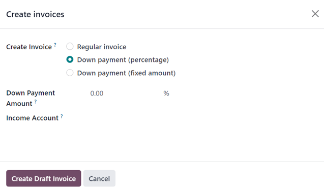

=============
Down payments
=============

A down payment is an initial up-front payment made during the confirmation of a sales transaction.
With a down payment, the buyer pays a portion of the total amount owed while agreeing to pay the
remaining amount at a later date. In turn, the seller provides goods or services to the buyer upon
or after accepting the down payment, trusting that the remaining amount will be paid later on.

In the Odoo **Sales** app, down payments can be customized to fit the needs of each individual sales
transaction.

Create invoices
===============

When a sales order is confirmed, the option to create an invoice becomes available via the
:guilabel:`Create Invoice` button. When clicked, a :guilabel:`Create invoice(s)` pop-up appears.

.. note::
   Invoices are automatically created as drafts so they can be reviewed before validation.

On the :guilabel:`Create invoice(s)` pop-up, there are 3 options to choose from in the
:guilabel:`Create Invoice` field:

- :guilabel:`Regular invoice`
- :guilabel:`Down payment (percentage)`
- :guilabel:`Down payment (fixed amount)`

Initial down payment request
============================

On the :guilabel:`Create invoice(s)` pop-up window, the down payment options are:

- :guilabel:`Down payment (percentage)`
- :guilabel:`Down payment (fixed amount)`

Select a down payment option and set the desired payment, either as a percentage or a fixed amount,
in the :guilabel:`Down Payment Amount` field.

Once all fields are filled in, click the :guilabel:`Create Draft` button. Upon clicking this button,
Odoo reveals the :guilabel:`Customer Invoice Draft`.

.. important::
   If an :guilabel:`Invalid Operation` error appears, double-check that the :doc:`invoicing policy
   <invoicing_policy>` is configured correctly. In some cases, for example, the invoicing policy is
   configured to require delivery before sending an invoice.

In the :guilabel:`Invoice Lines` tab of the :guilabel:`Customer Invoice Draft`, the down payment
that was just configured in the :guilabel:`Create invoice(s)` pop-up form appears under a new
:guilabel:`Down Payments` section.

.. _sales/invoicing/50-percent-down-payments:

Example: requesting a 50% down payment
======================================

.. note::
   The following example involves a 50% amount down payment on a (:guilabel:`Cabinet with Doors`)
   with :guilabel:`Ordered quantities` as the :guilabel:`Invoicing Policy`.

   .. image:: down_payment/cabinet-product-details.png
      :alt: Cabinet with doors product form showcasing various details and fields.

Navigate to :menuselection:`Sales app --> New`, and add a :guilabel:`Customer` to the quotation.
Then, click :guilabel:`Add a product` in the :guilabel:`Order Lines` tab, and select the
:guilabel:`Cabinet with Doors` product. When the order is confirmed (via the :guilabel:`Confirm`
button), the quotation turns into a sales order. Once this occurs, create and view the invoice by
clicking :guilabel:`Create Invoice`.

.. image:: down_payment/cabinet-sales-orders-confirmed.png
   :alt: Cabinet with doors sales order that's been confirmed in the Odoo Sales application.

Next, on the :guilabel:`Create invoice(s)` pop-up window that appears, select :guilabel:`Down
payment (percentage)`, and type `50` in the :guilabel:`Down Payment` field.

.. note::
   The :guilabel:`Income Account` attached to the :guilabel:`Down payment` can be changed. For more
   information, check out the documentation on :ref:`income account modification on down payments
   <sales/invoicing/income-account-modification>`. A :guilabel:`Down payment Account` can also be
   set on a product category. If set, this account is prioritized for future down payments.

Lastly, click :guilabel:`Create Draft Invoice` to create and view the invoice draft, which includes
the down payment under the :guilabel:`Down Payments` section of the :guilabel:`Invoice Lines` tab.
From there, the invoice can be confirmed and posted by clicking :guilabel:`Confirm`. Confirming the
invoice changes the status from :guilabel:`Draft` to :guilabel:`Posted`. It also reveals a new
series of buttons at the top of the page.

.. image:: down_payment/draft-invoice-sample.png
   :alt: A sample draft invoice with down payment mentioned in Odoo Sales.

From those buttons, the payment can be registered by clicking :guilabel:`Pay`. Doing so reveals a
:guilabel:`Pay` pop-up form, which is auto-populated with the necessary information. Confirm the
information provided is correct, and make any necessary adjustments. When ready, click the
:guilabel:`Create Payment` button.

.. image:: down_payment/register-payment-pop-up-window.png
   :alt: Showcase of the Pay pop-up window with create payment button.

After clicking :guilabel:`Create Payment`, Odoo reveals the customer invoice, now with a green
:guilabel:`In Payment` or :guilabel:`Paid` banner in the upper-right corner, depending on how the
database has configured and if manual confirmation of payments is required.

.. image:: down_payment/customer-invoice-green-payment-banner.png
   :alt: Customer Invoice with a green Paid banner located in the upper-right corner.

On the sales order, a new :guilabel:`Down Payments` section is present in the :guilabel:`Order
Lines` tab, along with the down payment that was just invoiced and posted. When the customer wants
to pay the remaining amount of the order, another invoice must be created.

.. image:: down_payment/down-payments-section-order-lines.png
   :alt: The down payments section in the order lines tab of a sales order.

Next, click the :guilabel:`Create Invoice` button. On the :guilabel:`Create invoice(s)` pop-up
window that appears, there is a new field: :guilabel:`Already invoiced` and :guilabel:`Amount to
invoice`.

.. image:: down_payment/create-invoices-pop-up-already-invoiced.png
   :alt: The deduct down payment option on the Create invoice(s) pop up in Odoo Sales.

If the remaining amount is ready to be paid, select the :guilabel:`Regular Invoice` option. Odoo
will create an invoice for the exact amount needed to complete the total payment, as indicated in
the :guilabel:`Amount to invoice` field.

Once ready, click :guilabel:`Create Draft Invoice`. Doing so reveals another :guilabel:`Customer
Invoice Draft` page, listing all the invoices for that specific sales order in the
:guilabel:`Invoice Lines` tab. Each invoice line item displays all the necessary information related
to each invoice.

To complete the flow, click :guilabel:`Confirm` to change the status of the invoice from
:guilabel:`Draft` to :guilabel:`Posted`. Then, click :guilabel:`Pay`. The :guilabel:`Pay` form
appears, with all fields auto-populated with the necessary information, including the remaining
amount left to be paid on the order.

.. image:: down_payment/second-register-payment-popup.png
   :alt: The second Pay pop-up form in Odoo sales.

After confirming that information, click :guilabel:`Create Payment`. Doing so reveals the final
:guilabel:`Customer Invoice` with a green :guilabel:`In Payment` or :guilabel:`Paid` banner in the
upper-right corner, depending on how the database has configured and if manual confirmation of
payments is required. Upon returning to the sales order, both down payments are present in the
:guilabel:`Order Lines` tab.

.. image:: down_payment/final-sales-order.png
   :alt: The second down payment invoice with Paid banner in Odoo Sales.

At this point, the flow is now complete. This flow is also possible with the :guilabel:`Fixed
amount` down payment option.

.. important::
   If a down payment is used with a product that has a :guilabel:`Delivered quantities` invoicing
   policy, and the cost of the product exceeds the 50% down payment, a regular invoice is created.
   However, for products that cost less than the 50% down payment, the down payments will not be
   able to be deducted when it comes time to invoice the customer. This is because the product(s)
   would have to be delivered *before* creating the final invoice due to Odoo not allowing negative
   totals for invoices. If nothing has been delivered, a :guilabel:`Credit Note` is created, which
   cancels the draft invoice that was created after the down payment.

   To utilize the :guilabel:`Credit Note` option, the **Inventory** application must be installed in
   order to confirm the delivery. Otherwise, the delivered quantity can be entered manually directly
   on the sales order.

.. _sales/invoicing/100-percent-down-payments:

Example: requesting a 100% down payment
=======================================

Requesting a 100% down payment is similar to requesting a :ref:`50% down payment
<sales/invoicing/50-percent-down-payments>`, but with fewer steps.

.. note::
   A 100% down payment is not the same as a full payment of the sales order. A sales order paid
   through the regular invoice process will not allow any additional invoices to be generated and
   will not display the :guilabel:`Create Invoice` button on the Sales Order. Instead, following
   this example will cause the :guilabel:`Create Invoice` button to be displayed on the Sales Order.
   This is because the system expects another invoice to be created after the down payment to
   complete payment of the sales order.

The *Solar Panel Installation* product is being used in this example.

To configure a 100% down payment, navigate to :menuselection:`Sales app --> New` and add a
:guilabel:`Customer` to the quote. Next, click :guilabel:`Add a product` in the :guilabel:`Order
Lines` tab, and select the `Solar Panel Installation` product. Upon clicking the :guilabel:`Confirm`
button, the quotation turns into a sales order. At that point, an invoice can now be created by
clicking :guilabel:`Create Invoice` in the top-left corner. On the :guilabel:`Create invoice(s)`
pop-up window that appears, select :guilabel:`Down payment (percentage)`, and type `100` in the
:guilabel:`Down Payment` field.

.. image:: down_payment/100p-down-payment-percentage.png
   :alt: The Down payment (percentage) option selected with 100% set as the Down Payment.

Next, click :guilabel:`Create Draft Invoice` to create an invoice draft. This will also bring the
draft invoice into view, which includes the :guilabel:`Down payment` under the :guilabel:`Down
Payments` section of the :guilabel:`Invoice Lines` tab. The invoice can now be confirmed and posted
by clicking :guilabel:`Confirm`. Confirming the invoice changes the status from :guilabel:`Draft` to
:guilabel:`Posted`. It also reveals a new series of buttons at the top of the page.

The payment can be registered by clicking the :guilabel:`Pay` button. This brings up the
:guilabel:`Pay` pop-up form, which is auto-populated with the necessary information. When ready,
click the :guilabel:`Create Payment` button.

After clicking :guilabel:`Create Payment`, Odoo reveals the customer invoice, now with a green
:guilabel:`In Payment` or :guilabel:`Paid` banner in the upper-right corner, depending on how the
database has configured and if manual confirmation of payments is required. The process is now
complete, and the 100% down payment has been successfully applied.

.. _sales/invoicing/income-account-modification:

Income account modification on down payments
============================================

.. important::
   To change or adjust the income account attached to down payments, the **Accounting** app must be
   installed. With the **Accounting** app installed, the :guilabel:`Accounting` column becomes
   available on the draft invoice.

Navigate to the invoice to be modified by going to :menuselection:`Sales app --> Orders --> Orders`.
Open an order, then click the :guilabel:`Invoices` smart button. Open an invoice, click the
drop-down arrow on the entry in the :guilabel:`Account` column and click :guilabel:`Search more...`
to bring up the :guilabel:`Search: Account` form. In this form, a different account can be chosen
from the list of pre-existing accounts. A new account can also be created by clicking the
:guilabel:`New` button.

.. image:: down_payment/income-account.png
   :alt: The Search:Account form with existing accounts displayed and a button to create a new
         account.

.. seealso::
   :doc:`invoicing_policy`
