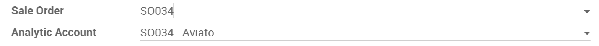

================================
Re-invoice expenses to customers
================================

It often happens that your employees have to spend their personal money
while working on a project for your client. Let's take the example of a
consultant paying for a hotel to work on the site of your client. As a
company, you would like to be able to invoice that expense to your
client.

Expenses configuration
======================

To track & invoice expenses, you will need the expenses app. Go to
:menuselection:`Apps --> Expenses` to install it.

You should also activate the analytic accounts feature to link expenses
to the sales order, to do so, go to :menuselection:`Invoicing -->
Configuration --> Settings` and activate *Analytic Accounting*.

Add expenses to your sales order
================================

From the expense app, you or your consultant can create a new one, e.g.
the hotel for the first week on the site of your customer.

You can then enter a relevant description and select an existing product
or create a new one from right there.

.. image:: expense/expense01.png
   :align: center

Here, we are creating a *Hotel* product:

.. image:: expense/expense02.png
   :align: center

Under the invoicing tab, select *Delivered quantities* and either *At
cost* or *Sales price* as well depending if you want to invoice the
cost of your expense or a previously agreed on sales price.

.. image:: expense/expense03.png
   :align: center

To modify or create more products go to :menuselection:`Expenses -->
Configuration --> Expense products`.

Back on the expense, add the original sale order in the expense to
submit.

It can then be submitted to the manager, approved and finally posted.

.. image:: expense/expense05.png
   :align: center

.. image:: expense/expense06.png
   :align: center

.. image:: expense/expense07.png
   :align: center

It will then be in the sales order and ready to be invoiced.
