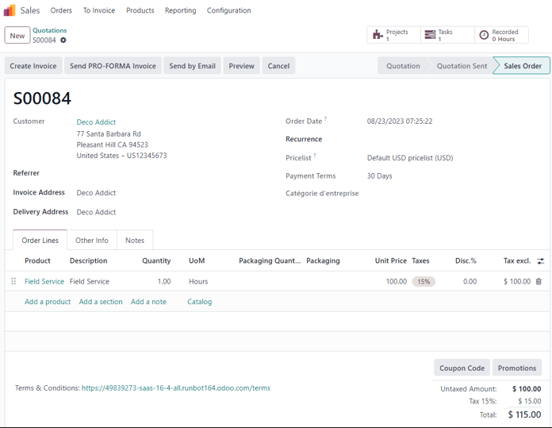
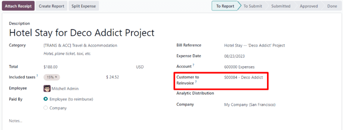
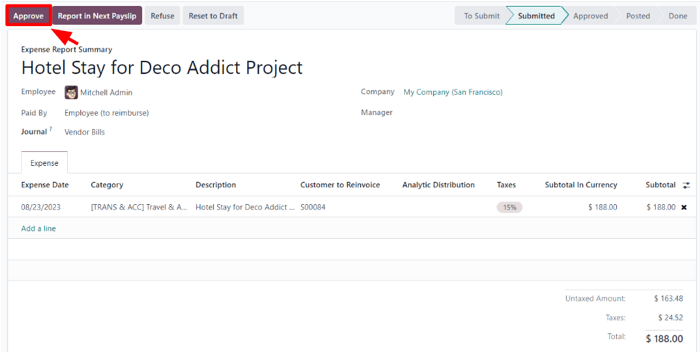
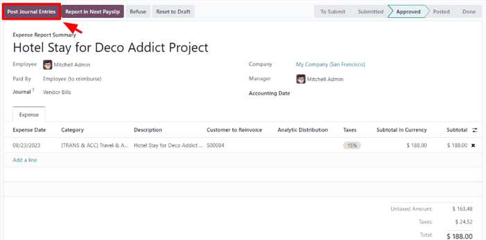
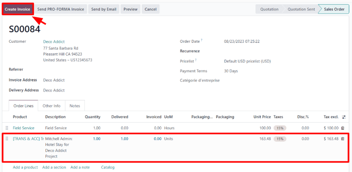
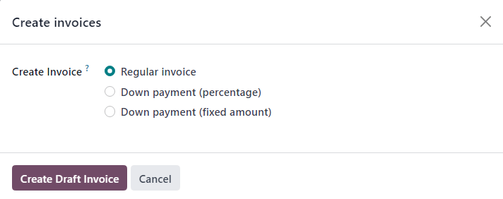
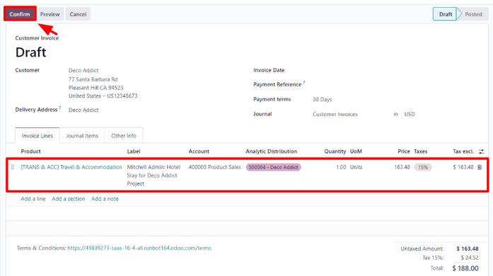
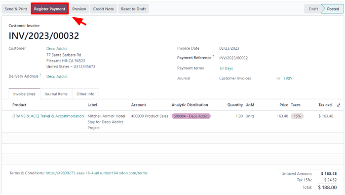
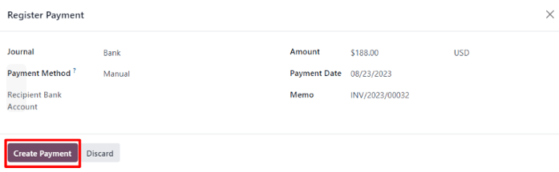
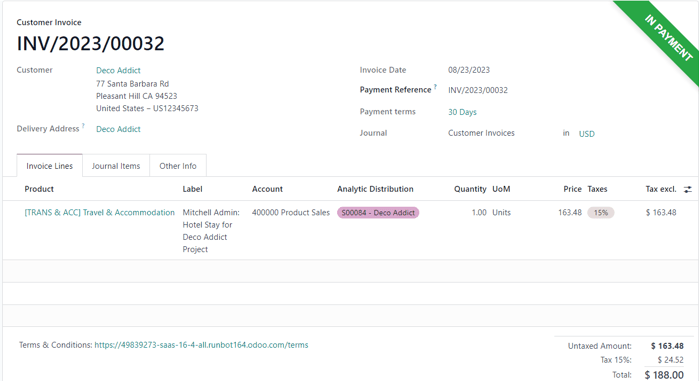

===============================
Reinvoice expenses to customers
===============================

While working on a project for a client, employees often have to spend their own money on various
expenses related to the project.

For example, an employee may need to use their own money to pay for a hotel, while they provide an
on-site service for a client. As a company, this expense should be reinvoiced to the customer. With
Odoo, these kinds of expenses can quickly be reinvoiced to the customer related to the project.

Expenses application
====================

To be able to reinvoice a customer for an expense, the *Expenses* application **must** be installed.

To install the *Expenses* application, navigate to :menuselection:`main Odoo dashboard --> Apps`,
and click :guilabel:`Install` on the *Expenses* application block. When clicked, Odoo installs the
application, refreshes the page, and returns to the main Odoo dashboard.

Add expenses to sales orders
============================

To begin, have a sales order confirmed in the *Sales* app to which a reinvoiced expense can be
added. Or, create a new sales order from scratch. To do that, navigate to the :menuselection:`Sales
app --> New`. Doing so reveals a blank quotation form.

Then, add a :guilabel:`Customer`, and add a product to the :guilabel:`Order Lines` tab, by clicking
:guilabel:`Add a product`. Next, select a product from the drop-down menu.

Lastly, click :guilabel:`Confirm` to confirm the sales order.

With the sales order confirmed, it's time to create an expense.

To do that, navigate to the *Expenses* application, by going to :menuselection:`main Odoo dashboard
--> Expenses`.

Then, from the *Expenses* dashboard, click :guilabel:`New` to reveal a blank expenses form.

.. image:: expense/blank-expenses-form.png
   :align: center
   :alt: A blank expenses form in the Odoo Expenses application.

On the expenses form, add a :guilabel:`Description` to easily reference the expense.

Then, in the :guilabel:`Category` field, select one of the following options from the drop-down
menu:

- :guilabel:`Communication`: any form of communication related to a project/order.
- :guilabel:`Others`: expense that doesn't fit into any other categories.
- :guilabel:`Meals`: any form of meal costs related to a project/order.
- :guilabel:`Gifts`: any form of gift costs related to a project/order.
- :guilabel:`Mileage`: any form of mileage (gas) costs related to project/order.
- :guilabel:`Travel \& Accommodation`: any travel or accommodation costs related to a project/order.

.. tip::
   New expense categories can be created from an expense form, by clicking the :guilabel:`Category`
   field drop-down menu, selecting :guilabel:`View All`, and clicking :guilabel:`New` from the
   :guilabel:`Search:Category` pop-up window.

   .. image:: expense/expense-category-pop-up.png
      :align: center
      :alt: The Search:Category expenses pop-up window from a blank expenses form in Odoo Expenses.

For this sample workflow, which will reinvoice a customer for a brief hotel stay, the
:guilabel:`Category` for this example is :guilabel:`[TRANS \& ACC] Travel \& Accommodation`.

.. note::
   The following example requires the *Sales*, *Accounting*, and *Expense* apps to view/modify all
   the fields mentioned during the workflow.

Beneath the :guilabel:`Category` field, enter in the amount to be expensed in the :guilabel:`Total`
field.

Next, designate if there are any :guilabel:`Included taxes` in the :guilabel:`Total`. If a
preconfigured tax amount is selected from the :guilabel:`Included taxes` field, Odoo auto-calculates
the taxed amount, based on the amount entered in the :guilabel:`Total` field.

Then, choose which :guilabel:`Employee` was responsible for the expense, and choose an option in the
:guilabel:`Paid By` field: :guilabel:`Employee (to reimburse)` or :guilabel:`Company`.

In this case, our employee paid for the hotel with their own money, so the :guilabel:`Employee (to
reimburse)` option is chosen.

On the right-hand side of the expenses form, the option to add a :guilabel:`Bill Reference` is
available. Beneath that, the auto-populated :guilabel:`Expense Date` and :guilabel:`Account` fields
are available.

.. note::
   The :guilabel:`Expense Date` and :guilabel:`Account` field can be modified, if needed.

Next, in the :guilabel:`Customer to Reinvoice` field, click the blank field to reveal a drop-down
menu. From this drop-down menu, select the appropriate sales order to which this expense should be
attached. This field **must** be filled, in order to reinvoice a customer for an expense.

Lastly, the option to modify the :guilabel:`Analytic Distribution` and :guilabel:`Company` fields
are available. These fields are *not* required to complete a reinvoiced expense to a customer, but
are available to modify, if needed.

Also, at the bottom of the expense form, there is a :guilabel:`Notes...` section, wherein any notes
related to this expense can be added, if needed.

At the top of the expense form, there are buttons to :guilabel:`Attach Receipt`, :guilabel:`Create
Report`, and :guilabel:`Split Expense`.

If there is a physical or digital receipt that should be attached to the expense, click
:guilabel:`Attach Receipt`.

If the cost of this expense needs to be split, click :guilabel:`Split Expense`. This feature can be
used for a number of reasons (spitting expense with another employee, to accommodate different tax
rates, etc.).

If neither of these options are necessary, click :guilabel:`Create Report` to lock in the expense
report that was just configured.

Doing so reveals an :guilabel:`Expense Report Summary` for the new expense.

Here, once the details related to the expense have been confirmed, click :guilabel:`Submit to
Manager`. This sends the expense report to the approving manager, who will review the expense.

The manager in charge of reviewing and approving the expense will inspect the details related to
the expense, and if there are no issues, they will click the :guilabel:`Approve` button — which
*only* appears on the manager's view of the :guilabel:`Expense Report Summary` that's been submitted
to the manager by the employee.

Once approved, the buttons at the top of the :guilabel:`Expense Report Summary` change once again.
At this point, the buttons at the top of the :guilabel:`Expense Report Summary` are: :guilabel:`Post
Journal Entries`, :guilabel:`Report in Next Payslip`, :guilabel:`Refuse`, and :guilabel:`Reset to
Draft`.

When the manager is satisfied with the :guilabel:`Expense Report Summary`, they'll click
:guilabel:`Post Journal Entries`.

Upon clicking :guilabel:`Post Journal Entries`, that button disappears, and the :guilabel:`Analytic
Distribution` column in the :guilabel:`Expense` tab is filled with the sales order that was
initially configured to the expense in the :guilabel:`Customer to Reinvoice` field.

Reinvoice expense
=================

With those steps completed, it's time to return to the sales order to complete the reinvoice of the
expense to the customer.

To do that, navigate to :menuselection:`main Odoo dashboard --> Sales app`, and select the
appropriate sales order that should be reinvoiced for the expense.

On the sales form, the newly-configured expense is now in the :guilabel:`Order Lines` tab, with its
:guilabel:`Delivered` column filled in, and ready to be invoiced.

After confirming the details of the expense, click :guilabel:`Create Invoice` at the top of the
sales order. When clicked, a :guilabel:`Create invoices` pop-up window appears.

From this pop-up window, leave the :guilabel:`Create Invoice` field on the default
:guilabel:`Regular invoice` option, and click :guilabel:`Create Draft Invoice`.

Doing so reveals a :guilabel:`Customer Invoice Draft` showing *only* the expense in the
:guilabel:`Invoice Lines` tab.

If all the information related to the expense is correct, click :guilabel:`Confirm` to confirm the
invoice. Doing so moves the status of the invoice from :guilabel:`Draft` to :guilabel:`Posted`.

To send the invoice to the customer, click :guilabel:`Send \& Print`. Doing so reveals a
:guilabel:`Send` pop-up window, with a preconfigured message and PDF invoice in the body of the
message. The message can be reviewed and modified, if needed.

Once ready, click :guilabel:`Send \& Print` to send the invoice to the customer. When clicked, the
pop-up window disappears, and Odoo sends the message/invoice to the customer. Additionally, a PDF of
the invoice is automatically downloaded for record-keeping and/or printing purposes.

Back on the :guilabel:`Customer Invoice`, click the :guilabel:`Register Payment` button when the
customer pays for the invoiced expense.

When :guilabel:`Register Payment` is clicked, a :guilabel:`Register Payment` pop-up window appears.
In this pop-up window, the necessary fields are auto-populated with the correct information. After
reviewing the information, click :guilabel:`Create Payment`.

Once :guilabel:`Create Payment` is clicked, the pop-up window disappears, and a green :guilabel:`In
Payment` banner is in the upper-right corner of the invoice, signifying this invoice is paid for in
full. Thus, completing the workflow.

.. seealso::
   - :doc:`invoicing_policy`
   - :doc:`time_materials`
   - :doc:`milestone`
