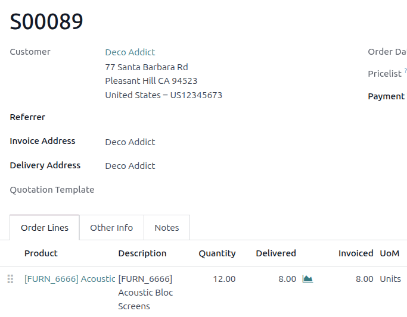

==================
Invoicing policies
==================

Depending on business needs, it may be advantageous to choose whether to invoice customers based on
the goods and services that they order or when those goods and services are delivered to them. To
allow businesses maximum flexibility to best meet their needs, Odoo offers two invoicing policies
that can be enabled in the **Sales** app: :ref:`Invoice what is ordered <invoice-on-order>` and
:ref:`Invoice what is delivered <invoice-on-delivery>`.

- The *Invoice what is ordered* rule is used as the default mode in Odoo **Sales**, which means
  customers are invoiced once the sales order is confirmed.
- The *Invoice what is delivered* rule invoices customers once the delivery is done. This rule is
  often used for businesses that sell materials, liquids, or food in large quantities. In these
  cases, the ordered quantity may differ slightly from the delivered quantity, making it preferable
  to invoice the quantity actually delivered. When the delivery order is validated, Odoo will
  automatically decrease the on-hand quantity in the inventory.

To configure an invoicing policy, go to :menuselection:`Sales app --> Configuration --> Settings`,
and under the :guilabel:`Invoicing` heading, select an :guilabel:`Invoicing Policy` option:
:guilabel:`Invoice what is ordered` or :guilabel:`Invoice what is delivered`.

Activating an invoicing policy option automatically applies the chosen option to all newly created
products. Existing products **must** have their invoicing policy manually updated on their product
forms.

.. image:: invoicing_policy/invoicing-policy-setting.png
   :alt: Choosing an invoicing policy in the Sales app.

.. important::
   If the :guilabel:`Invoice what is delivered` option is chosen, it is **not** possible to activate
   the :guilabel:`Automatic Invoice` feature, which automatically generates invoices when an online
   payment is confirmed. Regular draft invoices can only be created once the delivery order has been
   processed and validated.

Changing the invoicing policy for existing products
---------------------------------------------------

After the invoicing policy has been configured in *Settings*, navigate to a product's form through
:menuselection:`Sales app --> Products --> Products` and choosing a product. Locate the
:guilabel:`Invoicing Policy` option located under the :guilabel:`General Information` tab. Use the
drop-down menu to change the policy.

.. image:: invoicing_policy/invoicing-policy-general-info-tab.png
   :alt: How to change invoicing policy on a product form in the **Sales** app.

.. _invoice-on-order:

Invoicing what is ordered
=========================

The *Invoice what is ordered* option is used as the default mode in the **Sales** app, which means
customers are invoiced once a quotation has been sent to the customer and confirmed. The creation of
a quotation in turn leads to the creation and confirmation of a sales order. An invoice can then be
created as soon as the sales order is confirmed.

This invoicing policy has no impact on the basic Odoo sales flow.

Invoice ordered quantity workflow
---------------------------------

Confirm that the product's invoicing policy is set to :guilabel:`Ordered quantities` in the product
form. :ref:`Create a quotation and sales order <sales/create-quotation>` as normal. After the sales
order has been confirmed, create an invoice by clicking the :guilabel:`Create Invoice` button on the
sales order form. Choose the type of invoice to be sent, click :guilabel:`Create Draft Invoice`,
confirm the invoice when ready, and proceed with the payment flow as normal.

.. example::
   A independent artisan with a small business sells handmade jewelery nationwide online. Because
   they have direct control over their inventory levels and ship with 3rd party carriers, they
   invoice their customers after a sales order has been confirmed.

   The artisan receives an order for a necklace. They send their customer a quotation, confirm it,
   and create a sales order. After the sales order has been confirmed, an invoice can be created and
   sent to the customer for payment without any additional steps be taken. The invoice gets paid,
   the necklace is shipped and delivered, and the transaction is complete.

.. _invoice-on-delivery:

Invoicing what is delivered
===========================

The *Invoice what is delivered* option invoices customers as different amounts of the ordered goods
are delivered. This option is often used for businesses that sell large quantities of physical goods
in each sales order, but may not always be able to completely fulfill a given order all at once. In
these cases, the ordered quantity may differ slightly from the delivered quantity based on product
availability. Once a quotation is confirmed, and the status changes from :guilabel:`Quotation sent`
to :guilabel:`Sales order`, Odoo automatically adds both the delivered and invoiced quantities to
the invoice and sales order. Both partial and complete deliveries are tracked. :ref:`Backorders
<inventory/shipping/backorders>` can be created for partial orders that will be completed at a later
time.

This invoicing policy has a minor impact on the sales flow because the delivered quantity of a
product needs to be manually entered on the sales order.

Invoice delivered quantity workflow
-----------------------------------

Confirm that the product's invoicing policy is set to :guilabel:`Delivered quantities` in the
product form. :ref:`Create a quotation and sales order <sales/create-quotation>` as normal. After
the sales order has been confirmed, the product must be delivered before an invoice can be created.

Once the product has been shipped and delivery has been confirmed, click the :guilabel:`Delivery`
smart button on the sales order screen and click :guilabel:`Validate` to validate the delivery
order. Once at least a partial delivery has been confirmed, return to the sales order form. The
:guilabel:`Create Invoice` button is now purple to indicate that an invoice can be created and
confirmed, and that it is possible to proceed with the payment flow as normal.

.. warning::
   If a user attempts to create an invoice without validating the delivered quantity, the system
   returns an error message alerting them to the issue.

   .. image:: invoicing_policy/invoicing-policy-error-message.png
      :alt: If Delivered Quantities invoicing policy is chosen, ensure a quantity has been
            delivered.

.. example::
   A produce distributor using the invoice what is delivered option sells 50 heads of lettuce to a
   local restaurant. At the time the delivery is made, only 40 heads are available. The distributor
   delivers the available heads of lettuce and creates an invoice for what was delivered. Later,
   when more supply comes in, the distributor delivers the remaning 10 heads of lettuce and creates
   a second invoice to complete the order.

.. seealso::
   - :doc:`../sales_quotations/create_quotations`
   - :doc:`down_payment`
   - :doc:`../../../inventory_and_mrp/inventory`
   - :doc:`../../../inventory_and_mrp/inventory/shipping_receiving/setup_configuration/multipack`
