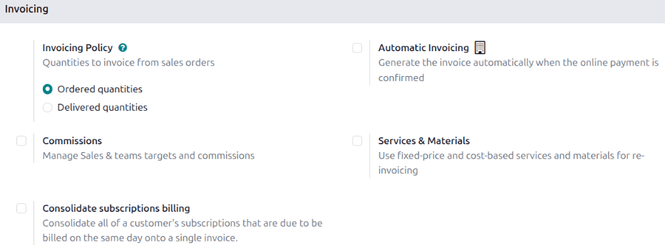
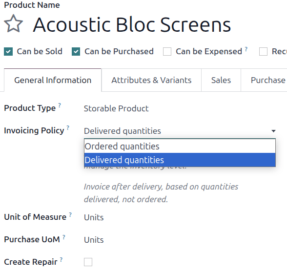
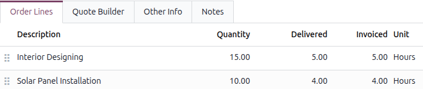

==================
Invoicing policies
==================

Depending on business needs, it may be advantageous to choose whether to invoice customers based on
the goods and services that they order or when those goods and services are delivered to them. To
allow businesses maximum flexibility to best meet their needs, Odoo offers two invoicing policies
that can be enabled in the **Sales** app: :ref:`invoice what is ordered
<sales/invoicing_policy/invoice-on-order>` and :ref:`invoice what is delivered
<sales/invoicing_policy/invoice-on-delivery>`.

.. _sales/invoicing_policy/configure-invoicing-policy:

Configure an invoicing policy
=============================

To configure an invoicing policy, go to :menuselection:`Sales app --> Configuration --> Settings`,
scroll to the *Invoicing* section. Select one of the :guilabel:`Invoicing Policy` options, either
:guilabel:`Ordered quantities` or :guilabel:`Delivered quantities`.

Activating an invoicing policy option automatically applies the chosen option to all newly created
products. Existing products **must** have their invoicing policy manually updated on their product
forms.

.. important::
   If the :guilabel:`Delivered quantities` option is chosen, it is **not** possible to activate the
   :guilabel:`Automatic Invoicing` :icon:`fa-building-o` feature, which automatically generates
   invoices when an online payment is confirmed.

   If the :guilabel:`Automatic Invoicing` :icon:`fa-building-o` feature is enabled in a
   multi-company database, it applies on a per-company basis and must be enabled for each company
   using automatic invoicing.

Change the invoicing policy for existing products
-------------------------------------------------

Even after the invoicing policy :ref:`has been configured
<sales/invoicing_policy/configure-invoicing-policy>` in the **Sales** app's configuration settings,
the invoicing policy may still be changed on a product-by-product basis. Open a product form by
navigating to :menuselection:`Sales app --> Products --> Products` and click on the product to be
updated. In the *General Information* tab, select an :guilabel:`Invoicing Policy` using the
drop-down menu.

.. _sales/invoicing_policy/invoice-on-order:

Invoice what is ordered
=======================

If the :guilabel:`Ordered quantities` option is selected in the **Sales** app settings, customers
are invoiced once a quotation has been confirmed. The creation of a quotation in turn leads to the
creation and confirmation of a sales order. An invoice can then be created as soon as the sales
order is confirmed.

This invoicing policy has no impact on the basic Odoo sales flow.

Invoice ordered quantity workflow
---------------------------------

Confirm that the product's invoicing policy is set to :guilabel:`Ordered quantities` in the product
form. :ref:`Create a quotation and sales order
<sales_quotations/create_quotations/create-quotation>` as normal. After the sales order has been
confirmed, create an invoice by clicking the :guilabel:`Create Invoice` button on the sales order
form. Choose the type of invoice to be sent, click :guilabel:`Create Draft Invoice`, confirm the
invoice when ready, and proceed with the payment flow as normal.

.. example::
   An independent artisan with a small business sells handmade jewelry nationwide online. Because
   they have direct control over their inventory levels and ship with 3rd-party carriers, they
   invoice their customers after a sales order has been confirmed.

   They receive an order for a necklace. They send their customer a quotation, confirm it, and
   create a sales order. After the sales order is confirmed, an invoice is created and sent to the
   customer for payment without any additional steps needed. The invoice gets paid, the necklace is
   shipped and delivered, and the transaction is complete.

.. _sales/invoicing_policy/invoice-on-delivery:

Invoice what is delivered
=========================

The :guilabel:`Delivered quantities` option invoices customers as the ordered goods are delivered.
This option is often used for businesses that sell large quantities of physical goods in each sales
order, but may not always be able to fulfill a given order all at once.

In these cases, the ordered quantity may differ from the delivered quantity based on product
availability. Once a quotation is confirmed, and the status changes from :guilabel:`Quotation sent`
to :guilabel:`Sales order`, Odoo automatically adds both the delivered and invoiced quantities to
the invoice and sales order. Both partial and complete deliveries are tracked. :ref:`Backorders
<inventory/shipping/backorders>` can be created for partial orders that are completed at a later
time.

This invoicing policy has a minor impact on the sales flow because the delivered quantity of a
product needs to be manually entered on the sales order.

Invoice delivered quantity workflow
-----------------------------------

Confirm that the product's invoicing policy is set to :guilabel:`Delivered quantities` in the
product form. :ref:`Create a quotation and sales order
<sales_quotations/create_quotations/create-quotation>` as normal. After the sales order has been
confirmed, the product must be delivered before an invoice can be created.

Once the product has been shipped and delivery has been confirmed, click the :icon:`fa-building-o`
:guilabel:`Delivery` smart button on the sales order screen and click :guilabel:`Validate` to
validate the delivery order. Once at least a partial delivery has been confirmed, return to the
sales order form. The :guilabel:`Create Invoice` button is now purple to indicate that an invoice
can be created and confirmed, and that it is possible to proceed with the payment flow as normal.

.. warning::
   If a user attempts to create an invoice without validating the delivered quantity, the system
   returns an error message alerting them to the issue.

.. example::
   A produce distributor using the :guilabel:`Delivered quantities` invoicing policy sells 50 heads
   of lettuce to a local restaurant.

   At the time of delivery, only 40 heads are available. The distributor delivers the available
   heads of lettuce and creates an invoice for the quantity delivered. Later, when the lettuce
   inventory is replenished, the distributor delivers the remaining 10 heads of lettuce and creates
   a second invoice to complete the order.

.. seealso::
   - :doc:`../sales_quotations/create_quotations`
   - :doc:`down_payment`
   - :doc:`../../../inventory_and_mrp/inventory`
   - :doc:`../../../inventory_and_mrp/inventory/shipping_receiving/setup_configuration/multipack`
