==========================
Invoice project milestones
==========================

Invoicing based on project milestones can be used for expensive or large-scale projects. The series
of milestones in a project represent a clear sequence of work that will inevitably result in the
completion of a project and/or contract.

This method of invoicing ensures the company gets a consistent flow of money throughout the lifetime
of the project. Customers can closely monitor every phase of the project's development as it
happens, in addition to paying a large bill in several installments, instead of all at once.

Create milestone products
=========================

In Odoo, each milestone of a project is considered as an individual product.

To create and/or configure products to work like this, first navigate to :menuselection:`Sales app
--> Products --> Products`. Then, click on a product, or create a new one by clicking
:guilabel:`New`.

The option to invoice based on milestones is only available for certain product types.

On the product form, under the :guilabel:`General Information` tab, the :guilabel:`Product Type`
field *must* be set on any of the following options: :guilabel:`Service`, :guilabel:`Event Ticket`,
:guilabel:`Event Booth`, or :guilabel:`Course`.

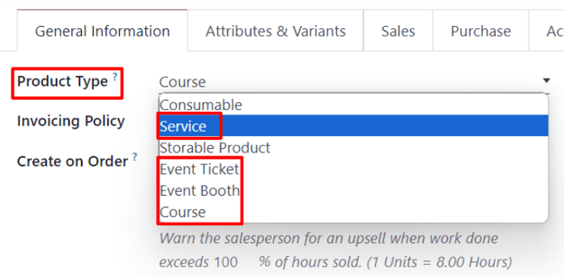

With any of those :guilabel:`Product Type` options selected, choose :guilabel:`Based on Milestones`
from the :guilabel:`Invoicing Policy` drop-down menu.

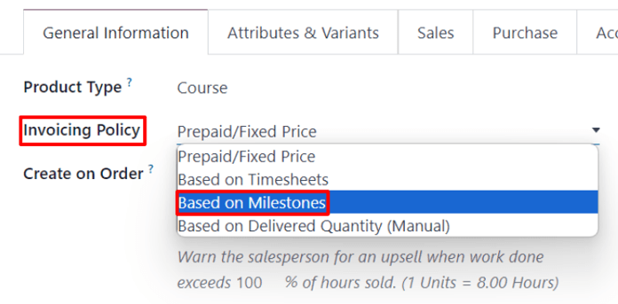

Beneath that is the :guilabel:`Create on Order` field.

To ensure workflows are as seamless as possible, it is recommended that an option in the
:guilabel:`Create on Order` field is selected.

.. note::
   Leaving it on the default :guilabel:`Nothing` option won't negatively affect the desired
   workflow. However, a project *must* then be created directly from a sales order form with that
   specific product. Once a project is created *then* milestones and tasks can be created and
   configured.

When the :guilabel:`Create on Order` default option of :guilabel:`Nothing` is clicked, a drop-down
menu is revealed with the following options:

- :guilabel:`Task`: Odoo creates a task related to this milestone product in the *Projects* app when
  this specific product is ordered.
- :guilabel:`Project \& Task`: Odoo creates a project and task related to this milestone product in
  the *Projects* app when this specific product is ordered.
- :guilabel:`Project`: Odoo creates a project related to this milestone product in the *Projects*
  app when this specific product is ordered.

When :guilabel:`Task` is selected, a :guilabel:`Project` field appears. In this field, select to
which existing project in the *Projects* app this created task should be connected.

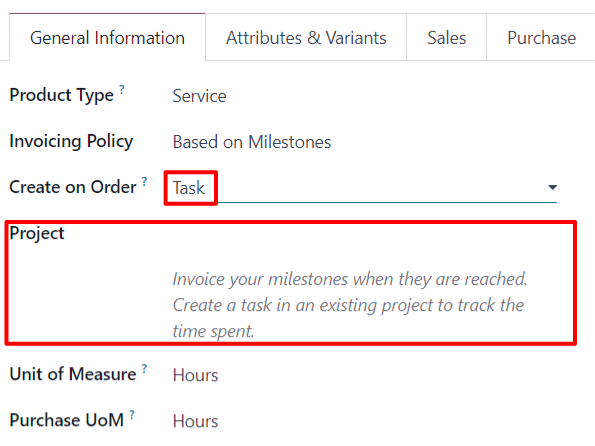

When :guilabel:`Project \& Task` or :guilabel:`Project` is selected, two new fields appear:
:guilabel:`Project Template` and :guilabel:`Workspace Template`.

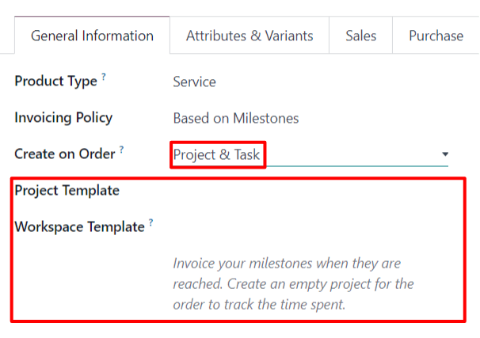

The :guilabel:`Project Template` field provides template options to use for the project that will be
created when this specific product is ordered.

The :guilabel:`Workspace Template` field provides template options to use for the workspace (for the
*Documents* app, not the *Projects* app) that will be automatically generated for the project when
this specific product is ordered.

.. tip::
   For organizational purposes, click the :guilabel:`Sales` tab on the product form, and enter a
   custom 'Milestone' related descriptor in the :guilabel:`Sales Description` field. This
   information appears in the :guilabel:`Description` column on the :guilabel:`Order Lines` tab of
   the sales order.

   Or, directly edit/modify the :guilabel:`Description` field on the :guilabel:`Order Lines` tab of
   the sales order.

   This is *not* a requirement.

Invoice milestones
==================

.. note::
   The following flow features a trio of milestone products that have :guilabel:`Service` set as
   their :guilabel:`Product Type`, and :guilabel:`Task` set on their :guilabel:`Create on Order`
   field.

    .. image:: milestone/settings-for-workflow.png
       :align: center
       :alt: Product with Service "Product Type" and "Task" in the Create on Order field on form.

   Those tasks are then attached to a pre-existing :guilabel:`Project`, which, in this case, is
   titled, :guilabel:`Rebranding Projects`.

To invoice milestones, create a sales order with the milestone product(s). To do that, go to
:menuselection:`Sales app --> New`. Doing so reveals a blank quotation form.

From this quotation form, add a :guilabel:`Customer`. Then, click :guilabel:`Add a product` in the
:guilabel:`Order Lines` tab. Next, add the milestone product(s) to the :guilabel:`Order Lines` tab.

Once the corresponding milestone product(s) have been added, click :guilabel:`Confirm` to confirm
the order, which turns the quotation into a sales order.

When the order is confirmed, new smart buttons appear at the top of the sales order based on what
was selected in the :guilabel:`Create on Order` field on the product form.

From the sales order, click the :guilabel:`Milestones` smart button. Doing so reveals a blank
:guilabel:`Milestones` page. Click :guilabel:`New` to add milestones.

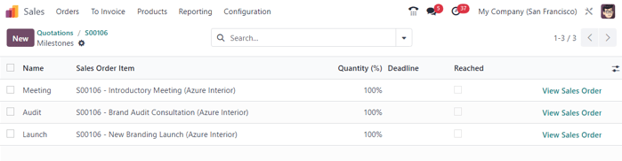

Enter a :guilabel:`Name` for the milestone. Next, apply it to the corresponding :guilabel:`Sales
Order Item`. Lastly, assign a :guilabel:`Deadline` to the milestone, if desired.

Repeat that process for all milestone sales order items.

Then, return to the sales order, via the breadcrumbs. From the sales order, click the
:guilabel:`Tasks` smart button. Doing so reveals a :guilabel:`Tasks` page with a task for each sales
order item with that option designated in the :guilabel:`Create on Order` field.

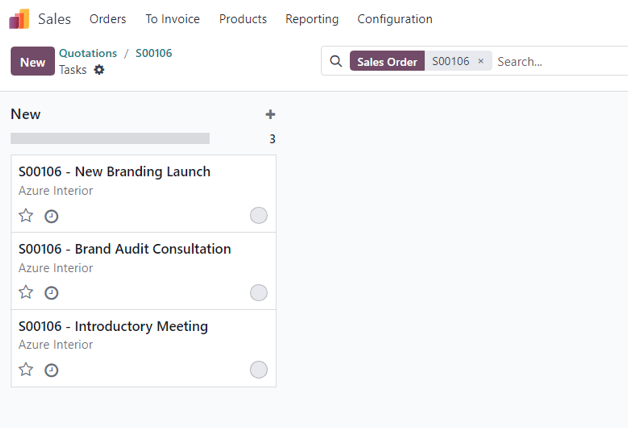

To manually assign a configured milestone to a task, click the desired task, which reveals the task
form. On the task form, select the appropriate milestone to which this task should be connected, in
the :guilabel:`Milestone` field.

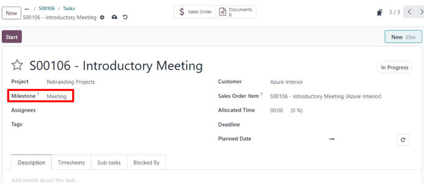

Repeat this process for all milestone tasks.

With those tasks properly configured, employees log in their progress as they work on the task, in
addition to adding any notes related to the task.

Then, when that task is complete, that means that milestone has been reached. At that point, it is
time to invoice that milestone.

To invoice a milestone, first return to the sales order — either via the breadcrumb links, or by
navigating to :menuselection:`Sales app --> Orders --> Orders` and picking the appropriate sales
order.

Back on the sales order form, click the :guilabel:`Milestones` smart button, and check the box in
the :guilabel:`Reached` column for that particular task.

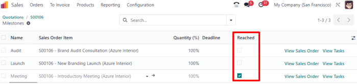

Next, return to the sales order — either by clicking :guilabel:`View Sales Order` on the
:guilabel:`Milestones` page, or via the breadcrumb links.

Back on the sales order, the line item for the milestone that's been reached has its
:guilabel:`Delivered` column filled. That's because the milestone has been reached, and therefore
delivered.

.. image:: milestone/delivered-milestone-product-sales-order.png
   :align: center
   :alt: A milestone product that's been reached marked as delivered on the sales order in Odoo.

Click :guilabel:`Create Invoice` in the upper-left corner. Doing so reveals a :guilabel:`Create
invoices` pop-up window.

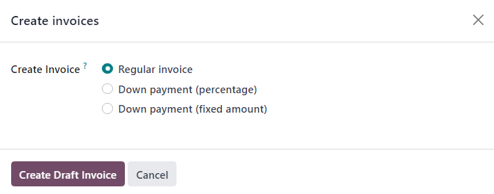

On the :guilabel:`Create invoices` pop-up window, leave the :guilabel:`Create Invoice` option on the
default :guilabel:`Regular Invoice` selection, and click the :guilabel:`Create Draft Invoice`
button.

Upon clicking :guilabel:`Create Draft Invoice`, Odoo reveals the :guilabel:`Customer Invoice Draft`,
*only* showing that reached milestone in the :guilabel:`Invoice Lines` tab.

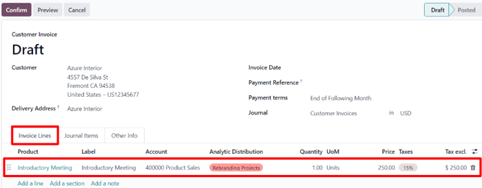

From this invoice page, click the :guilabel:`Confirm` button to confirm the invoice. Then, when the
customer has paid for this milestone, click :guilabel:`Register Payment`.

When :guilabel:`Register Payment` is clicked, a :guilabel:`Register Payment` pop-up window appears.

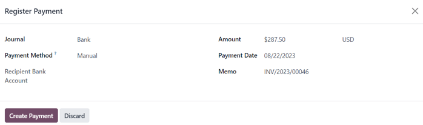

On this pop-up window, confirm the accuracy of the auto-populated fields, then click
:guilabel:`Create Payment`.

When clicked, the pop-up window disappears, and Odoo returns to the invoice for that milestone,
which now has a green :guilabel:`In Payment` banner in the upper-right corner. This banner signifies
the invoice has been paid.

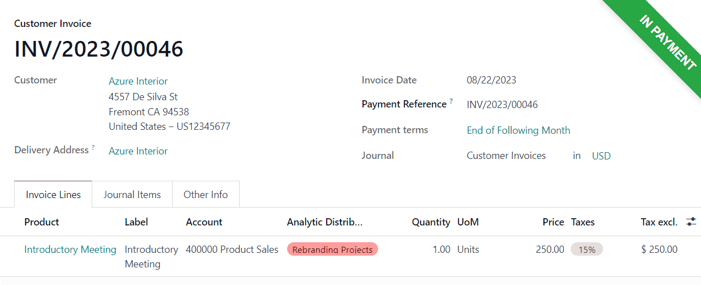

Then, return to the sales order, via the breadcrumb links. Back on the sales order, in the
:guilabel:`Order Lines` tab, the reached milestone that's been invoiced and paid for, now has its
:guilabel:`Invoiced` column filled.

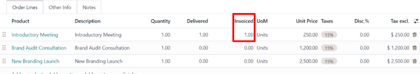

There is also a new :guilabel:`Invoices` smart button at the top of the sales order. Clicking that
reveals all the invoices that are connected to this sales order.

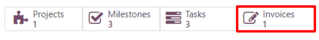

Simply repeat the above process for each milestone as it is worked on, and subsequently, completed.

Continue that process until the entire project has been completed, each milestone has been invoiced,
and the entire order has been paid for in full.

.. seealso::
   - :doc:`time_materials`
   - :doc:`proforma`
   - :doc:`invoicing_policy`
