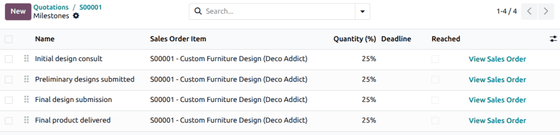

==========================
Invoice project milestones
==========================

.. |SO| replace:: :abbr:`SO (Sales Order)`
.. |SOs| replace:: :abbr:`SOs (Sales Orders)`

Invoicing based on project milestones allows companies to bill large or long-running projects
progressively as key deliverables are completed. Each milestone represents a measurable stage of
work that triggers invoicing upon completion. This approach helps maintain predictable cash flow and
provides customers with visibility into project progress, all while allowing payments to occur in
manageable installments.

In Odoo, milestone invoicing is configured at the product level in the **Sales** app, with milestone
progress and completion managed in the **Projects** app. When a milestone is marked as reached, the
delivered quantity on the sales order (SO) is updated and can be invoiced.

In Odoo, this workflow is driven by two key elements:

 - A service product configured with a *Based on Milestones* invoicing policy
 - One or more milestones that represent the phases of work

As project work is completed, milestones are marked as reached, which automatically updates the
delivered quantities and makes the milestone eligible for invoicing.

.. important::
   This document covers the **Sales** app configuration and invoicing flow for invoicing based on
   project milestones. For more information on creating, managing, and completing milestones, and
   how to link them to tasks, see :doc:`Project milestones
   <../../../services/project/project_management/project_milestones>`.

Create milestone products
=========================

To begin, a product must be configured specifically for milestone-based invoicing. Navigate to
:menuselection:`Sales app --> Products --> Products` and click :guilabel:`New`. Enter the necessary
information, including the product title and :guilabel:`Sales Price`.

For the :guilabel:`Product Type`, select :guilabel:`Service`. Doing so reveals the :guilabel:`Create
on Order` field. Select either :guilabel:`Project`, :guilabel:`Project and Task`, or
:guilabel:`Task`, depending on how the product is tracked in the **Project** app.

.. note::
   A :guilabel:`Project Template` can also be selected for the product. See :doc:`Project templates
   <../../../services/project/project_management/project_templates>` for more information.

For the :guilabel:`Invoicing Policy`, select :guilabel:`Based on Milestones`. This option ensures
that the product's delivered quantities update automatically once a milestone is completed.

.. important::
   *Based on Milestones* is only available if there is at least one project with *Milestones*
   enabled.

Creating milestones from a sales order
======================================

After the milestone product has been sold, a  *Milestones* smart button is added to the |SO|. Click
the smart button to view, edit, or create new milestones.

From here, the :guilabel:`Delivered %` can be altered. This amount equates to the total cost of the
|SO| that is billed when the milestone is reached.

.. example::
   A company sells a *Custom furniture design* product with four milestones:

   - Initial design consult
   - Preliminary designs submitted
   - Final design submission
   - Final product delivered

   Each of these milestones has a *Delivered %* of `25%`. As each milestone is marked complete, a
   corresponding `25%` of the total number of hours is marked as *Delievered* on the invoice.

Invoicing a completed milestone
===============================

Milestones can be tracked through the **Project** app (see :ref:`Using milestones
<project/using-milestones>`). Additionally, a milestone can be marked as :guilabel:`Reached` on the
*Milestones* page by ticking the checkbox for that milestone.

Then, click :guilabel:`View Sales Order` or use the breadcrumbs to return to the |SO|. The
:guilabel:`Delivered` column will be updated to reflect the *Delivered %* for the milestone reached.
Click :guilabel:`Create Invoice`.

These steps can be repeated as additional milestones are reached until the |SO| has been fulfilled.

.. seealso::
   - :doc:`time_materials`
   - :doc:`proforma`
   - :doc:`invoicing_policy`
