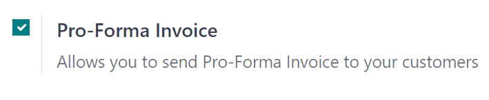
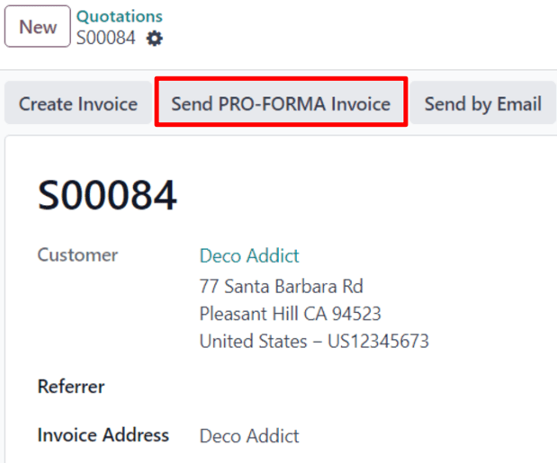
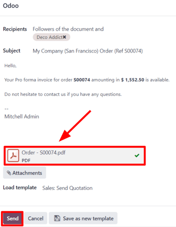

==================
Pro-forma invoices
==================

A *pro-forma invoice* is an abridged or estimated invoice sent in advance of a delivery of goods. It
notes the kind and quantity of goods, their value, and other important information, such as weight
and transportation charges.

Pro-forma invoices are commonly used as preliminary invoices with a quotation. They are also used
during importation for customs purposes. They differ from a normal invoice, in that they are *not* a
demand (or request) for payment.

Configuration
=============

In order to utilize pro-forma invoices, the *Pro-Forma Invoice* feature **must** be activated.

To enable this feature, navigate to :menuselection:`Sales app --> Configuration --> Settings`, and
in the :guilabel:`Quotations \& Orders` section, click the checkbox next to :guilabel:`Pro-Forma
Invoice`. Then, click :guilabel:`Save` to save all changes.

Send pro-forma invoice
======================

With the :guilabel:`Pro-Forma Invoice` feature activated, the option to send a pro-forma invoice is
now available on any quotation or sales order, via the :guilabel:`Send Pro-Forma Invoice` button.

.. note::
   Pro-forma invoices can **not** be sent for a sales order or quotation if an invoice for a down
   payment has already been sent, or for a recurring subscription.

   In either case, the :guilabel:`Send Pro-Froma Invoice` button does **not** appear.

   However, pro-forma invoices **can** be sent for services, event registrations, courses, and/or
   new subscriptions. Pro-forma invoices are not limited to physical, consumable, or storable goods.

When the :guilabel:`Send Pro-Forma Invoice` button is clicked, a pop-up window appears, from which
an email can be sent.

In the pop-up window, the :guilabel:`Recipients` field is auto-populated with the customer from the
sales order or quotation. The :guilabel:`Subject` field and the body of the email can be modified,
if necessary.

The pro-forma invoice is automatically added as an attachment to the email.

When ready, click :guilabel:`Send`, and Odoo instantly sends the email, with the attached pro-forma
invoice, to the customer.

.. tip::
   To preview what the pro-forma invoice looks like, click on the PDF at the bottom of the email
   pop-up window *before* clicking :guilabel:`Send`. When clicked, the pro-forma invoice is
   downloaded instantly. Open that PDF to view (and review) the pro-forma invoice.

   .. image:: proforma/pro-forma-pdf.png
      :align: center
      :alt: Sample pro-forma invoice PDF from Odoo Sales.

.. seealso::
   :doc:`invoicing_policy`
