=====================================
Invoicing based on time and materials
=====================================

Invoicing based on time and/or materials is typically used when accurately estimating the size of a
project isn't possible, or when the requirements of a project may change.

This is different from a fixed-price contract, when a customer agrees to pay a specified total for
the fulfillment of the contract---no matter what needs to be paid to the employees, sub-contractors,
vendors, suppliers, and so on.

The Odoo *Sales* app can invoice for time and various other expenses (e.g. transport, lodging), as
well as purchases needed to fulfill an order.

App and settings configuration
==============================

First, in order to accurately keep track of the progress of a project, the Odoo *Project* and
*Accounting* apps **must** be installed.

To install the *Project* app, navigate to :menuselection:`Odoo main dashboard --> Apps`. Then, on
the :guilabel:`Apps` page, locate the :guilabel:`Project` app block, and click :guilabel:`Activate`.
The page automatically refreshes and returns to the main Odoo dashboard, where the *Project* app is
now available to access.

Repeat the same process to install the *Accounting* application.

After installation, click the :guilabel:`Accounting` app icon from the main Odoo dashboard, and
navigate to :menuselection:`Configuration --> Settings`. On the :guilabel:`Settings` page, scroll
down to the :guilabel:`Analytics` section, and ensure the box next to :guilabel:`Analytic
Accounting` is checked.

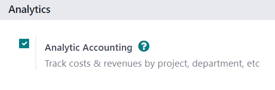

Then, click :guilabel:`Save` to save all changes.

Then, navigate to :menuselection:`Odoo main dashboard --> Project app --> Configuration -->
Settings`. On the :guilabel:`Settings` page, in the :guilabel:`Time Management` section, ensure the
box beside the :guilabel:`Timesheets` feature is checked.

Then, click :guilabel:`Save` to save all changes.

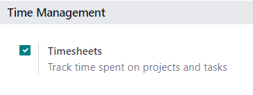

.. _sales/invoicing/configured-service-product:

Service product configuration
=============================

With the *Timesheets* feature activated in the *Project* app, it is now possible to invoice for time
spent on a project, but **only** when the following product configurations have been made.

.. important::
   Invoicing for time spent on a project is **only** possible with products that have *Service* set
   as the *Product Type* on their product form.

To configure a service product, first navigate to :menuselection:`Sales app --> Products -->
Products`. On the :guilabel:`Products` page, select the desired service product to be configured, or
click :guilabel:`New` to create a new product.

From the product form, in the :guilabel:`General Information` tab, set the :guilabel:`Product Type`
to :guilabel:`Service`. Then, open the drop-down menu in the :guilabel:`Invoicing Policy` field, and
select :guilabel:`Based on Timesheets`.

Next, from the :guilabel:`Create on Order` drop-down menu, select :guilabel:`Project \& Task`. That
setting indicates that, when a sales order is created with this specific service product, a new
project and task is created in the *Project* app.

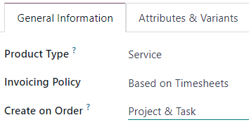

.. note::
   The option :guilabel:`Task` can be chosen instead from the :guilabel:`Create on Order` drop-down
   menu. If :guilabel:`Task` is chosen, select an existing project that the task will appear in from
   :guilabel:`Project` field, which only appears if :guilabel:`Task` is chosen in the
   :guilabel:`Create on Order` field.

Add time spent to sales order
=============================

After properly configuring a service product with the correct *Invoicing Policy* and *Create on
Order* options, it is possible to add time spent to a sales order.

To see that in action, navigate to :menuselection:`Sales app --> New` to open a blank quotation
form. Then, proceed to add a :guilabel:`Customer`, and in the :guilabel:`Order Lines` tab, click
:guilabel:`Add a product`, and select the properly :ref:`configured service product
<sales/invoicing/configured-service-product>` from the drop-down menu.

Next, click :guilabel:`Confirm` to confirm the order.

After confirming the sales order, two smart buttons appear at the top of the order form:
:guilabel:`Projects` and :guilabel:`Tasks`.

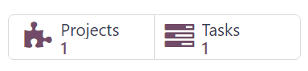

If the :guilabel:`Projects` smart button is clicked, it reveals the specific project related to this
sales order. If the :guilabel:`Tasks` smart button is clicked, it reveals the specific project task
related to this sales order. Both are also accessible in the *Project* app.

In order to add time spent on a sales order, click the :guilabel:`Tasks` smart button.

On the task form, select the :guilabel:`Timesheets` tab. From the :guilabel:`Timesheets` tab,
employees can be assigned to work on the project, and the time they spend working on the task can be
added by the employees or by the person who created the sales order.

To add an employee, and the time spent working on the task, click :guilabel:`Add a line` in the
:guilabel:`Timesheets` tab. Then, select the appropriate :guilabel:`Date` and :guilabel:`Employee`.
There is also the option to add a brief description of the work done during this time in the
:guilabel:`Description` column, but it's not required.

Lastly, enter the amount of time worked on the task in the :guilabel:`Hours Spent` column, and click
away to complete that line in the :guilabel:`Timesheets` tab.

.. note::
   The time entered in the :guilabel:`Hours Spent` column is immediately reflected in the
   :guilabel:`Allocated Time` field (located near the top of the task form) as a percentage, which
   reflects how much of the total allocated work hours have been done so far.

   That same information is found as numerical hours in the :guilabel:`Hours Spent` and
   :guilabel:`Remaining Hours` fields, located at the bottom of the :guilabel:`Timesheets` tab.

   .. image:: time_materials/timesheets-tab-on-task.png
      :align: center
      :alt: How the Timesheets tab appears on a task form in Odoo Sales and Odoo Project.

Repeat this process for however many employees and hours have been worked on the project.

Invoice time spent
==================

Once all the necessary employees and time spent have been added to the project task, return to the
sales order to invoice the customer for those hours. To do that, either click the :guilabel:`Sales
Order` smart button at the top of the task form, or return to the sales order via the breadcrumb
links, located in the upper-left of the screen.

Back on the sales order form, the time that was added to the task is reflected in the
:guilabel:`Order Lines` tab (in the :guilabel:`Delivered` column) and in the new :guilabel:`Recorded
Hours` smart button at the top of the sales order.

To invoice the customer for time spent on the project, click :guilabel:`Create Invoice`, and select
:guilabel:`Regular invoice` from the :guilabel:`Create invoices` pop-up window. Then, click
:guilabel:`Create Draft Invoice`.

Doing so reveals a :guilabel:`Customer Invoice Draft`, clearly showing all the work that's been done
in the :guilabel:`Invoice Lines` tab.

.. tip::
   Pay attention to the :guilabel:`Analytic Distribution` column in the :guilabel:`Customer
   Invoice`, as that information is necessary to ensure other time/material invoicing tasks are
   completed properly and accurately.

   .. image:: time_materials/invoice-lines-time.png
      :align: center
      :alt: Invoice draft showing time spent on sales order in Odoo Sales.

Click :guilabel:`Confirm` to confirm the invoice and continue with the invoicing process.

.. seealso::
   :doc:`invoicing_policy`

Expenses configuration
======================

In order to track and invoice expenses related to a sales order, the Odoo *Expenses* app **must** be
installed.

To install the *Expenses* app, navigate to :menuselection:`Odoo main dashboard --> Apps`. Then, on
the :guilabel:`Apps` page, locate the :guilabel:`Expenses` app block, and click
:guilabel:`Activate`.

The page automatically refreshes and returns to the main Odoo dashboard, where the
:guilabel:`Expenses` app is now available to access.

.. _sales/invoicing/add-expenses-sales-order:

Add expenses to sales order
===========================

To add an expense to a sales order, first navigate to the :menuselection:`Expenses` app. Then, from
the main *Expenses* dashboard, click :guilabel:`New`, which reveals a blank expense form.

On the expense form, add a :guilabel:`Description` of the expense (e.g. `Hotel Stay`, `Plane
Ticket`). Next, in the :guilabel:`Category` field, select the appropriate option from the drop-down
menu (e.g. :guilabel:`Meals`, :guilabel:`Miles`, :guilabel:`Travel \& Accommodation`).

.. note::
   Expense categories can be added and modified by navigating to :menuselection:`Expenses app -->
   Configuration --> Expense Categories`.

Then, enter the total amount of the expense in the :guilabel:`Total` field, as well as any
:guilabel:`Included Taxes` that may apply. Next, ensure that the correct :guilabel:`Employee` is
selected, and designate who paid for the expense in the :guilabel:`Paid By` field: the
:guilabel:`Employee (to reimburse)` or the :guilabel:`Company`.

Next, in the :guilabel:`Customer to Reinvoice` field, select the appropriate sales order from the
drop-down menu. Then, select that same sales order information from the :guilabel:`Analytic
Distribution` field, as well.

.. note::
   The :guilabel:`Analytic Distribution` field will **only** have the corresponding sales order as
   an option if the sales order contains a service product that is billed based on *Timesheets*,
   *Milestones*, or *Delivered Quantities*.

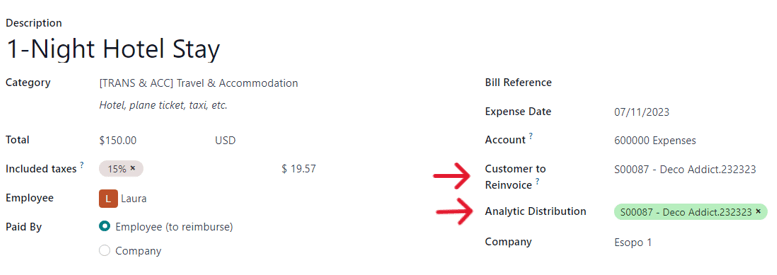

If there are any receipts that should be uploaded and attached to the expense, click the
:guilabel:`Attach Receipt` button, and upload the necessary documents to the expense. This is
**not** required, but it may affect whether or not an expense is approved.

When all the information has been entered, click :guilabel:`Create Report` to create an expense
report detailing all the expense information that was just entered.

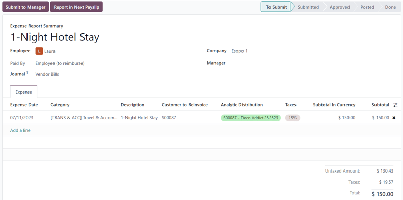

Then, there's the option to :guilabel:`Submit to Manager` for approval. Once approved, the
:guilabel:`Report in Next Payslip` appears.

To showcase a complete flow in this example, select :guilabel:`Submit to Manager`. Then, the manager
would click :guilabel:`Approve` to approve this expense, and click :guilabel:`Post Journal Entries`
to post this expense to the accounting journal.

Invoice expenses
================

To invoice a customer for an :ref:`expense on a sales order
<sales/invoicing/add-expenses-sales-order>`, navigate to the related sales order, either from the
:menuselection:`Sales` app or from the expense report in the :menuselection:`Expenses` app. From the
expense report, click the :guilabel:`Sales Orders` smart button at the top of the page.

If the expense report was linked to the sales order, the newly-configured expense now has its own
line in the :guilabel:`Order Lines` tab, and can be invoiced to the customer.

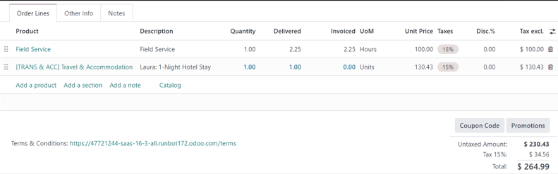

To invoice the customer for the expense on the sales order, click :guilabel:`Create Invoice`, select
:guilabel:`Regular Invoice` from the :guilabel:`Create invoices` pop-up window, then click
:guilabel:`Create Draft Invoice`.

Doing so reveals a :guilabel:`Customer Invoice Draft` for the expense. Then, the invoicing process
can be completed as usual.

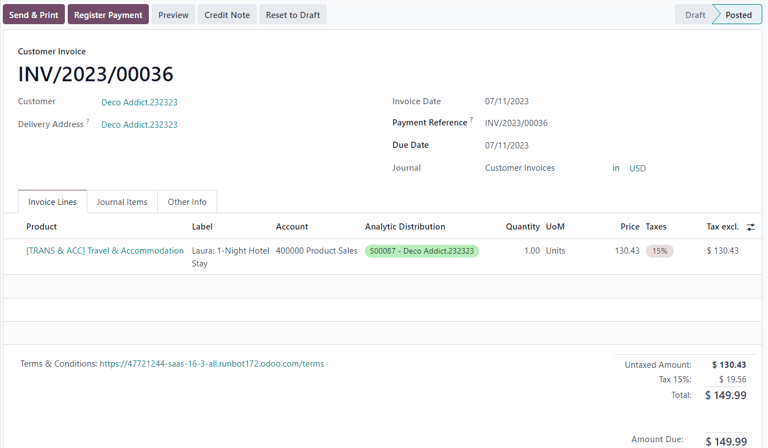

Purchase configuration
======================

In order to invoice a customer for purchases made on a sales order, the *Purchase* application
**must** be installed.

To install the *Purchase* application, navigate to :menuselection:`Odoo main dashboard --> Apps`.
Then, on the :guilabel:`Apps` page, locate the :guilabel:`Purchase` app block, and click
:guilabel:`Activate`. The page automatically refreshes and returns to the main Odoo dashboard, where
the :guilabel:`Purchase` app is now available to access.

.. _sales/invoicing/add-purchase-to-sales-order:

Add purchase to sales order
===========================

To add a purchase to a sales order, a purchase order must first be created. To create a purchase
order, navigate to :menuselection:`Purchase app --> New` to reveal a blank purchase order form.

First, add a :guilabel:`Vendor` to the purchase order. Then, under the :guilabel:`Products` tab,
click the :guilabel:`extra column options` drop-down menu, represented by two horizontal lines with
dots on them, located to the far-right of the column headers. From that drop-down menu, select
:guilabel:`Analytic Distribution`.

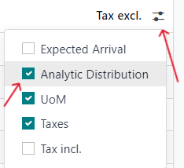

After adding the :guilabel:`Analytic Distribution` column to the headers on the :guilabel:`Products`
tab of the purchase order form, proceed to add the product(s) to the purchase order. To do that,
click :guilabel:`Add a product`, and select the desired product from the drop-down menu. Repeat for
all the products to add.

.. important::
   In order for a purchase to be properly invoiced on a sales order, the product on the purchase
   order **must** be marked as :guilabel:`Can be Expensed`, have an :guilabel:`Invoicing Policy` set
   to :guilabel:`Delivered quantities`, and have the :guilabel:`At cost` option selected in the
   :guilabel:`Re-Invoice Expenses` field on its product form.

   .. image:: time_materials/product-form-settings-invoice-purchase.png
      :align: center
      :alt: Product settings for a purchase order to be invoiced on a sales order in Odoo.

Then, select the appropriate :guilabel:`Analytic Distribution` associated with the sales order to
which this purchase order is related. To do that, click the empty :guilabel:`Analytic Distribution`
field to reveal an :guilabel:`Analytic` pop-up window.

Then, from the :guilabel:`Departments` drop-down menu, select the analytic distribution associated
with the desired sales order to be invoiced for the purchase.

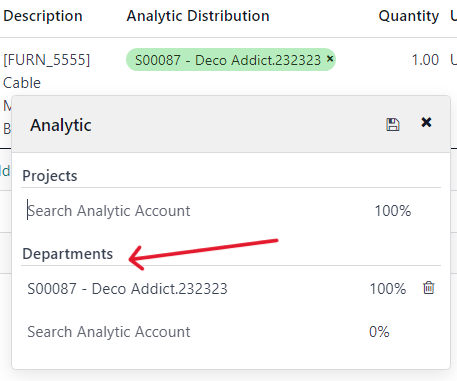

Once all the information is entered in the :guilabel:`Products` tab of the purchase order, confirm
the order by clicking :guilabel:`Confirm Order`. Then, click :guilabel:`Receive Products` when the
products have been received. This creates a receipt form.

.. note::
   If any serial/lot numbers must be entered before validating the receipt of products, then on the
   receipt form, click the :guilabel:`details` icon represented by four horizontal lines located to
   the far-right of the product line.

   This reveals a :guilabel:`Detailed Operations` tab, in which the necessary :guilabel:`Lot/Serial
   Number(s)` and :guilabel:`Done` quantity can be added. When ready, click :guilabel:`Confirm` to
   confirm the data.

Then, click :guilabel:`Validate` to validate the purchase order.

Next, return to the purchase order, via the breadcrumb links at the top of the page, and click
:guilabel:`Create Bill` to create a vendor bill that can be invoiced to the customer on the attached
sales order.

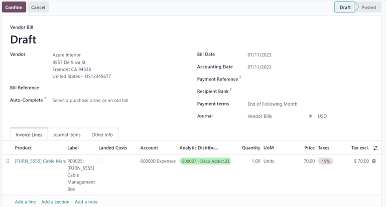

.. note::
   Make sure to enter a :guilabel:`Bill Date` on the :guilabel:`Vendor Bill Draft` before
   confirming. If a :guilabel:`Bill Date` is *not* entered, an error window appears, requesting that
   information to be entered before confirmation can occur.

Then, click :guilabel:`Confirm` to confirm the vendor bill, which is then automatically added to the
sales order, where it can be invoiced directly to the customer attached to it.

Invoice purchase
================

To invoice a customer for a purchase on a sales order, first :ref:`add the purchase to the sales
order <sales/invoicing/add-purchase-to-sales-order>`, then navigate to the desired sales order in
the :menuselection:`Sales` app.

On the sales order that was attached to the purchase order, the purchased product now has its own
product line under the :guilabel:`Order Lines` tab, and it is ready to be invoiced.

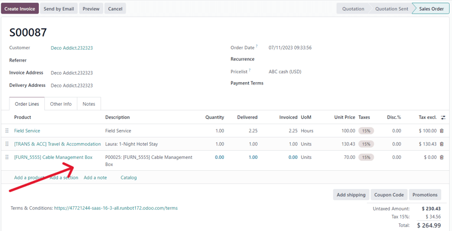

To invoice the customer for the purchase, simply click :guilabel:`Create Invoice`, select
:guilabel:`Regular Invoice` from the :guilabel:`Create invoices` pop-up window, then click
:guilabel:`Create Draft Invoice`.

Doing so reveals a :guilabel:`Customer Invoice Draft` with the newly-added purchase order product in
the :guilabel:`Invoice Lines` tab.

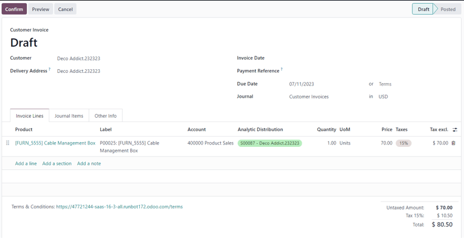

To complete the invoicing process, click :guilabel:`Confirm` to confirm the invoice, and then click
:guilabel:`Register Payment` in the :guilabel:`Register Payment` pop-up form.
