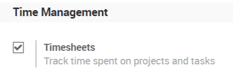
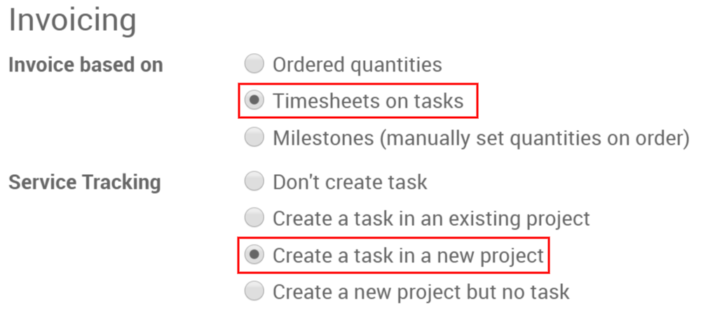

===================================
Invoice based on time and materials
===================================

Time and Materials is generally used in projects in which it is not
possible to accurately estimate the size of the project, or when it is
expected that the project requirements would most likely change.

This is opposed to a fixed-price contract in which the owner agrees to
pay the contractor a lump sum for the fulfillment of the contract no
matter what the contractors pay their employees, sub-contractors, and
suppliers.

For this documentation I will use the example of a consultant, you will
need to invoice their time, their various expenses (transport,
lodging, ...) and purchases.

Invoice time configuration
==========================

To keep track of progress in the project, you will need the *Project*
app. Go to :menuselection:`Apps --> Project` to install it.

In *Project* you will use timesheets, to do so go to
:menuselection:`Project --> Configuration --> Settings` and activate the
*Timesheets* feature.

Invoice your time spent
=======================

From a product page set as a service, you will find two options under
the invoicing tab, select both *Timesheets on tasks* and *Create a
task in a new project*.

You could also add the task to an existing project.

Once confirming a sales order, you will now see two new buttons, one for
the project overview and one for the current task.

You will directly be in the task if you click on it, you can also access
it from the *Project* app.

Under timesheets, you can assign who works on it. You can or they can
add how many hours they worked on the project so far.

.. image:: time_materials/time_materials04.png
   :align: center

From the sales order, you can then invoice those hours.

.. image:: time_materials/time_materials05.png
   :align: center

Expenses configuration
======================

To track & invoice expenses, you will need the expenses app. Go to
:menuselection:`Apps --> Expenses` to install it.

You should also activate the analytic accounts feature to link expenses
to the sales order, to do so, go to :menuselection:`Accounting -->
Configuration --> Settings` and activate *Analytic Accounting*.

Add expenses to your sales order
================================

From the expense app, you or your consultant can create a new one, e.g.
the hotel for the first week on the site of your customer.

You can then enter a relevant description and select an existing product
or create a new one from right there.

.. image:: time_materials/time_materials06.png
   :align: center

Here, we are creating a *Hotel* product:

.. image:: time_materials/time_materials07.png
   :align: center

under the invoicing tab, select *Delivered quantities* and either *At
cost* or *Sales price* as well depending if you want to invoice the
cost of your expense or a previously agreed on sales price.

.. image:: time_materials/time_materials08.png
   :align: center

To modify or create more products go to :menuselection:`Expenses -->
Configuration --> Expense products`.

Back on the expense, add the original sale order in the expense to
submit.

.. image:: time_materials/time_materials09.png
   :align: center

It can then be submitted to the manager, approved and finally posted.

.. image:: time_materials/time_materials10.png
   :align: center

.. image:: time_materials/time_materials11.png
   :align: center

.. image:: time_materials/time_materials12.png
   :align: center

It will then be in the sales order and ready to be invoiced.

Invoice purchases
=================

The last thing you might need to add to the sale order is purchases made
for it.

You will need the *Purchase Analytics* feature, to activate it, go to
:menuselection:`Invoicing --> Configuration --> Settings` and select
*Purchase Analytics*.

While making the purchase order don't forget to add the right analytic
account.

.. image:: time_materials/time_materials08.png
   :align: center

Once the PO is confirmed and received, you can create the vendor bill,
this will automatically add it to the SO where you can invoice it.
