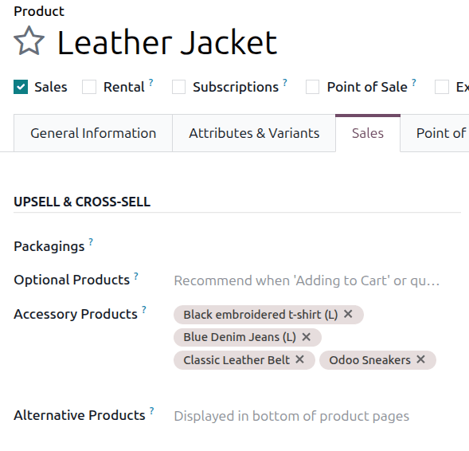
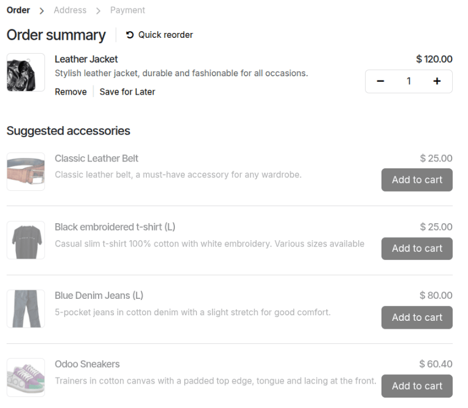

==================
Accessory products
==================

The use of accessory products is a marketing strategy that involves the cross-selling of related
products alongside a desired core product. In Odoo, accessory products can be added to a core
product's product form to integrate them into the customer's shopping experience and help drive
increased sales.

Example
=======

An electronics business has configured their products with an eye on cross-selling accessories
whenever customers purchase big-ticket items. After a customer adds a tablet to their shopping cart,
they are automatically suggested useful accessories like cases, screen protectors, and extra cables
because of the accessory products that have been configured. This helps to drive sales by creating
opportunities for impulse purchases, as well as reminding customers of useful accessories that they
may have intended to purchase but forgot about while shopping.

.. note::
   Accessory products are differentiated from optional products and alternative products by where
   they appear in the customer's shopping experience.

   - Accessory products appear as suggestions when viewing an eCommerce cart with an associated core
     product in it. This creates an opportunity for cross-selling during the checkout process.
   - Optional products are suggested when a core product has been added to a cart or a quotation.
     This creates an opportunity for cross-selling during the shopping process.
   - Alternative products are suggested at the bottom of an eCommerce product page whenever the
     product page is viewed. This creates an opportunity for upselling during the shopping process.

Configuring accessory products
==============================

To add an accessory product to a product form, navigate to :menuselection:`Sales --> Products -->
Products` and choose a product. Ensure that the product's :guilabel:`Sales` checkbox is ticked and
click the :guilabel:`Sales` tab. Under :guilabel:`Upsell & Cross-sell` heading, the
:guilabel:`Accessory Products` drop-down menu allows for accessory products to be set. Products will
be displayed in alphabetical order. If the desired product isn't readily visible, type its name in
the field to bring it up, then select it to add it as an accessory product.

How accessory products appear to customers
==========================================

Accessory products appear alongside core products prior to checkout. They are automatically
suggested based on what accessory products have been configured and what core products the customer
has added to their shopping cart.

   In this example, the core product, "Leather jacket", has several associated accessory products.
   Once a customer adds the core product to their shopping cart, the accessory products will appear
   as suggestions during the checkout process.

.. seealso::
   :doc:`../../../websites/ecommerce/products/cross_upselling`
