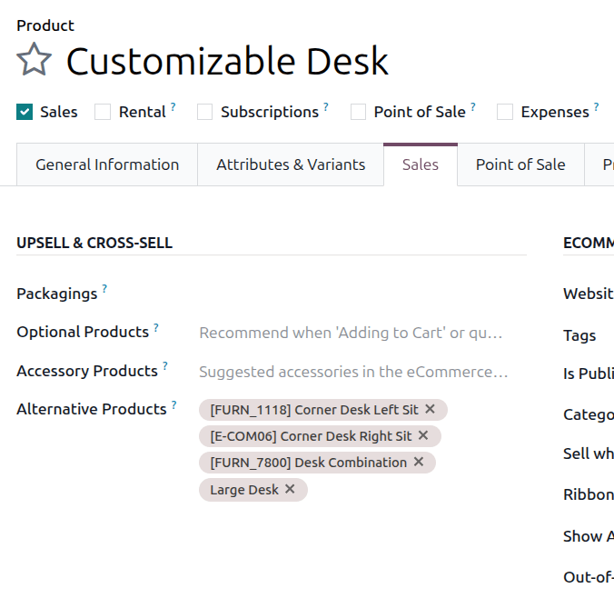
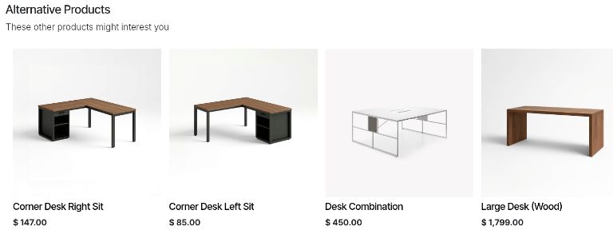

====================
Alternative products
====================

The use of alternative products is a marketing strategy that involves upselling related products
alongside a desired core product. For instance, by configuring alternative products, a customer
could be suggested a mechanical keyboard or a wireless keyboard when they visit the eCommerce
website page for a standard keyboard.

.. note::
   Alternative products are different from accessory and optional products because of where they
   show up in the customer's shopping experience.

   - Alternative products are suggested at the bottom of an eCommerce product page whenever the
     product page is viewed. This creates an opportunity for upselling during the shopping process.
   - Accessory products appear as suggestions when viewing an eCommerce cart. This creates an
     opportunity for cross-selling during the checkout process.
   - Optional products are suggested when a core product has been added to a cart or a quotation.
     This creates an opportunity for cross-selling during the shopping process.

Configuring alternative products
================================

To add an alternative product to a product form, navigate to :menuselection:`Sales --> Products -->
Products` and choose a product. Ensure that the product's :guilabel:`Sales` checkbox is ticked and
click the :guilabel:`Sales` tab. In the :guilabel:`Upsell & Cross-sell` section, click the
:guilabel:`Alternative Products` drop-down menu to set alternative products. Products are displayed
in alphabetical order. If the desired product isn't readily visible, type its name in the field to
bring it up, then select it to add it as an alternative product.

   Entries in the :guilabel:`Alternative Products` field on a product form.

How alternative products appear to customers
============================================

Although the **Sales** app is used to configure alternative products, customers will only encounter
them when visiting a website created with the **eCommerce** app. Alternative products are
automatically suggested during the shopping process when a customer visits the webpage for an
associated core product. They appear underneath the product listing under the header
:guilabel:`Alternative Products`.

   The alternative products section of an eCommerce product page.

.. seealso::
   :doc:`/applications/websites/ecommerce/products/cross_upselling`
