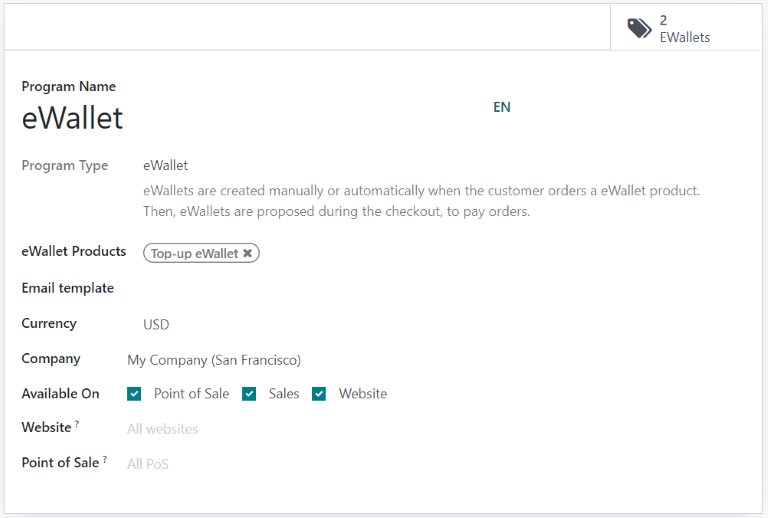
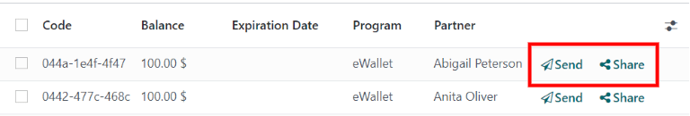
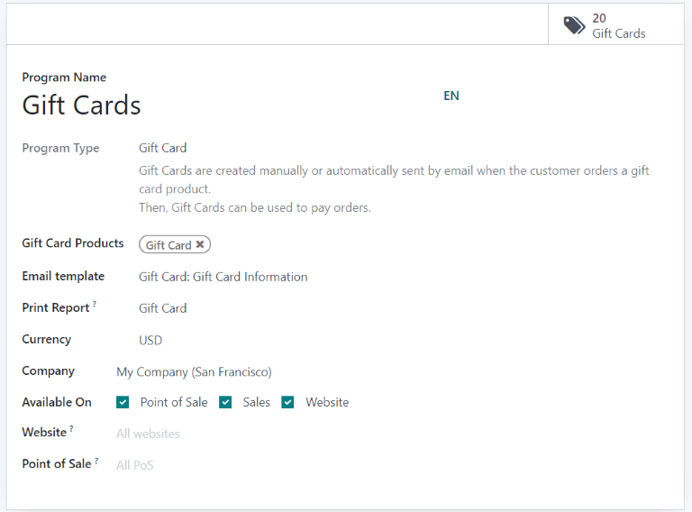
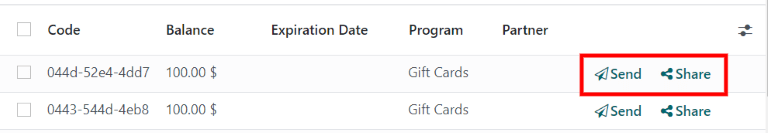

===========================
Use eWallets and gift cards
===========================

With Odoo, customers can use **eWallets** and **gift cards** for online and in-store shopping.

To enable eWallets and gift cards for eCommerce and Point of Sale (PoS), first enable
:guilabel:`Discounts, Loyalty & Gift Card` under :menuselection:`Sales app --> Configuration -->
Settings --> Pricing section`. Once enabled, go to :menuselection:`Sales app --> Products --> Gift
cards & eWallet` and :guilabel:`Create` a new eWallet or gift card program.

eWallets
========

eWallets allow customers to save credits on their online account and use these credits as a payment
method when buying items in an online store or a brick-and-mortar store. eWallets can also be used
to centralize multiple :ref:`gift cards <ewallet_gift/gift-cards>`.

Before creating an eWallet program, it is necessary to create an eWallet **top-up** product. Top-ups
are pre-defined digital credit values added to an eWallet in exchange for its equivalent in real
currency. These credits can then be used as a payment method in the eCommerce shop or :abbr:`PoS
(Point of Sale)`. Top-up values can be of different amounts.

.. example::
   A $50 top-up can be bought for $50, and adds that same amount of credits to the eWallet.

To create a top-up product, go to :menuselection:`Sales app --> Products --> Products` and
:guilabel:`Create` a new product. On the product template, configure the options as follows:

- :guilabel:`Product Name`: enter a name for the top-up product (for example, `$50 Top-Up`)
- :guilabel:`Can be Sold`: enabled
- :guilabel:`Product Type`: select :guilabel:`Service`
- :guilabel:`Invoicing Policy`: select :guilabel:`Prepaid/Fixed Price`
- :guilabel:`Create on Order`: select :guilabel:`Nothing`
- :guilabel:`Sales Price`: enter the amount of the top-up

.. note::
   In order to have eWallet top-ups of different amounts, create multiple top-up products and
   modify the :guilabel:`Sales Price` accordingly.

Once the top-up is created, go to :menuselection:`Sales app --> Products --> Gift cards & eWallet`
to :guilabel:`Create` an eWallet program. The following configuration options are available:

- :guilabel:`Program Name`: enter a name for the eWallet program
- :guilabel:`Program Type`: select :guilabel:`eWallet`
- :guilabel:`eWallet Products`: select the eWallet top-up created earlier. Repeat the process if
  you created top-ups of different amounts.
- :guilabel:`Email template`: select the email template used for the email sent to the customer. To
  create a new template, click on the field, select :guilabel:`Search More`, and then click
  :guilabel:`Create`.
- :guilabel:`Currency`: select the currency to use for the eWallet program
- :guilabel:`Company`: select the company for which the program is valid and available
- :guilabel:`Available On`: select the applications on which the program is valid and available
- :guilabel:`Website`: select the website on which the program is valid and available. Leave this
  field empty to include all websites.
- :guilabel:`Point of Sale`: select the :abbr:`PoS (Point of Sale)` in which the program is valid
  and available. Leave this field empty to include all :abbr:`PoS (Point of Sale)`.

Once the program is configured, click the :guilabel:`Generate eWallet` button in the upper-left
corner to generate eWallets. eWallets can be generated based on :guilabel:`Customers` and/or
:guilabel:`Customer Tags`. The quantity is automatically adapted according to the
:guilabel:`Customers` and :guilabel:`Customer Tags` selected. Then, set the :guilabel:`eWallet
value`. Finally, set the :guilabel:`Valid Until` period if applicable.

Generated eWallets can be accessed through the :guilabel:`eWallets` smart button in the upper-right
corner. From there, :guilabel:`Send` or :guilabel:`Share` the eWallets via email or a URL link.

Click on an eWallet to change the :guilabel:`Expiration Date`, :guilabel:`Partner`, or
:guilabel:`Balance`. The :guilabel:`Code` of an eWallet *cannot* be changed, deleted, or duplicated.

.. _ewallet_gift/gift-cards:

Gift cards
==========

Gift cards can be purchased by customers, and in turn used as a payment method upon checkout at an
eCommerce shop or :abbr:`PoS (Point of Sale)`.

Before creating a new gift card program, it is necessary to first create gift cards as products. To
do so, go to :menuselection:`Sales app --> Products --> Products` and :guilabel:`Create` a product.
On the product template, configure the options as follows:

- :guilabel:`Product Name`: enter a name for the gift card product
- :guilabel:`Can be Sold`: enabled
- :guilabel:`Product Type`: select :guilabel:`Service`
- :guilabel:`Invoicing Policy`: select :guilabel:`Prepaid/Fixed Price`
- :guilabel:`Create on Order`: select :guilabel:`Nothing`
- :guilabel:`Sales Price`: enter the amount of the gift card

.. note::
  In order to have gift cards of different amounts, create multiple gift card products and modify
  the :guilabel:`Sales Price` accordingly.

Once the gift card product is created, go to :menuselection:`Sales app --> Products --> Gift cards
& eWallet` to :guilabel:`Create` a gift card program. The following configuration options are
available:

- :guilabel:`Program Name`: enter a name for the gift card program
- :guilabel:`Program Type`: select :guilabel:`Gift Card`
- :guilabel:`Gift Card Products`: select the gift card product created earlier. Repeat the process
  if you created gift card products of different amounts.
- :guilabel:`Email template`: select the default :guilabel:`Gift Card: Gift Card Information`
  template, or create a new template by clicking on the field, selecting :guilabel:`Search More`,
  and then clicking :guilabel:`Create`.
- :guilabel:`Print Report`: select :guilabel:`Gift Card`
- :guilabel:`Currency`: select the currency to use for the gift card program
- :guilabel:`Company`: select the company for which the program is valid and available
- :guilabel:`Available On`: select the applications on which the program is valid and available
- :guilabel:`Website`: select the website on which the program is valid and available. Leave this
  field empty to include all websites.
- :guilabel:`Point of Sale`: select the :abbr:`PoS (Point of Sale)` in which the program is valid
  and available. Leave this field empty to include all :abbr:`PoS (Point of Sale)`.

Once the program is configured, click the :guilabel:`Generate Gift Cards` button in the upper-left
corner to generate gift cards. Gift cards can be generated either for :guilabel:`Anonymous
Customers` or :guilabel:`Selected Customers`. Set the :guilabel:`Quantity to generate` for
:guilabel:`Anonymous Customers`, or select the :guilabel:`Customers` and/or :guilabel:`Customer
Tags` for :guilabel:`Selected Customers`. Then, set the :guilabel:`Gift Card value`. Finally, set
the :guilabel:`Valid Until` period if applicable.

Generated gift cards can be accessed through the :guilabel:`Gift Cards` smart button in the
upper-right corner. From there, :guilabel:`Send` or :guilabel:`Share` the gift cards via email or a
URL link.

Click on a gift card to change the :guilabel:`Expiration Date`, :guilabel:`Partner`, or
:guilabel:`Balance`. The :guilabel:`Code` of a gift card *cannot* be changed, deleted, or
duplicated.
