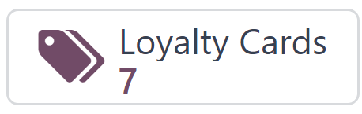

=============================
Discount and loyalty programs
=============================

The Odoo *Sales*, *eCommerce*, and *Point of Sale* applications allow users to create discount and
loyalty programs that customers can use for online and in-store shopping. These programs offer more
varied, public, and time-sensitive pricing options than :doc:`pricelists
</applications/sales/sales/products_prices/prices/pricing>`.

Configure the settings
======================

To begin using discount and loyalty programs, navigate to :menuselection:`Sales --> Configuration
--> Settings`. Under the :guilabel:`Pricing` heading, activate the :guilabel:`Discounts, Loyalty &
Gift Card` setting by checking the box next to the feature. Finally, click :guilabel:`Save` to save
the changes.

Configure discount and loyalty programs
=======================================

To create discount and loyalty programs, go to :menuselection:`Sales --> Products --> Discount &
Loyalty`.

If no discount or loyalty programs have been created yet, Odoo provides a choice of templates to
help create the first program. Choose one of the template cards, or click :guilabel:`New` to create
a new program from scratch.

Or, if there are already existing programs, select an existing program to edit it.

.. image:: loyalty_discount/price-discount-loyalty.png
   :align: center
   :alt: Discount and loyalty program template cards.

.. note::
   Templates only appear when no programs have been created, and they disappear once the first
   program is created.

Creating or editing a program opens the program form.

The program form contains the following options:

- :guilabel:`Program Name`: Enter the name of the program. The program name is *not* visible to the
  customer.
- :guilabel:`Program Type`: Select the desired :ref:`program type
  <sales/pricing_management/program-types>`.
- :guilabel:`Currency`: Select the currency used for the program.
- :guilabel:`Points Unit`: Enter the name of the points used for the :guilabel:`Loyalty Cards`
  program (e.g. `Loyalty Points`). The points unit name *is* visible to the customer. This field is
  only available when the :guilabel:`Program Type` is set to :guilabel:`Loyalty Cards`.
- :guilabel:`Validity`: Select the date until which the program is valid. Leave this field blank for
  no end date, meaning the program is always valid and does not expire.
- :guilabel:`Limit Usage`: Check this box and enter a number to limit the number of times the
  program can be used during the :guilabel:`Validity` period.
- :guilabel:`Company`: In the case of multiple companies, choose the company for which the program
  is available.
- :guilabel:`Available On`: Select the app(s) on which the program is available.
- :guilabel:`Website`: Select the website(s) on which the program is available. Leave this field
  blank to make it available on all websites.
- :guilabel:`Point of Sale`: Select the point(s) of sale at which the program is available. Leave
  this field blank to make it available at all :abbr:`PoS (Point of Sale)`.

.. image:: loyalty_discount/price-programs.png
   :align: center
   :alt: Program options on the loyalty program form.

.. note::
   The options available on the program form vary depending on the :ref:`Program Type
   <sales/pricing_management/program-types>` selected.

All of the existing cards, codes, coupons, etc. that have been generated for the program are
accessible through the smart button located in the upper-right corner of the form.

.. _sales/pricing_management/program-types:

Program types
-------------

The different :guilabel:`Program Types` available on the program form are:

- :guilabel:`Coupons`: Generate and share single-use coupon codes that grant immediate access to
  rewards.
- :guilabel:`Next Order Coupons`: Generate and share single-use coupon codes that grant access to
  rewards on the customer's next order.
- :guilabel:`Loyalty Cards`: When making purchases, the customer accumulates points to exchange for
  rewards on future orders.
- :guilabel:`Promotions`: Set conditional rules for ordering products, which, when fulfilled, grant
  access to rewards for the customer.
- :guilabel:`Discount Code`: Set codes which, when entered upon checkout, grant discounts to the
  customer.
- :guilabel:`Buy X Get Y`: For every X item bought, the customer is granted 1 credit. After
  accumulating a specified amount of credits, the customer can trade them in to receive Y item.

Conditional rules
-----------------

Next, configure the :guilabel:`Conditional rules` that determine when the program applies to a
customer's order.

In the :guilabel:`Rules & Rewards` tab, click :guilabel:`Add` next to :guilabel:`Conditional rules`
to add *conditions* to the program. This reveals a :guilabel:`Create Conditional rules` pop-up
window.

.. image:: loyalty_discount/price-conditional-rewards.png
   :align: center
   :alt: Rules & Rewards tab of the loyalty program form.

.. note::
   The options for :guilabel:`Conditional rules` vary depending on the selected :ref:`Program Type
   <sales/pricing_management/program-types>`.

The following options are available for configuring conditional rules:

- :guilabel:`Discount Code`: Enter a custom code to be used for the :guilabel:`Discount Code`
  program, or use the default one generated by Odoo. This field is only available when the
  :guilabel:`Program Type` is set to :guilabel:`Discount Code`.
- :guilabel:`Minimum Quantity`: Enter the minimum number of products that must be purchased in order
  to access the reward. Set the minimum quantity to at least `1` to ensure that the customer must
  make a purchase in order to access the reward.
- :guilabel:`Minimum Purchase`: Enter the minimum amount (in currency), with :guilabel:`tax
  Included` or :guilabel:`tax Excluded`, that must be spent in order to access the reward. If both a
  minimum quantity *and* minimum purchase amount are entered, then the customer's order must meet
  both conditions.
- :guilabel:`Products`: Select the specific product(s) for which the program applies. Leave this
  field blank to apply it to all products.
- :guilabel:`Categories`: Select the category of products for which the program applies. Choose
  :guilabel:`All` to apply it to all product categories.
- :guilabel:`Product Tag:` Select a tag to apply the program to products with that specific tag.
- :guilabel:`Grant`: Enter the number of points the customer earns :guilabel:`per order`,
  :guilabel:`per currency spent`, or :guilabel:`per unit paid` (for the :guilabel:`Loyalty Cards`
  and :guilabel:`Buy X Get Y` programs).

.. image:: loyalty_discount/price-conditions.png
   :align: center
   :alt: Conditional rules configuration window for a discount or loyalty program.

Click :guilabel:`Save & Close` to save the rule and close the pop-up window, or click
:guilabel:`Save & New` to save the rule and immediately create a new one.

Rewards
-------

In the :guilabel:`Rules & Rewards` tab of the program form, click :guilabel:`Add` next to
:guilabel:`Rewards` to add *rewards* to the program. This reveals a :guilabel:`Create Rewards`
pop-up window.

.. note::
   The options for :guilabel:`Rewards` vary depending on the selected :ref:`Program Type
   <sales/pricing_management/program-types>`.

The following options are available for configuring rewards:

- :guilabel:`Reward Type`: Select the reward type among :guilabel:`Free Product`,
  :guilabel:`Discount`, and :guilabel:`Free Shipping`. The other options for reward configuration
  depend on the :guilabel:`Reward Type` selected.

  - :guilabel:`Free Product`:

    - :guilabel:`Quantity Rewarded`: Select the number of free products rewarded to the customer.
    - :guilabel:`Product`: Select the product given for free as a reward. Only one product can be
      selected.
    - :guilabel:`Product Tag`: Select a tag to further specify the free product eligible for the
      reward.

  - :guilabel:`Discount`:

    - :guilabel:`Discount`: Enter the discounted amount in either :guilabel:`percentage`,
      :guilabel:`currency per point`, or :guilabel:`currency per order`. Then, select whether the
      discount applies to the entire :guilabel:`Order`, only the :guilabel:`Cheapest Product` on the
      order, or only :guilabel:`Specific Products`.
    - :guilabel:`Max Discount`: Enter the maximum amount (in currency) that this reward may grant as
      a discount. Leave this field at `0` for no limit.

  - :guilabel:`Free Shipping`:

    - :guilabel:`Max Discount`: Enter the maximum amount (in currency) that this reward may grant as
      a discount. Leave this field at `0` for no limit.

- :guilabel:`In exchange of`: Enter the number of points required to exchange for the reward (for
  the :guilabel:`Loyalty Cards` and :guilabel:`Buy X Get Y` programs).
- :guilabel:`Description on order`: Enter the description of the reward, which is displayed to the
  customer upon checkout.

.. image:: loyalty_discount/price-rewards.png
   :align: center
   :alt: Rewards configuration window for a discount or loyalty program.
