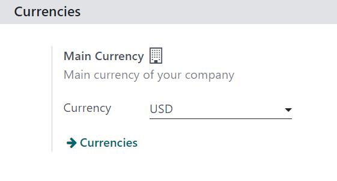
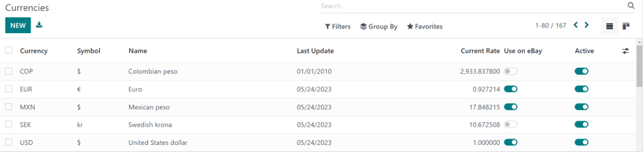
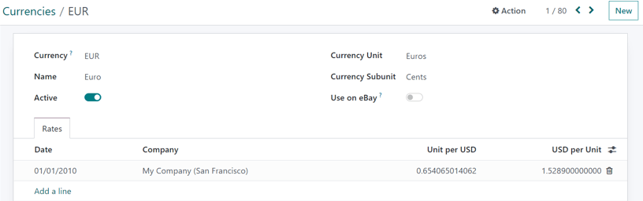
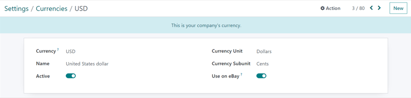
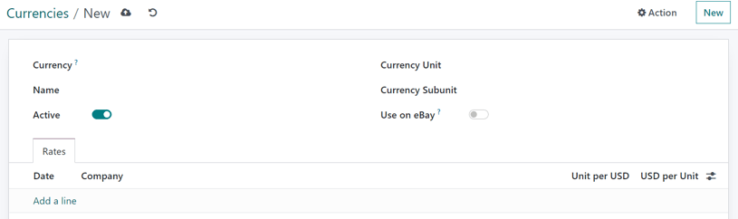
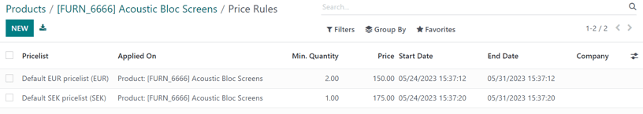

==================
Foreign currencies
==================

With Odoo, pricelists can be used to manage prices in a number of foreign currencies. Specifically,
Odoo has the ability to work with 167 total currencies.

.. note::
   In order to use multiple currencies in Odoo *Sales*, the *Accounting* application **must** be
   installed.

Settings
========

Once the *Accounting* app has been installed, foreign currencies can be added to the database.
Navigate to :menuselection:`Accounting app --> Configuration --> Settings`, scroll to the
:guilabel:`Currencies` section, and locate the :guilabel:`Main Currency` setting.

Odoo automatically sets the main currency as the currency of the country the company is based in.

To change the main currency of the company, select the drop-down menu in the :guilabel:`Currency`
field, select the desired currency, and be sure to :guilabel:`Save` the changes.

.. tip::
   To ensure currency rates are updated automatically, enable the *automatic currency rates* feature
   on the *Accounting* settings page (:menuselection:`Accounting app --> Configuration --> Settings
   --> Currencies section`).

   .. image:: currencies/automatic-currency-rates.png
      :align: center
      :alt: How the main currency feature appears on settings page in Odoo Accounting.

   Click the checkbox beside the :guilabel:`Automatic Currency Rates` feature, choose a designated
   bank to get the currency rates from in the :guilabel:`Service` field drop-down menu, and select
   an :guilabel:`Interval` of time for the updates to take place. Then determine when the date of
   the :guilabel:`Next Run` should be.

   To instantly update the currency rates, click the :guilabel:`🔁 (circular arrows)` icon, located
   to the right of the :guilabel:`Next Run` field.

   When all configurations are complete, be sure to :guilabel:`Save` all changes.

.. note::
   All payment methods **must** be in the same currency as the sales journal, or the company
   currency, if the company currency is not set. If it is not the same, a :guilabel:`Validation
   Error` message appears.

View, edit, and add currencies
==============================

To view, edit, and add currencies to the database, making them available on pricelists and on the
:guilabel:`Main Currency` drop-down menu, click the :guilabel:`Currencies` link, located beneath the
:guilabel:`Currency` field on the :menuselection:`Accounting app --> Settings` page.

When the :guilabel:`Currencies` link is clicked, a separate :guilabel:`Currencies` page is revealed.

On this page, Odoo provides a master list of 167 global currencies. Each row shows the corresponding
:guilabel:`Currency`, :guilabel:`Symbol`, :guilabel:`Name`, date of the :guilabel:`Last Update`, and
:guilabel:`Current Rate` (compared to the default currency of the country in which the company is
based).

To the far right, there are two columns, which can be toggled on or off:

- :guilabel:`Use on eBay`: this currency can be used with the connected eBay account (if
  applicable).
- :guilabel:`Active`: this currency is activated, which means it can be added to a pricelist, or
  used as the main currency of the company, if desired (via :menuselection:`Accounting app -->
  Configuration --> Settings --> Currencies section`).

.. note::
   By default, all the :guilabel:`Active` currency options are at the top of the list.

.. tip::
   It is recommended that *at least* one pricelist is created per :guilabel:`Active` currency. See
   :doc:`./pricing` to learn more about pricelist configuration.

To toggle options on/off, click the toggle switch in the row for the corresponding column. When *on*
the color of the switch is green. When *off*, the color of the switch is grey.

Currency detail form
--------------------

To edit any currency on the :guilabel:`Currencies` page, click the desired currency to reveal the
detail form for that specific currency, and proceed to make any necessary changes.

On the currency detail form, the relevant currency code appears in the :guilabel:`Currency` field.
Beneath that, the name for the currency is in the :guilabel:`Name` field.

Then, toggle the currency's availability with the :guilabel:`Active` toggle: *on* is indicated with
a green switch, and *off* is indicated with a grey switch.

On the right of the currency detail form, the appropriate :guilabel:`Currency Unit` (e.g. `Dollars`)
and :guilabel:`Currency Subunit` (e.g. `Cents`) can be found.

If the currency is meant to be used for eBay purposes, toggle the :guilabel:`Use on eBay` option to
the desired activation.

Next, under the :guilabel:`Rates` tab, the various conversion rates can be viewed, added, or
deleted. Each row shows the :guilabel:`Date` of that specific rate, the :guilabel:`Company` to which
it is connected, followed by the :guilabel:`Unit per...` and :guilabel:`...per Unit`.

.. note::
   The *...* in each of the last two columns represents the main currency set for the company. For
   example, if the main currency is set to `USD`, the columns are titled :guilabel:`Unit per USD`
   and :guilabel:`USD per Unit`.

To add a new rate, click :guilabel:`Add a line` in the :guilabel:`Rates` tab, and proceed to fill in
the necessary information in the aforementioned columns.

Main currency detail form
-------------------------

If the selected currency is the main currency of the company, a blue banner appears at the top of
the currency detail form with the message: :guilabel:`This is your company's currency.`.

All the fields are the same as a typical currency detail form, but there will **not** be a
:guilabel:`Rates` tab because all other currency rates are based off the main currency of the
company.

Create new currency
===================

If a desired currency isn't on the :guilabel:`Currencies` page, click the :guilabel:`New` button to
open a blank currency template form.

.. tip::
   The same :guilabel:`New` button is located in the upper-right corner of any currency detail form.

On the blank currency detail form, proceed to enter the desired currency code in the
:guilabel:`Currency` field. Beneath that, enter the name for the currency in the :guilabel:`Name`
field.

Then, toggle the currency's availability with the :guilabel:`Active` toggle switch.

On the right of the currency detail form, enter the appropriate :guilabel:`Currency Unit` (e.g.
`Dollars`) and appropriate :guilabel:`Currency Subunit` (e.g. `Cents`).

If the currency is meant to be used for eBay purposes, toggle the :guilabel:`Use on eBay` to the
desired activation.

Next, under the :guilabel:`Rates` tab, add a new rate by clicking :guilabel:`Add a line`. Then,
proceed to confirm and adjust the :guilabel:`Date`, :guilabel:`Company`, :guilabel:`Unit per...`,
and :guilabel:`...per Unit` fields to ensure all the auto-populated information is accurate.

.. note::
   The *...* in each of the last two columns represents the main currency set for the company. For
   example, if the main currency is set to `USD`, the columns are titled :guilabel:`Unit per USD`
   and :guilabel:`USD per Unit`.

Currency-specific pricelists
============================

It is recommended that *at least* one pricelist is created per active currency in the database. To
create (or assign) a pricelist to a specific currency, start by navigating to :menuselection:`Sales
app --> Products --> Pricelists`.

From the :guilabel:`Pricelists` page, either select an existing pricelist to edit, or click
:guilabel:`New` to create a new pricelist.

On the pricelist detail form, for either a new or existing pricelist, adjust the
:guilabel:`Currency` field as desired.

.. seealso::
   :doc:`./pricing` to learn more about pricelist configuration.

Auto-conversion from public price
=================================

It should be noted that the public price seen on products is directly related to the main currency
the company has set, which is configured by navigating to :menuselection:`Accounting app -->
Configuration --> Settings --> Currencies section --> Main Currency --> Currency drop-down menu`.

The sales price automatically updates if the pricelist is changed to a different pricelist that has
a different currency than the company's main currency. The change in price is directly related to
the updated conversion rate for that currency.

Set product prices
==================

In order to have product prices set in place to avoid any changes in currency rates, start by
navigating to :menuselection:`Sales app --> Products --> Products`.

From the :guilabel:`Products` page, select the desired product to modify. Or, create a new product
by clicking the :guilabel:`New` button.

Then, on the product detail form, click the :guilabel:`Extra Prices` smart button, located in the
upper-left corner. Doing so reveals a separate :guilabel:`Price Rules` page, specific to that
particular product.

Click :guilabel:`New`, and select the desired pricelist from the drop-down menu in the
:guilabel:`Pricelist` column.

The :guilabel:`Applied On` field is auto-populated with the product, so proceed to enter in the
desired figures in the :guilabel:`Min. Quantity` and :guilabel:`Price` fields.

.. note::
   The figure in the :guilabel:`Min. Quantity` field means the :guilabel:`Price` being set will
   **only** trigger if at least that amount of product is purchased.

If necessary, configure a :guilabel:`Start Date` and :guilabel:`End Date` for the set prices.
Leaving those columns blank ensures the set price will remain valid, regardless of the date of sale.

If working in a multi-company environment, designate to which company this price rule should be
applied in the :guilabel:`Company` field. Leaving that field blank ensures the price rule applies to
all companies in the database.

With those configurations complete, regardless of any changes/updates in conversion, whenever those
designated pricelists are applied to a customer trying to purchase this specific product, these
pre-determined set prices appear.

.. seealso::
   :doc:`./pricing`
