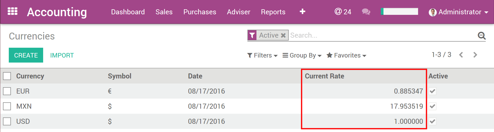
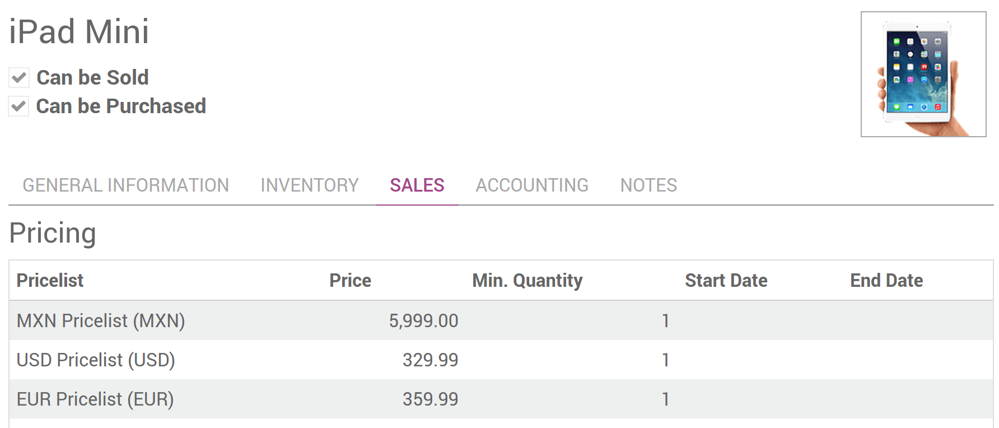

=================================
How to sell in foreign currencies
=================================

Pricelists can also be used to manage prices in foreign currencies.

* Check *Allow multi currencies* in :menuselection:`Invoicing/Accounting --> Settings`.
  As admin, you need *Adviser* access rights on Invoicing/Accounting apps.

* Create one pricelist per currency. A new *Currency* field shows up in pricelist setup form.

.. tip::
    To activate a new currency, go to :menuselection:`Accounting --> Configuration --> Currencies`,
    select it in the list and press *Activate* in the top-right corner. Now it will show up in
    currencies drop-down lists.

Prices in foreign currencies can be defined in two fashions.

Automatic conversion from public price
======================================

The public price is in your company's main currency (see
:menuselection:`Accounting --> Settings`) and is set in product detail form.

.. image:: currencies/public_price.png
   :align: center

The conversion rates can be found in
:menuselection:`Accounting --> Configuration --> Currencies`. They can be updated
from Yahoo or the European Central Bank at your convenience: manually, daily, weekly,
etc. See :menuselection:`Accounting --> Settings`.

.. image:: currencies/prices_conversion.png
   :align: center

Set your own prices
===================

This is advised if you don't want your pricing to change along with currency rates.

.. seealso::

  * :doc:`pricing`
