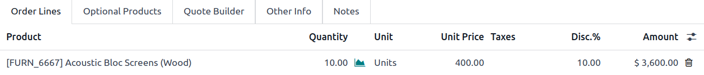
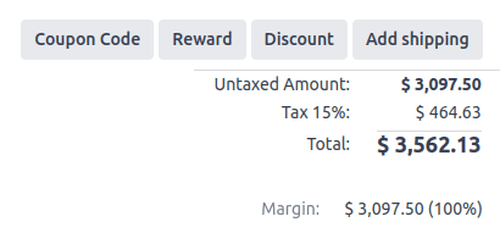

=========
Discounts
=========

The *Discounts* feature allows users to decrease or increase the price on item lines in a sales
quotation or order. This is calculated as a percentage of the products' sales price.

To access discounts in the **Sales** app, navigate to :menuselection:`Sales app --> Configuration
--> Settings`. In the :guilabel:`Pricing` section, tick the :guilabel:`Discounts` checkbox, then
click :guilabel:`Save`.

After the setting has been activated, navigate to the desired quotation by going to
:menuselection:`Sales app --> Orders --> Quotations` at the top of the page. Once there, click on
the desired quote from the list.

Discounts on product lines
==========================

In the :guilabel:`Order Lines` tab of the quotation form, a new column heading appears labeled
:guilabel:`Disc.%`. This column is used to set discounts on individual line items. Enter the desired
discount for each product line and the new price is automatically calculated in the
:guilabel:`Total` at the bottom of the page.

.. tip::
   A discount can also be added directly to a sales order in the same way. Navigate to
   :menuselection:`Sales app --> Orders --> Orders`, click the desired sales order, and add the
   discount to :guilabel:`Disc.%` field as described above.

.. note::
   Positive values for :guilabel:`Disc.%` will apply a *discount*, while negative values can be
   used to *increase* the price.

.. important::
   Positive values, or price decreases, will be visible to the customer, while negative values, or
   price increases, will *not* be visible to the customer. Instead of a discount column, the
   negative discount will change the product's unit price.

.. _sales/discounts/discount-button:

Discount button
===============

With the *Discounts* settings enabled, a :guilabel:`Discount` button appears at the bottom of sales
orders.

Clicking the :guilabel:`Discount` button on a sales order opens a pop-up window, where the
:guilabel:`Discount` percentage, and options are configured:

- :guilabel:`On All Order Lines`: Add the specified discount percentage (configured in the
  :guilabel:`Discount` field of the pop-up window) on all existing order lines of the sales order.
- :guilabel:`Global Discount`: Add a discount product line to the order, which has the cumulative
  value equivalent to the specified discount percentage.

  .. example::
     A global discount of 10% is added in the last line of a sales order with a subtotal of $4,200
     by adding a discount line with a -$420 value (which is 10% of $4,200).

     .. image:: discounts/global-discount-option.png
        :alt: The sales order with the applied global discount option in the Odoo Sales application.

  .. important::
     Any product added (or removed) *after* the global discount line is added does **not** affect
     the discount value on the discount line. To include new products or amend current products in
     the global discount, delete the current global discount line and repeat the steps.

- :guilabel:`Fixed Amount`: Add a monetary amount to the :guilabel:`Discount` field. Once applied,
  this amount is added to the order as a product line, with the monetary value subtracted from the
  order total.

  .. example::
     A fixed discount of $20 appears as a product line, with a negative :guilabel:`Unit Price`.

     .. image:: discounts/fixed-discount-on-sales-order.png
        :alt: The sales order with the applied fixed discount option in the Odoo Sales application.

.. note::
   It is more beneficial to add a :guilabel:`Fixed Amount` discount after **all** desired products
   have been added to a sales order. If there are changes made to the sales order *after* the
   discount is added, adjust the value on the :guilabel:`Discount` line, or remove the line and add
   the discount again, as needed.
