===================================
Pricelists, discounts, and formulas
===================================

Odoo *Sales* has a useful pricelist feature that can be tailored to fit any unique pricing strategy.

A *pricelist* is a list of prices (or price rules) that Odoo uses to determine the appropriate price
for a customer. These pricelists can be set with specific criteria (such as time periods, minimum
quantity sold, and more) in order to apply certain prices or discounts.

Pricelists suggest certain prices, but they can always be overridden on the sales order.

Pricing strategy options
========================

To choose a pricing strategy, first navigate to :menuselection:`Sales app --> Configuration -->
Settings`. In the :guilabel:`Pricing` section, click the checkbox next to the :guilabel:`Pricelists`
feature.

Doing so reveals two additional options beneath it: :guilabel:`Multiple prices per product` and
:guilabel:`Advanced price rules (discounts, formulas)`. A link labeled :guilabel:`Pricelists` also
appears, which leads to a separate pricelists page, wherein pricelists can be created and/or
modified.

- :guilabel:`Multiple prices per product`: provides the option to set several different prices per
  product.
- :guilabel:`Advanced price rules (discounts, formulas)`: provides the option to create detailed
  price rules and apply discounts, margins, and roundings.

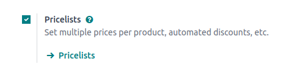

After clicking the checkbox beside the :guilabel:`Pricelists` feature, select one of those two
options, then click :guilabel:`Save` to save all changes.

Pricelists
==========

After activating and saving the :guilabel:`Pricelists` feature, the :guilabel:`Settings` page
reloads and, from here, either select the :guilabel:`Pricelists` link (beneath the
:guilabel:`Pricelists` feature on the :guilabel:`Settings` page), or navigate to
:menuselection:`Sales app --> Products --> Pricelists`.

Either option reveals the :guilabel:`Pricelists` page, in which pricelists can be created and/or
modified at any time.

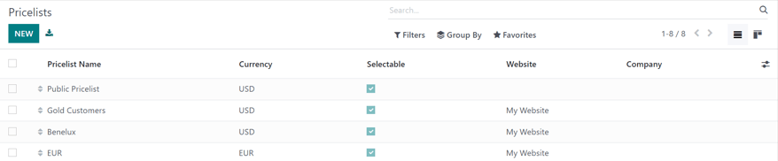

.. note::
   The :guilabel:`Public Pricelist` is the default pricelist used with Odoo *Sales* and *eCommerce*.

From the :guilabel:`Pricelists` page, either select the desired pricelist to edit, or click
:guilabel:`New` to create a new pricelist, which reveals a blank pricelist form that can be
configured in a number of different ways.

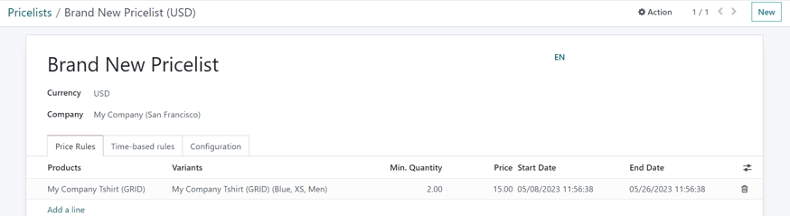

When creating a new pricelist, start by adding a name for the pricelist at the top of the form, in
the blank field. Next, select which :guilabel:`Currency` should be used.

Then, if working in a multi-company environment, select which company this pricelist should apply to
in the :guilabel:`Company` field. If this field is left blank, the pricelist is automatically
applied to all companies in the database.

Price rules tab
---------------

The :guilabel:`Price Rules` tab functionality on a pricelist form varies depending on the
:guilabel:`Pricelists` setting chosen: either :guilabel:`Multiple prices per product` or
:guilabel:`Advanced price rules (discounts, formulas)`.

However, the :guilabel:`Time-based rules` tab and :guilabel:`Configuration` tab are always the same,
regardless of the chosen :guilabel:`Pricelists` setting.

Price rules tab (multiple prices per product)
~~~~~~~~~~~~~~~~~~~~~~~~~~~~~~~~~~~~~~~~~~~~~

With the :guilabel:`Multiple prices per product` setting activated, the :guilabel:`Price Rules` tab
on pricelist forms provides the option to add specific products, with a specific price, to a
pricelist.

To add a specific product and price to a pricelist form, click the :guilabel:`Price Rules` tab, then
click :guilabel:`Add a line` in the :guilabel:`Products` column. Then, select the desired product
for which a specific price should be applied.

Next, if necessary, select a product variant under the :guilabel:`Variants` column (e.g. a specific
product size, color, etc.). If no variants are selected, then this price will apply to all variants
of the product.

If a minimum amount of the product must be purchased in order to apply the specific price, enter the
amount under the :guilabel:`Min. Quantity` column.

To configure the price of the product for this specific pricelist, enter the desired amount under
the :guilabel:`Price` column. Then, there is the option to add a :guilabel:`Start Date` and
:guilabel:`End Date` to the configured product price, if desired.

To add another product line, click :guilabel:`Add a line` again, and repeat the process. There is no
limit to how many products can be added in the :guilabel:`Price Rules` tab of a pricelist form.

For more information, check out the following section: :ref:`Multiple prices per product
<sales/multiple-prices-per-product>`.

Price rules tab (advanced price rules)
~~~~~~~~~~~~~~~~~~~~~~~~~~~~~~~~~~~~~~

With the :guilabel:`Advanced price rules (discounts, formulas)` setting activated, the
:guilabel:`Price Rules` tab on pricelist forms provides the option to configure detailed price rules
based on formulas.

Check out the :ref:`Advanced price rules (discounts, formulas) <sales/advanced-price-rules>` section
for detailed steps on how to add advanced price rules to a pricelist.

Time-based rules tab
--------------------

Time-based rules are used specifically with :doc:`subscription products
</applications/sales/subscriptions/products>`. Be sure to check out the Odoo *Subscriptions*
:doc:`documentation </applications/sales/subscriptions>`.

Under the :guilabel:`Time-based rules` tab, the same functionality of the :guilabel:`Price Rules`
tab is present, with the only difference being that a repeating time period can be applied in the
:guilabel:`Period` column.

After a :guilabel:`Product` and potential :guilabel:`Variant` are selected in the
:guilabel:`Time-based rules` tab, select the blank field in the :guilabel:`Period` column to reveal
a drop-down menu of pre-designated recurrence periods (e.g. `Monthly`, `Quarterly`, `Weekly`, etc.).

New recurrence periods can also be directly created from this column, by typing in the new name for
the :guilabel:`Period` and then selecting :guilabel:`Create` to create the time period, which can be
edited later. Or, select :guilabel:`Create and edit...` to reveal a pop-up form, in which the new
recurrence period can be directly configured.

.. image:: pricing/time-period-popup.png
   :align: center
   :alt: Custom time period pop-up form in Odoo Sales.

From this :guilabel:`Create Period` pop-up form, add a :guilabel:`Name`, :guilabel:`Duration`, then
a :guilabel:`Unit` (e.g. `Days`, `Weeks`, etc.). When finished, click :guilabel:`Save and Close`.

Lastly, add the desired price for this time-based rule in the :guilabel:`Price` column.

.. seealso::
   :doc:`/applications/sales/subscriptions`

Configuration tab
-----------------

Under the :guilabel:`Configuration` tab, there are a few options that can further customize the
pricelist.

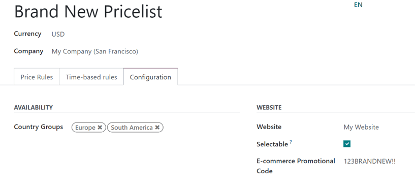

From here, under the :guilabel:`Availability` section, in the :guilabel:`Country Groups` field,
certain country groups can be added to the pricelist. There is no limit to how many country groups
can be added in this field.

.. note::
   If no country is set for a customer, Odoo takes the first pricelist without any country group.

Under the :guilabel:`Website` section, there are a few options that can be configured. In the
:guilabel:`Website` field, this pricelist can be applied to a specific website, if working in a
multi-website environment. If left blank, the pricelist will be applied to all websites in the
database.

Click the :guilabel:`Selectable` checkbox to have this pricelist as a selectable option for
customers to choose as they shop. If the :guilabel:`Selectable` box is left unchecked, customers
**cannot** select this pricelist for themselves as they shop.

Lastly, there is the option to add an :guilabel:`E-commerce Promotional Code`. To add a code, type
in the desired promo code that, when entered during the checkout process, applies the pricelist to
the customer, even if the customer does not fall into the previously-specified criteria.

Show discount percentage to customers
~~~~~~~~~~~~~~~~~~~~~~~~~~~~~~~~~~~~~

With Odoo *Sales*, the option to show the public price *and* the computed discount percentage on the
product catalog is available.

To do that, navigate to :menuselection:`Sales app --> Configuration --> Settings`, and in the
:guilabel:`Pricing` section, click the checkbox next to the :guilabel:`Discounts` feature, and then
click :guilabel:`Save` to save all changes.

After activating the :guilabel:`Discounts` feature, navigate to the pricelists page, either by
clicking the :guilabel:`Pricelists` link from the :guilabel:`Settings` page, or by going to
:menuselection:`Sales app --> Products --> Pricelists`.

On the :guilabel:`Pricelists` page, select the desired pricelist to edit. On the pricelist form,
click into the :guilabel:`Configuration` tab. In the :guilabel:`Configuration` tab, at the bottom, a
:guilabel:`Discounts` section is now available.

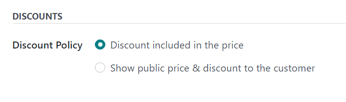

The options available in this section are:

- :guilabel:`Discount included in the price`: shows the customer only the final price with the
  discount already included.
- :guilabel:`Show public price & discount to the customer`: shows the customer the public price
  *and* the discount they're earning.

Customer pricelist application
==============================

While the default pricelist applied to any customer is the :guilabel:`Public Pricelist`, Odoo
provides the opportunity to directly apply a different pricelist to customers on their contact form.

To do that, open the desired customer's contact form, either by navigating to :menuselection:`Sales
app --> Orders --> Customers` and selecting the customer from the main :guilabel:`Customers` page,
or by clicking on the customer's name on a sales order.

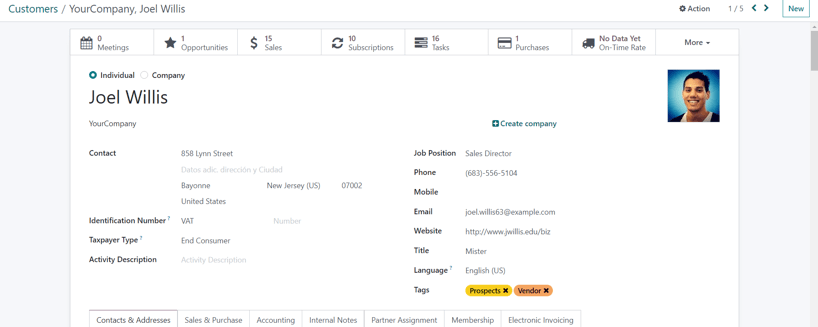

On the desired customer's contact form, under the :guilabel:`Sales & Purchase` tab, in the
:guilabel:`Sales` section, designate what pricelist should be applied to this specific customer from
the drop-down menu in the :guilabel:`Pricelist` field.

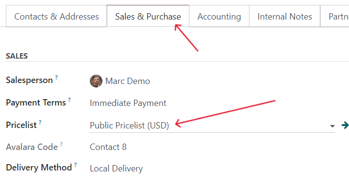

.. _sales/multiple-prices-per-product:

Multiple prices per product
===========================

To apply several prices per individual product, select the :guilabel:`Multiple prices per product`
option, after enabling the :guilabel:`Pricelists` feature on the *Sales* app setting page
(:menuselection:`Sales app --> Configuration --> Settings`), and click :guilabel:`Save`.

Next, apply pricelists to specific products using the product form. Navigate to the
:menuselection:`Sales app --> Products --> Products` and select the product for which multiple
prices should be applied. Selecting a product from the :guilabel:`Products` page reveals that
specific product's product form on a separate page.

On the product form, click the :guilabel:`Extra Prices` smart button, located at the top of the
form.

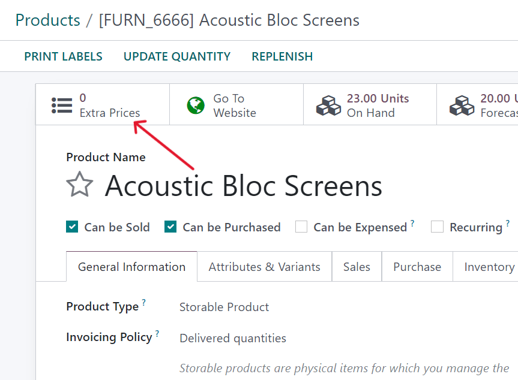

Doing so reveals a separate page displaying the :guilabel:`Price Rules` that are specific to that
particular product. Here, price rules can be edited or created at any time.

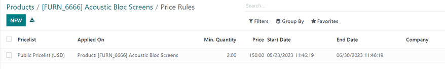

To create a new price rule for a product from this specific :guilabel:`Price Rules` page, click
:guilabel:`New` to add a new, customizable row that has the desired product already populated in the
:guilabel:`Applied On` column.

Next, select which :guilabel:`Pricelist` this specific product price rule should apply to, via the
drop-down menu in the :guilabel:`Pricelist` column.

.. note::
   The :guilabel:`Public Pricelist` is the default pricelist used with Odoo *Sales* and *eCommerce*.

.. tip::
   To create a new pricelist from this page, type in the desired name of the new pricelist in the
   :guilabel:`Pricelist` column, then select :guilabel:`Create` from the drop-down menu. All
   pricelists can be modified at any time, by navigating to :menuselection:`Sales app --> Products
   --> Pricelists`. Pricelists can also be created on that specific :guilabel:`Pricelists` page, as
   well.

After the desired pricelist is added to the row, designate a :guilabel:`Min. Quantity` for the price
rule.

.. example::
   If the :guilabel:`Min. Quantity` column is set to `2`, the new price in the :guilabel:`Price`
   column will be applied to orders of 2 or more products. So, in theory, if a single product costs
   $100, customers can be encouraged to buy more, if the :guilabel:`Price` is set at $85 per product
   for a :guilabel:`Min. Quantity` of `2` products.

Next, enter the desired amount in the :guilabel:`Price` column. Then, if needed, enter a
:guilabel:`Start Date` and :guilabel:`End Date` for the product's price rule.

And lastly, if working in a multi-company environment, select which company this price rule should
be applied to in the :guilabel:`Company` field. Leaving this field blank means the price rule
applies for all companies in the database.

Click away from the row to activate Odoo's auto-save capability, meaning that newly-created price
rule is now ready to be used.

Proceed to add as many unique price rules per product as desired. There is no limit to how many
price rules can be added per product.

With the price rule(s) in place for a specific product, customers who fall into those corresponding
pricelists automatically see those new prices applied. The number of price rules applied to a
particular product are also displayed in the :guilabel:`Extra Prices` smart button, located on every
product form.

.. note::
   When a price rule/pricelist is added to a product via the :guilabel:`Extra Prices` smart button,
   it is also reflected on the pricelist itself. Similarly, when a price rule for a specific product
   is added to a pricelist, it is also reflected on the product form via the :guilabel:`Extra
   Prices` smart button.

.. _sales/advanced-price-rules:

Advanced price rules
====================

The :guilabel:`Advanced price rules (discounts, formulas)` pricelist feature provides the option to
set price change rules based on discounts and formulas. These changes can be relative to the product
list/catalog price, the product's cost, or another pricelist.

To use advanced pricing rules, with discounts and formulas, select the :guilabel:`Advanced price
rules (discounts, formulas)` option, after enabling the :guilabel:`Pricelists` feature on the
*Sales* app setting page (:menuselection:`Sales app --> Configuration --> Settings`), and click
:guilabel:`Save`.

After activating and saving that :guilabel:`Pricelists` feature, the :guilabel:`Settings` page
reloads and, from here, either select the :guilabel:`Pricelists` link (beneath the
:guilabel:`Pricelists` feature on the :guilabel:`Settings` page), or navigate to
:menuselection:`Sales app --> Products --> Pricelists`.

Either option reveals the :guilabel:`Pricelists` page, in which pricelists can be created and/or
modified at any time.

From the :guilabel:`Pricelists` page, select a desired pricelist to modify, or create a new
pricelist by clicking the :guilabel:`New` button.

On the pricelist form, under the :guilabel:`Price Rules` tab, click :guilabel:`Add a line` to add an
advanced price rule. Doing so reveals a :guilabel:`Create Pricelist Rules` pop-up form, in which the
advanced rule is configured.

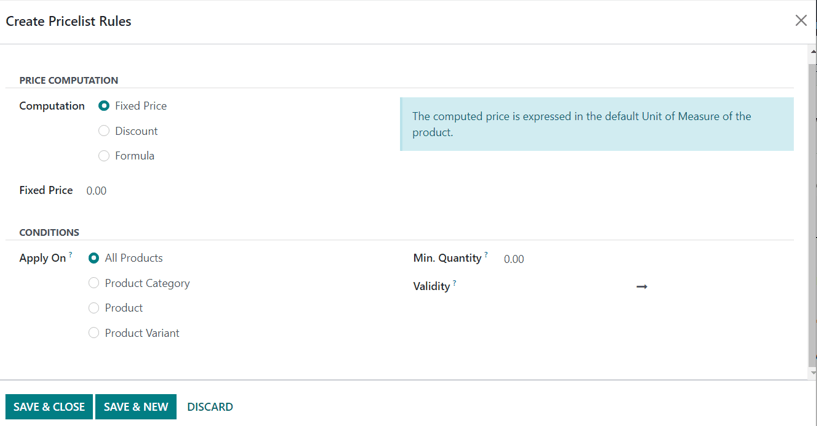

Price computation
-----------------

On this form, first choose one of the three :guilabel:`Computation` options:

- :guilabel:`Fixed Price`: the price computation is based on a fixed price.
- :guilabel:`Discount`: the price computation is based on a discount.
- :guilabel:`Formula`: the price computation is based on a formula.

.. note::
   Each :guilabel:`Computation` option reveals its own computation-specific fields on the form.

If :guilabel:`Fixed Price` is selected, enter the desired price in the :guilabel:`Fixed Price` field
below. If :guilabel:`Discount` is selected, enter the desired discount percentage in the
:guilabel:`Discount` field that appears.

If :guilabel:`Formula` is selected, a number of configurable options appear.

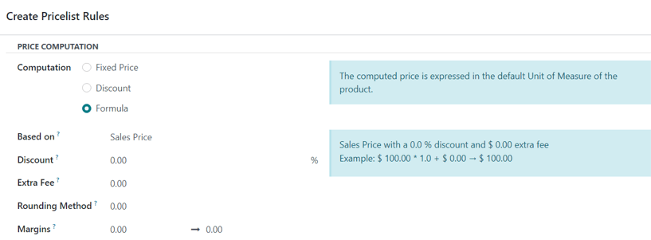

To configure the :guilabel:`Formula` computation option, start by selecting an option from the
:guilabel:`Based on` field: :guilabel:`Sales Price`, :guilabel:`Cost`, or :guilabel:`Other
Pricelist`. This determines what the advanced price rule formula will be based on.

Next, in the :guilabel:`Discount` field, determine how much of a discount should be applied. It
should be noted that a mark-up can be applied by setting a negative discount in this field.

.. example::
   To formulate a 100% markup (or 2 times the cost of the product), with a $5 minimum margin, set
   the :guilabel:`Based on` field to :guilabel:`Cost`, the :guilabel:`Discount` to `-100`, and the
   :guilabel:`Margins` to `5`. This is often seen in retail situations.

   .. image:: pricing/formula-markup-cost-example.png
      :align: center
      :alt: How it looks to formulate a markup cost with 5 dollar minimum margin in Odoo Sales.

Then, in the :guilabel:`Extra Fee` field, specify a fixed amount to add (or subtract) to the amount
calculated with the discount. After that, enter a desired figure in the :guilabel:`Rounding Method`
field. The rounding method sets the price so that it is a multiple of the value in the field.

.. note::
   Rounding is applied *after* the discount and *before* the surcharge.

.. tip::
   To have prices that end in 9.99, set the :guilabel:`Rounding Method` to `10` and the
   :guilabel:`Extra Fee` to `-0.01`.

Lastly, specify the minimum amount of margin over the base price in the :guilabel:`Margins` field.

Once all formula-related configurations are complete, Odoo provides an example of the formula in a
blue block to the right of the configurations.

.. example::
   To apply 20% discounts, with prices rounded up to 9.99, set the :guilabel:`Based on` field to
   :guilabel:`Sales Price`, the :guilabel:`Discount` field to `20`, the :guilabel:`Extra Fee` field
   to `-0.01`, and the :guilabel:`Rounding Method` field to `10`.

   .. image:: pricing/formula-discount-example.png
      :align: center
      :alt: Example of a 20% discount with prices rounded to 9.99 in Odoo Sales.

Conditions
----------

At the bottom of the :guilabel:`Create Pricelist Rules` pop-up form is the :guilabel:`Conditions`
section.

Here, start by selecting one of the options in the :guilabel:`Apply On` field:

- :guilabel:`All Products`: the advanced pricelist rule will be applied to all products.
- :guilabel:`Product Category`: the advanced pricelist rule will be applied to a specific category
  of products.
- :guilabel:`Product`: the advanced pricelist rule will be applied to a specific product.
- :guilabel:`Product Variant`: the advanced pricelist rule will be applied to a specific product
  variant.

If any of those options, apart from :guilabel:`All Products`, are selected, a new option-specific
field appears, in which the specific :guilabel:`Product Category`, :guilabel:`Product`, or
:guilabel:`Product Variant` must be chosen.

Then, select a minimum quantity to be applied to the advanced pricelist rule in the :guilabel:`Min.
Quantity` field. Lastly, select a range of dates for the pricelist item validation in the
:guilabel:`Validity` field.

Once all configurations are complete, either click :guilabel:`Save & Close` to save the advanced
pricelist rule, or click :guilabel:`Save & New` to immediately create another advanced pricelist
rule on a fresh form.

.. note::
   If a price rule is set for a particular product, and another one for its product category, Odoo
   takes the rule of the product itself.

.. seealso::
   - :doc:`/applications/sales/sales/products_prices/prices/currencies`
   - :doc:`/applications/websites/ecommerce/managing_products/price_management`
